# 编辑器插件（`McpEditorPlugin`）

> `godot_mcp_gdext.dll` 的生命周期管理。

## 生命周期

```mermaid
stateDiagram-v2
    [*] --> EnterTree: Godot 加载插件
    
    EnterTree --> Initializing: _enter_tree()
    
    state Initializing {
        [*] --> InitStatic: 初始化全局静态变量
        InitStatic --> StartTokio: 创建 tokio 运行时
        StartTokio --> StartWS: 启动 WebSocket 服务器
        StartWS --> DockUI: 添加 Dock UI
        DockUI --> ConnectFrame: process_frame 信号连接
        ConnectFrame --> [*]
    }
    
    Initializing --> Ready: 初始化完成
    
    Ready --> Processing: 编辑器正常运行
    
    state Processing {
        [*] --> PumpDispatcher: 每帧泵 dispatcher
        PumpDispatcher --> PumpLogs: 泵日志队列
        PumpLogs --> [*]: 等待下一帧
    }
    
    Processing --> Exiting: 编辑器卸载
    Processing --> Exiting: _exit_tree()
    
    state Exiting {
        [*] --> CloseWS: 关闭 WebSocket
        CloseWS --> StopTokio: 停止 tokio 运行时
        StopTokio --> CleanStatic: 清理静态变量
        CleanStatic --> [*]
    }
    
    Exiting --> [*]
```



## `_enter_tree()` 初始化

```rust
fn _enter_tree(&mut self) {
    // 1. 初始化全局静态 PluginState
    let state = PluginState::new();
    
    // 2. 如果尚未运行，启动 tokio 运行时
    if TOKIO_RUNTIME.is_none() {
        TOKIO_RUNTIME = Some(tokio::runtime::Runtime::new().unwrap());
    }
    
    // 3. 创建并启动 WebSocket 服务器
    let ws_server = IpcWebSocketServer::new("0.0.0.0:9500");
    let dispatcher = MainThreadDispatcher::new();
    ws_server.start(dispatcher.clone());
    
    // 4. 设置 Dock UI
    setup_dock(editor_interface);
    
    // 5. 连接 process_frame 信号
    let tree = editor_interface.get_base_control().get_tree();
    tree.connect("process_frame", Callable::from_fn("pump", |_| {
        dispatcher.process_pending();
        LOG.drain_to_console();
        Variant::nil()
    }));
}
```

## `_exit_tree()` 清理

```rust
fn _exit_tree(&mut self) {
    // 1. 关闭 WebSocket
    ws_server.stop();
    
    // 2. 停止 tokio 运行时
    if let Some(rt) = TOKIO_RUNTIME.take() {
        rt.shutdown_background();
    }
    
    // 3. 清理静态变量
    PluginState::clear();
}
```

## `_process()` — 故意留空

这是 `bind_mut` 陷阱（参见[线程模型](overview/threading-model.md)）的关键缓解措施。

`process_frame` 信号连接在 `SceneTree` 上，没有对 `McpEditorPlugin` 的引用绑定，因此不会产生 `bind_mut` 死锁。**不要**将此逻辑移回 `_process()`。

## 启动顺序

```
EditorPlugin::_enter_tree()
  → EditorPlugin::_ready()
  → process_frame (初始化后的第一帧起，每帧调用)
  → EditorPlugin::_process()  ← 空
  → EditorPlugin::_physics_process()  ← 未使用
  → EditorPlugin::_exit_tree()
```

## 静态状态（`PluginState`）

`PluginState` 持有全局单例：

| 字段 | 类型 | 说明 |
|------|------|------|
| `ws_server` | `Option<Arc<Mutex<IpcWebSocketServer>>>` | 监听中 |
| `dispatcher` | `Option<MainThreadDispatcher>` | 排队中 |
| `connected` | `AtomicBool` | 客户端已连接 |
| `editor_interface` | `Option<Gd<EditorInterface>>` | 编辑器句柄 |

通过 `PluginState::global()` 访问的静态 `OnceLock`。
