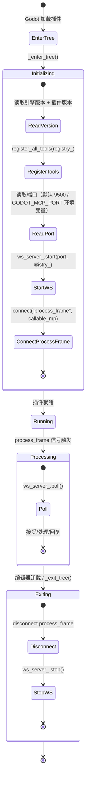

# 编辑器插件（`McpEditorPlugin`）

> `godot_mcp_gdext.dll` 的生命周期管理。**C++ 版本（当前）与 Rust 遗留版本差异显著**。

## C++ 版本（当前）—— 极其简单

### 生命周期



### `_enter_tree()` 初始化

```cpp
void McpEditorPlugin::_enter_tree() {
    if (!Engine::get_singleton()->is_editor_hint()) return;
    
    registry_.set_engine_version(...);     // 引擎版本
    registry_.set_plugin_version(GODOT_MCP_PLUGIN_VERSION);  // 编译时版本
    
    register_all_tools(registry_);         // 注册 125 个工具
    
    int port = read_port_from_env();       // GODOT_MCP_PORT 或 9500
    ws_server_.start(port, &registry_);    // 启动同步 WebSocket 服务器
    
    // process_frame 驱动轮询（生存游戏模式）
    SceneTree *tree = Object::cast_to<SceneTree>(get_tree());
    tree->connect("process_frame", callable_mp(this, &McpEditorPlugin::_on_process_frame));
}
```

### `_exit_tree()` 清理

```cpp
void McpEditorPlugin::_exit_tree() {
    if (!started_) return;
    // 断开 signal
    tree->disconnect("process_frame", callable_mp(this, &McpEditorPlugin::_on_process_frame));
    ws_server_.stop();    // 关闭所有连接
}
```

### 关键设计

- **端口**：通过 `GODOT_MCP_PORT` 环境变量覆盖，默认 9500
- **`process_frame` 而非 `_process()`**：`EditorPlugin::_process()` 在场景播放时停止触发。`SceneTree::process_frame` 信号在场景播放时继续触发，确保实时工具（如 `play_current_scene`、`stop_scene`）正常工作
- **启动条件**：`EditorPlugin::_enter_tree()` 首先检查 `Engine::get_singleton()->is_editor_hint()`——非编辑器模式直接返回

---

## Rust 版本（遗留）

### 生命周期

```mermaid
stateDiagram-v2
    [*] --> EnterTree: Godot 加载插件
    
    EnterTree --> Initializing: enter_tree()
    
    state Initializing {
        [*] --> ReadVersion
        ReadVersion --> CreateRuntime: 创建 tokio 运行时 (2 workers)
        CreateRuntime --> CreateDispatcher: MainThreadDispatcher
        CreateRuntime --> CreateRegistry: create_registry() 17组 handler
        CreateDispatcher --> StartWS: IpcWebSocketServer::new(9500)
        StartWS --> SpawnServer: runtime.spawn(server.run())
        SpawnServer --> InstallPump: process_frame 信号安装
        InstallPump --> AddDock: add_control_to_dock RIGHT_UL
        AddDock --> [*]
    }
    
    Initializing --> Running
    
    Running --> Exiting: exit_tree()
    
    state Exiting {
        [*] --> UninstallPump
        UninstallPump --> RemoveDock
        RemoveDock --> SendShutdown: shutdown.notify_one()
        SendShutdown --> WaitServer: sleep 200ms
        WaitServer --> CleanRuntime: drop runtime
        CleanRuntime --> [*]
    }
```

### Rust 与 C++ 的关键区别

| 方面 | C++（当前） | Rust（遗留） |
|------|-----------|-------------|
| 初始化复杂度 | 低——约 10 行代码 | 高——需要 tokio runtime、dispatcher、shutdown signal、Dock UI |
| 每帧任务 | `ws_server_.poll()` | `dispatcher.process_pending()` + `logging::drain_to_console()` |
| 端口配置 | 环境变量 `GODOT_MCP_PORT` 或默认 9500 | 硬编码 9500（仅通过 CLI arg） |
| Dock UI | 未实现 | 通过 `add_control_to_dock` 添加 |
| 关闭 | 简单：断开 signal + stop server | 复杂：通知 shutdown → sleep → drop runtime |
