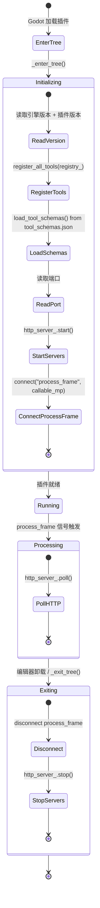

# 编辑器插件（`McpEditorPlugin`）

> `godot_mcp_gdext.dll` 的生命周期管理。

### 生命周期



### `_enter_tree()` 初始化

```cpp
// McpEditorPlugin 的 McpHandler 通过构造函数传入 registry_ 指针：
// McpHandler mcp_handler_{&registry_};

void McpEditorPlugin::_enter_tree() {
    if (!Engine::get_singleton()->is_editor_hint()) return;
    
    registry_.set_engine_version(...);     // 引擎版本
    registry_.set_plugin_version(GODOT_MCP_PLUGIN_VERSION);  // 编译时版本
    
    register_all_tools(registry_);         // 注册所有工具
    
    load_tool_schemas();                   // 从 tool_schemas.json 加载描述和 schema
    
    int http_port = read_env("GODOT_MCP_HTTP_PORT", 9600);
    
    http_server_.start(http_port, &mcp_handler_);  // 只传 McpHandler 指针
    
    SceneTree *tree = Object::cast_to<SceneTree>(get_tree());
    tree->connect("process_frame", callable_mp(this, &McpEditorPlugin::_on_process_frame));
}
```

### `_on_process_frame()` 每帧执行

```cpp
void McpEditorPlugin::_on_process_frame() {
    if (!started_) return;
    http_server_.poll();   // MCP HTTP: 解析 HTTP 请求 + 会话管理 + SSE 刷新
}
```

### `_exit_tree()` 清理

```cpp
void McpEditorPlugin::_exit_tree() {
    if (!started_) return;
    tree->disconnect("process_frame", callable_mp(this, &McpEditorPlugin::_on_process_frame));
    http_server_.stop();
}
```

### 关键设计

- **HTTP 服务器**: HttpServer (`:9600`, MCP Streamable HTTP)
- **端口**：通过 `GODOT_MCP_HTTP_PORT` 环境变量覆盖
- **`process_frame` 而非 `_process()`**：`EditorPlugin::_process()` 在场景播放时停止触发。`SceneTree::process_frame` 信号在场景播放时继续触发，确保实时工具（如 `play_current_scene`、`stop_scene`）正常工作
- **启动条件**：`EditorPlugin::_enter_tree()` 首先检查 `Engine::get_singleton()->is_editor_hint()`——非编辑器模式直接返回
- **Schema 加载**: `tool_schemas.json` 提供工具描述和 JSON Schema，C++ 侧不需要硬编码这些信息
