# 编辑器插件（`McpEditorPlugin`）

> `godot_mcp_gdext.dll` 的生命周期管理。

## 生命周期

```mermaid
stateDiagram-v2
    [*] --> EnterTree: Godot 加载插件

    EnterTree --> Initializing: _enter_tree()

    state Initializing {
        [*] --> ReadVersion: 读取引擎版本 + 插件版本
        ReadVersion --> RegisterTools: register_itools(registry_)
        RegisterTools --> InitSDK: McpToolRegistry 单例 + 注入 HandlerRegistry
        InitSDK --> WireBridge: registry_.set_runtime_bridge + bridge_server
        WireBridge --> RegisterSettings: register_project_settings()
        RegisterSettings --> LoadConfig: load_config() ProjectSettings → 环境变量
        LoadConfig --> PortFallback: for 循环尝试 10 个端口
        PortFallback --> StartBridgeServer: bridge_server_.start()
        PortFallback --> StartHTTPServer: http_server_.start(port, handler, host)
        StartHTTPServer --> InitConfirmDialog: McpConfirmDialog 初始化
        InitConfirmDialog --> InitLogger: McpLogger 初始化 + rotate()
        InitLogger --> CreateUI: McpConsole (底部面板)
        CreateUI --> Ready: started_ = true
        Ready --> [*]
    }

    Initializing --> Running: 插件就绪

    Running --> Processing: _process(delta) 每帧调用

    state Processing {
        [*] --> PollHTTP: http_server_.poll()
        PollHTTP --> CheckDialog: pending_dialog_op_ 确认对话框状态机
        CheckDialog --> CheckTimeouts: mcp_handler_.check_pending_timeouts()
        CheckTimeouts --> PollBridge: bridge_server_.poll()
        PollBridge --> [*]
    }

    Processing --> Exiting: 编辑器卸载 / _exit_tree()

    state Exiting {
        [*] --> RemoveUI: 移除并销毁 Console
        RemoveUI --> CleanupSDK: McpToolRegistry 断连 + 注销单例
        CleanupSDK --> DisconnectBridge: bridge_server_.stop() + runtime_bridge_.disconnect()
        DisconnectBridge --> StopServer: http_server_.stop()
        StopServer --> [*]
    }

    Exiting --> [*]
```



## `load_config()` 端口与主机配置

`load_config()`（`editor_plugin.cpp:57-93`）首先调用 `register_project_settings()`（`editor_plugin.cpp:95-130`）注册所有 ProjectSettings 键，然后按**优先级**读取配置：

| 配置项 | ProjectSettings 键 | 环境变量 | 默认值 |
|--------|-------------------|----------|--------|
| HTTP 端口 | `godot_mcp/http_port` | `GODOT_MCP_HTTP_PORT` | `9600` |
| HTTP 主机 | `godot_mcp/http_host` | `GODOT_MCP_HTTP_HOST` | `127.0.0.1` |
| 桥接端口 | `godot_mcp/bridge_port` | `GODOT_MCP_BRIDGE_PORT` | `9601` |
| 日志目录 | `godot_mcp/log_dir` | — | `res://.mcp_logs` |
| 最大日志条数 | `godot_mcp/max_log_entries` | — | `500` |

**优先级**：ProjectSettings 值存在且类型匹配 → 使用；否则降级到环境变量 → 再降级到默认值。

## `restart_server()` 重启逻辑

`restart_server()`（`editor_plugin.cpp:142-175`）：

`http_server_.stop()` → `bridge_server_.stop()` → `load_config()` → 端口回退循环（尝试 10 个端口起始于 `http_port_`）→ `http_server_.start(try_port, handler, host)` → `http_server_.set_test_engine()` → `bridge_server_.set_port(actual_bridge_port_)` → `bridge_server_.start()` → `runtime_bridge_.set_port(actual_bridge_port_)` → `started_ = true`

由 `McpConsole` UI 在用户修改端口设置后调用。端口回退循环确保配置端口被占时自动尝试下一个。

## `_enter_tree()` 初始化

```cpp
void McpEditorPlugin::_enter_tree() {
    if (!Engine::get_singleton()->is_editor_hint()) return;
    if (started_) return;

    registry_.set_engine_version(Engine::get_singleton()->get_version_info().get("string", String()));
    registry_.set_plugin_version(String(GODOT_MCP_PLUGIN_VERSION));
    register_itools(registry_);                          // X-macro 注册所有内置 ITool

    // 运行时桥接注入
    registry_.set_runtime_bridge(&runtime_bridge_);
    registry_.set_runtime_bridge_server(&bridge_server_);

    load_config();                                       // ProjectSettings → 环境变量
    runtime_bridge_.set_port(bridge_port_);
    bridge_server_.set_port(bridge_port_);

    // Wire up RuntimeBridgeServer → McpHandler
    bridge_server_.set_mcp_handler(&mcp_handler_);
    mcp_handler_.set_bridge_server(&bridge_server_);

    // RuntimeBridgeServer response callback → McpHandler enqueue_event
    bridge_server_.set_response_callback([this](const Dictionary &response) { ... });

    // 端口回退循环：尝试 http_port_ + 0..9
    for (int i = 0; i < kMaxPortAttempts; ++i) {
        const int try_port = http_port_ + i;
        if (http_server_.start(try_port, &mcp_handler_, http_host_) == OK) {
            actual_http_port_ = try_port;
            actual_bridge_port_ = bridge_port_ + i;
            break;
        }
    }

    bridge_server_.start(actual_bridge_port_);

    // SDK 单例注入
    McpToolRegistry *sdk_registry = McpToolRegistry::get_singleton();
    sdk_registry->set_handler_registry(&registry_);
    sdk_registry->set_mcp_handler(&mcp_handler_);
    Engine::get_singleton()->register_singleton("McpToolRegistry", sdk_registry);

    // 确认对话框（破坏性操作拦截）
    confirm_dialog_ = memnew(McpConfirmDialog);
    confirm_dialog_->connect("confirmed", Callable(this, "_on_confirm_allow"));
    // ... deny, allow_all_session
    mcp_handler_.set_confirm_callback([this](const PendingDestructiveOp &op) {
        pending_dialog_op_ = op;
    });

    http_server_.set_test_engine(&test_engine_);
    logger_.rotate();
    mcp_handler_.set_log_callback(...);                  // ToolCallLog → logger_.append()

    mcp_console_ = memnew(McpConsole);
    mcp_console_->set_logger(&logger_);
    mcp_console_->set_registry(&registry_);
    mcp_console_->set_plugin(this);
    logger_.set_log_callback(...);
    add_control_to_bottom_panel(mcp_console_, "MCP Console");

    started_ = true;
}
```

> 完整实现见 `editor_plugin.cpp:177-311`。

## `_process()` 每帧执行

```cpp
void McpEditorPlugin::_process(double /*delta*/) {
    if (!started_) return;

    http_server_.poll();                                 // MCP HTTP: 解析 + 流式通知

    if (pending_dialog_op_.has_value()) {                // 确认对话框状态机
        confirm_dialog_->show_for_op(
            pending_dialog_op_->jsonrpc_id,
            pending_dialog_op_->tool_name,
            pending_dialog_op_->arguments);
        pending_dialog_op_.reset();
    }

    mcp_handler_.check_pending_timeouts(kConfirmTimeoutMs);
    bridge_server_.poll();                               // 推进桥接服务端轮询
}
```

> 完整实现见 `editor_plugin.cpp:353-369`。

## `_exit_tree()` 清理

```cpp
void McpEditorPlugin::_exit_tree() {
    if (!started_) return;

    mcp_handler_.set_log_callback(nullptr);
    logger_.set_log_callback(nullptr);

    McpToolRegistry *sdk_registry = McpToolRegistry::get_singleton();
    if (sdk_registry) {
        sdk_registry->set_handler_registry(nullptr);
        sdk_registry->set_mcp_handler(nullptr);
    }

    if (mcp_console_) {
        remove_control_from_bottom_panel(mcp_console_);
        memdelete(mcp_console_);
        mcp_console_ = nullptr;
    }

    if (confirm_dialog_) {
        confirm_dialog_->queue_free();
        confirm_dialog_ = nullptr;
    }
    mcp_handler_.set_confirm_callback(nullptr);
    mcp_handler_.reset_session_flags();

    bridge_server_.stop();
    runtime_bridge_.disconnect();
    http_server_.stop();

    if (sdk_registry) {
        Engine::get_singleton()->unregister_singleton("McpToolRegistry");
        memdelete(sdk_registry);
    }

    started_ = false;
}
```

> 完整实现见 `editor_plugin.cpp:313-351`。

## 关键设计

- **HTTP 服务器**：`HttpServer::start(uint16_t port, McpHandler *handler, const String &bind_address)` 返回 `Error`（`http_server.hpp:40`）。端口 `:9600`，MCP Streamable HTTP。
- **`_process()` 驱动轮询**：非 `_on_process_frame` 信号。`EditorPlugin::_process()` 在场景播放时仍触发。每帧执行 `http_server_.poll()` + `bridge_server_.poll()` + 确认对话框状态机。
- **运行时桥接**：`bridge_server_.poll()`（`editor_plugin.cpp:368`）在 _process 中推进桥接服务端轮询。`RuntimeBridge` 为遗留客户端实例，供运行时工具通过 `registry_` 调用。
- **端口回退**：初始化时自动尝试 `http_port_` + 0..9 共 10 个端口，避免端口冲突导致启动失败。
- **破坏性操作确认**：`McpConfirmDialog` + `pending_dialog_op_` 状态机实现异步确认，30 秒超时自动拒绝。
- **重入保护**：`HttpServer::polling_` 标志防止 `EditorProgress` → `Main::iteration()` 递归重入。
- **Schema 自描述**：每个 ITool 通过 `input_schema()` 提供自身 JSON Schema，无需外部配置文件。
- **SDK 初始化**：`McpToolRegistry` 单例在初始化时注入 `HandlerRegistry` 和 `McpHandler` 指针，供 GDScript 自定义工具使用。

## 组合成员

| 成员 | 类型 | 用途 |
|---|---|---|---|
| `registry_` | `HandlerRegistry` | 工具注册表 |
| `mcp_handler_` | `McpHandler` | MCP 协议处理（构造时注入 `&registry_`） |
| `http_server_` | `HttpServer` | HTTP 传输层 |
| `test_engine_` | `TestEngine` | YAML 测试引擎（构造时注入 `&registry_`） |
| `bridge_server_` | `RuntimeBridgeServer` | 运行时桥接服务端（TCPServer） |
| `runtime_bridge_` | `RuntimeBridge` | 运行时桥接客户端（遗留，供运行时工具使用） |
| `logger_` | `McpLogger` | MCP 调用日志记录 |
| `mcp_console_` | `McpConsole*` | 底部面板日志 UI |
| `confirm_dialog_` | `McpConfirmDialog*` | 破坏性操作确认对话框 |
| `pending_dialog_op_` | `std::optional<PendingDestructiveOp>` | 待处理的确认操作 |
| `http_port_` | `int` | HTTP 端口（默认 9600） |
| `bridge_port_` | `int` | 桥接端口（默认 9601） |
| `actual_http_port_` | `int` | 实际使用的 HTTP 端口（回退后） |
| `actual_bridge_port_` | `int` | 实际使用的桥接端口（回退后） |
| `http_host_` | `String` | HTTP 绑定地址（默认 127.0.0.1） |
| `started_` | `bool` | 插件是否已启动 |
