# 编辑器插件（`McpEditorPlugin`）

> `godot_mcp_gdext.dll` 的生命周期管理。

## 生命周期

```mermaid
stateDiagram-v2
    [*] --> EnterTree: Godot 加载插件

    EnterTree --> Initializing: _enter_tree()

    state Initializing {
        [*] --> ReadVersion: 读取引擎版本 + 插件版本
        ReadVersion --> RegisterTools: register_itools(registry_)
        RegisterTools --> InitSDK: McpToolRegistry 单例 + 注入 HandlerRegistry
        InitSDK --> WireBridge: registry_.set_runtime_bridge(&runtime_bridge_)
        WireBridge --> LoadConfig: load_config() ProjectSettings → 环境变量
        LoadConfig --> StartServer: http_server_.start(port, handler, host)
        StartServer --> InitLogger: McpLogger 初始化 + rotate()
        InitLogger --> CreateUI: McpDock (右栏) + McpConsole (底部面板)
        CreateUI --> Ready: started_ = true
        Ready --> [*]
    }

    Initializing --> Running: 插件就绪

    Running --> Processing: _process(delta) 每帧调用

    state Processing {
        [*] --> RestartCheck: pending_restart_ 轮询
        RestartCheck --> PollHTTP: http_server_.poll()
        PollHTTP --> TryBridge: _try_bridge_connect()
        TryBridge --> PollBridge: runtime_bridge_.poll()
        PollBridge --> [*]
    }

    Processing --> Exiting: 编辑器卸载 / _exit_tree()

    state Exiting {
        [*] --> RemoveUI: 移除并销毁 Dock + Console
        RemoveUI --> DisconnectBridge: runtime_bridge_.disconnect()
        DisconnectBridge --> StopServer: http_server_.stop()
        StopServer --> [*]
    }

    Exiting --> [*]
```



## `load_config()` 端口与主机配置

`load_config()`（`editor_plugin.cpp:46-74`）按**优先级**读取配置：

| 配置项 | ProjectSettings 键 | 环境变量 | 默认值 |
|--------|-------------------|----------|--------|
| HTTP 端口 | `godot_mcp/http_port` | `GODOT_MCP_HTTP_PORT` | `9600` |
| HTTP 主机 | `godot_mcp/http_host` | `GODOT_MCP_HTTP_HOST` | `127.0.0.1` |
| 桥接端口 | `godot_mcp/bridge_port` | `GODOT_MCP_BRIDGE_PORT` | `9601` |

**优先级**：ProjectSettings 值存在且类型匹配 → 使用；否则降级到环境变量 → 再降级到默认值。

首次运行时（ProjectSettings 中 `godot_mcp/http_port` 不存在），自动调用 `save_config()` 持久化默认值（`editor_plugin.cpp:71-73`）。

## `restart_server()` 重启逻辑

`restart_server(bool force)`（`editor_plugin.cpp:84-101`）：

- **有未完成请求且非 force**：设置 `pending_restart_ = true`，`_process()` 中每帧检查，等待请求完成或超时（`kRestartTimeoutSec = 10s`）后强制重启
- **force 或无未完成请求**：`http_server_.stop()` → `runtime_bridge_.disconnect()` → `load_config()` → `http_server_.start(port, handler, host)` → `runtime_bridge_.set_port(bridge_port_)`

由 `McpDock` UI 在用户修改端口设置后调用。

## `_enter_tree()` 初始化

```cpp
void McpEditorPlugin::_enter_tree() {
    if (!Engine::get_singleton()->is_editor_hint()) return;

    registry_.set_engine_version(...);
    registry_.set_plugin_version(String(GODOT_MCP_PLUGIN_VERSION));
    register_itools(registry_);                          // X-macro 注册所有内置 ITool

    // SDK 单例注入
    McpToolRegistry *sdk_registry = McpToolRegistry::get_singleton();
    sdk_registry->set_handler_registry(&registry_);
    sdk_registry->set_mcp_handler(&mcp_handler_);

    // 运行时桥接注入
    registry_.set_runtime_bridge(&runtime_bridge_);

    load_config();                                       // ProjectSettings → 环境变量
    runtime_bridge_.set_port(bridge_port_);

    // start(port, mcp_handler, bind_address) — 3 参数
    if (http_server_.start(http_port_, &mcp_handler_, http_host_) != OK) return;
    http_server_.set_test_engine(&test_engine_);
    started_ = true;

    // McpLogger 初始化
    logger_.set_log_dir(...); logger_.set_max_entries(...); logger_.rotate();
    mcp_handler_.set_log_callback(...);                  // ToolCallLog → logger_.append()

    // UI
    mcp_dock_ = memnew(McpDock); add_control_to_dock(DOCK_SLOT_RIGHT_UL, mcp_dock_);
    mcp_console_ = memnew(McpConsole); add_control_to_bottom_panel(mcp_console_, "MCP Console");
}
```

> 完整实现见 `editor_plugin.cpp:103-181`。

## `_process()` 每帧执行

```cpp
void McpEditorPlugin::_process(double delta) {
    if (!started_) return;

    if (pending_restart_) {                              // 延迟重启轮询
        bool timed_out = Time::get_singleton()->get_ticks_msec() / 1000.0 > restart_deadline_;
        if (force_restart_ || !mcp_handler_.has_pending_requests() || timed_out)
            restart_server(true);
    }

    http_server_.poll();                                 // MCP HTTP: 解析 + 流式通知
    _try_bridge_connect();                               // 检测游戏启停，自动连接/断开
    runtime_bridge_.poll();                              // 推进桥接连接状态机
}
```

> 完整实现见 `editor_plugin.cpp:205-221`。

## `_exit_tree()` 清理

```cpp
void McpEditorPlugin::_exit_tree() {
    if (!started_) return;

    // UI 清理
    remove_control_from_docks(mcp_dock_);     memdelete(mcp_dock_);
    remove_control_from_bottom_panel(mcp_console_);  memdelete(mcp_console_);

    runtime_bridge_.disconnect();
    http_server_.stop();
    started_ = false;
}
```

> 完整实现见 `editor_plugin.cpp:183-203`。

## 关键设计

- **HTTP 服务器**：`HttpServer::start(uint16_t port, McpHandler *handler, const String &bind_address)` 返回 `Error`（`http_server.hpp:40`）。端口 `:9600`，MCP Streamable HTTP。
- **`_process()` 驱动轮询**：非 `_on_process_frame` 信号。`EditorPlugin::_process()` 在场景播放时仍触发，`_try_bridge_connect()` 通过 `ei->is_playing_scene()` 检测游戏运行状态。
- **运行时桥接**：`_try_bridge_connect()`（`editor_plugin.cpp:223-236`）每帧检测 `ei->is_playing_scene()`，游戏启动时 `runtime_bridge_.connect()`（无参数），游戏停止时 `disconnect()`。
- **重入保护**：`HttpServer::polling_` 标志防止 `EditorProgress` → `Main::iteration()` 递归重入。
- **Schema 自描述**：每个 ITool 通过 `input_schema()` 提供自身 JSON Schema，无需外部配置文件。
- **SDK 初始化**：`McpToolRegistry` 单例在初始化时注入 `HandlerRegistry` 和 `McpHandler` 指针，供 GDScript 自定义工具使用。

## 组合成员

| 成员 | 类型 | 用途 |
|---|---|---|
| `registry_` | `HandlerRegistry` | 工具注册表 |
| `mcp_handler_` | `McpHandler` | MCP 协议处理（构造时注入 `&registry_`） |
| `http_server_` | `HttpServer` | HTTP 传输层 |
| `test_engine_` | `TestEngine` | YAML 测试引擎（构造时注入 `&registry_`） |
| `runtime_bridge_` | `RuntimeBridge` | 运行时桥接客户端 |
| `logger_` | `McpLogger` | MCP 调用日志记录 |
| `mcp_dock_` | `McpDock*` | 右栏 Dock UI |
| `mcp_console_` | `McpConsole*` | 底部面板日志 UI |
| `http_port_` | `int` | HTTP 端口（默认 9600） |
| `bridge_port_` | `int` | 桥接端口（默认 9601） |
| `http_host_` | `String` | HTTP 绑定地址（默认 127.0.0.1） |
| `started_` | `bool` | 插件是否已启动 |
| `game_was_running_` | `bool` | 上一帧游戏是否运行（边缘检测） |
| `pending_restart_` | `bool` | 是否有待重启 |
| `force_restart_` | `bool` | 是否强制重启 |
| `restart_deadline_` | `double` | 重启超时截止时间戳 |
| `kRestartTimeoutSec` | `constexpr double` | 重启超时（10s） |
