# 编辑器插件（`McpEditorPlugin`）

> `godot_mcp_gdext.dll` 的生命周期管理。

### 生命周期

```mermaid
stateDiagram-v2
    [*] --> EnterTree: Godot 加载插件
    
    EnterTree --> Initializing: _enter_tree()
    
    state Initializing {
        [*] --> ReadVersion: 读取引擎版本 + 插件版本
        ReadVersion --> RegisterTools: register_all_tools(registry_)
        RegisterTools --> LoadSchemas: load_tool_schemas() from tool_schemas.json
        LoadSchemas --> ReadPort: 读取端口
        ReadPort --> StartServers: ws_server_.start() + http_server_.start()
        StartServers --> ConnectProcessFrame: connect("process_frame", callable_mp)
        ConnectProcessFrame --> [*]
    }
    
    Initializing --> Running: 插件就绪
    
    Running --> Processing: process_frame 信号触发
    
    state Processing {
        [*] --> PollWS: ws_server_.poll()
        PollWS --> PollHTTP: http_server_.poll()
        PollHTTP --> [*]
    }
    
    Processing --> Exiting: 编辑器卸载 / _exit_tree()
    
    state Exiting {
        [*] --> Disconnect: disconnect process_frame
        Disconnect --> StopServers: ws_server_.stop() + http_server_.stop()
        StopServers --> [*]
    }
    
    Exiting --> [*]
```



### `_enter_tree()` 初始化

```cpp
void McpEditorPlugin::_enter_tree() {
    if (!Engine::get_singleton()->is_editor_hint()) return;
    
    registry_.set_engine_version(...);     // 引擎版本
    registry_.set_plugin_version(GODOT_MCP_PLUGIN_VERSION);  // 编译时版本
    
    register_all_tools(registry_);         // 注册 16 组活跃工具 (115 个)
    
    load_tool_schemas();                   // 从 tool_schemas.json 加载描述和 schema
    
    int ws_port = read_env("GODOT_MCP_PORT", 9500);
    int http_port = read_env("GODOT_MCP_HTTP_PORT", 9600);
    
    ws_server_.start(ws_port, &registry_);
    mcp_handler_.set_registry(&registry_);
    http_server_.start(http_port, &registry_, &mcp_handler_);
    
    SceneTree *tree = Object::cast_to<SceneTree>(get_tree());
    tree->connect("process_frame", callable_mp(this, &McpEditorPlugin::_on_process_frame));
}
```

### `_on_process_frame()` 每帧执行

```cpp
void McpEditorPlugin::_on_process_frame() {
    if (!started_) return;
    ws_server_.poll();     // Legacy WebSocket: 接受连接 + 处理 IPC 消息
    http_server_.poll();   // MCP HTTP: 解析 HTTP 请求 + 会话管理 + SSE 刷新
}
```

### `_exit_tree()` 清理

```cpp
void McpEditorPlugin::_exit_tree() {
    if (!started_) return;
    tree->disconnect("process_frame", callable_mp(this, &McpEditorPlugin::_on_process_frame));
    ws_server_.stop();
    http_server_.stop();
}
```

### 关键设计

- **双服务器**: WsServer (`:9500`, legacy IPC) + HttpServer (`:9600`, MCP Streamable HTTP)
- **端口**：通过 `GODOT_MCP_PORT`（WS）和 `GODOT_MCP_HTTP_PORT`（HTTP）环境变量覆盖
- **`process_frame` 而非 `_process()`**：`EditorPlugin::_process()` 在场景播放时停止触发。`SceneTree::process_frame` 信号在场景播放时继续触发，确保实时工具（如 `play_current_scene`、`stop_scene`）正常工作
- **启动条件**：`EditorPlugin::_enter_tree()` 首先检查 `Engine::get_singleton()->is_editor_hint()`——非编辑器模式直接返回
- **Schema 加载**: `tool_schemas.json`（由构建系统从 `registry.py` 生成）提供工具描述和 JSON Schema，C++ 侧不需要硬编码这些信息
