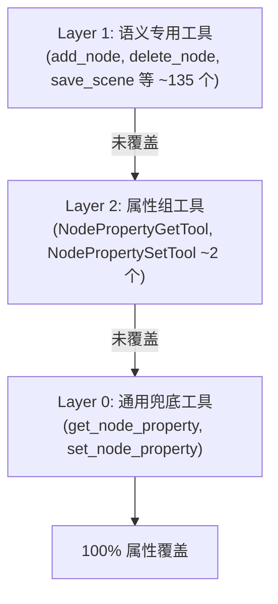

# 通用兜底工具（Layer 0）

> 四层工具体系的最底层。当没有语义专用工具或属性组工具覆盖某个属性时，这两个通用工具提供兜底读写能力。

## 工具列表

| 工具 | 功能 | 文件 |
|------|------|------|
| `get_node_property` | 按名称读取任意节点属性 | `node_properties/fallback_tools.hpp` |
| `set_node_property` | 按名称写入任意节点属性（带 Undo） | `node_properties/fallback_tools.hpp` |

## 设计原理



- **Layer 1**（语义专用）：场景树 CRUD、文件系统、脚本、工作区等命名操作
- **Layer 2**（属性组）：按节点类型批量生成 get/set 工具（当前使用通用模板 `NodePropertyGetTool`/`NodePropertySetTool`）
- **Layer 0**（通用兜底）：任意属性名 + 任意值类型，确保引擎升级新增属性时零维护

## 实现细节

### `get_node_property`

```cpp
Dictionary execute_impl(const ToolContext &ctx) override {
    String prop = args_string(ctx.args, "property");
    Variant val = ctx.node->get(prop);
    data["value"] = variant_to_json(val);
    return ToolResult::ok(data);
}
```

### `set_node_property`

```cpp
Dictionary execute_impl(const ToolContext &ctx) override {
    Variant new_val = json_to_variant(ctx.args["value"]);
    undoable_set(ctx.node, prop, new_val, ...);
    data["value"] = variant_to_json(ctx.node->get(prop));
    return ToolResult::ok(data);
}
```

### `json_to_variant` 支持的 Resource 引用

`json_to_variant`（`cmd_utils_json.cpp:218`）支持通过 `{"path": "res://icon.svg"}` 加载 Resource：

```cpp
if (d.has("path") && !d.has("x") && !d.has("r") && !d.has("position")) {
    const String path = d["path"];
    if (!path.is_empty()) {
        return ResourceLoader::get_singleton()->load(path);
    }
}
```

## 注意事项

- `set_node_property` 的 `value` 参数 schema **不应声明 `"type": "object"`**，否则 string 值会被 `ITool::execute()` 的类型检查拒绝
- `json_to_variant` 支持 `{"x":1,"y":2}` → Vector2、`{"r":1,"g":0.5,"b":0.2}` → Color 等自动类型推断
- 所有操作通过 `undoable_set()` 注册撤销，支持 Ctrl+Z
