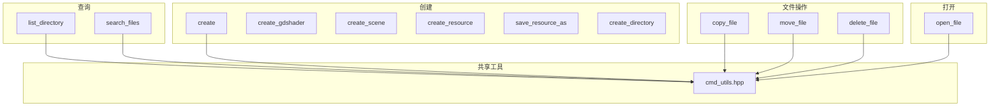

# 文件系统工具

> 与 Godot 编辑器文件系统面板交互的工具集，支持文件/目录 CRUD、场景/资源/着色器创建、文件搜索等。12 个工具，位于 `extensions/src/built_in/tools/editor_tools/filesystem/`。

## 工具列表

| 工具名 | 文件 | 功能 |
|--------|------|------|
| `list_directory` | `list_directory.hpp` | 列出目录内容（支持扩展名过滤、排除 addons） |
| `create_directory` | `create_directory.hpp` | 创建目录 |
| `create` | `create.hpp` | 通用文件创建（指定文件名和内容） |
| `create_gdshader` | `create_gdshader.hpp` | 创建 GDShader 文件 |
| `create_scene` | `create_scene.hpp` | 创建场景文件 |
| `create_resource` | `create_resource.hpp` | 创建资源文件 |
| `save_resource_as` | `save_resource_as.hpp` | 将资源另存到指定路径 |
| `open_file` | `open_file.hpp` | 在编辑器中打开文件 |
| `copy_file` | `copy_file.hpp` | 复制文件/目录 |
| `move_file` | `move_file.hpp` | 移动文件/目录 |
| `delete_file` | `delete_file.hpp` | 删除文件/目录 |
| `search_files` | `search_files.hpp` | 按名称模式搜索文件 |

## 依赖关系

## 关键实现细节

### 路径校验

`filesystem_utils.hpp` 提供 `validate_res_path()` 函数，确保所有路径操作在 `res://` 范围内，防止越界访问。

### 递归复制

`copy_file` 支持目录递归复制，使用 `DirAccess::copy_dir()` 或逐文件遍历复制。

### 文件系统通知

所有写操作后调用 `notify_file_changed(path)` 通知编辑器刷新文件系统面板。

### 脚本模板

`create_gd_script` 和 `create_csharp_script` 使用 Godot 的脚本模板系统（`script_templates_search_path` 设置），而非硬编码模板内容。

## 注册

所有工具通过 X-macro 注册（`register/register_existing.hpp`），category 为 `editor_tools/filesystem`。
