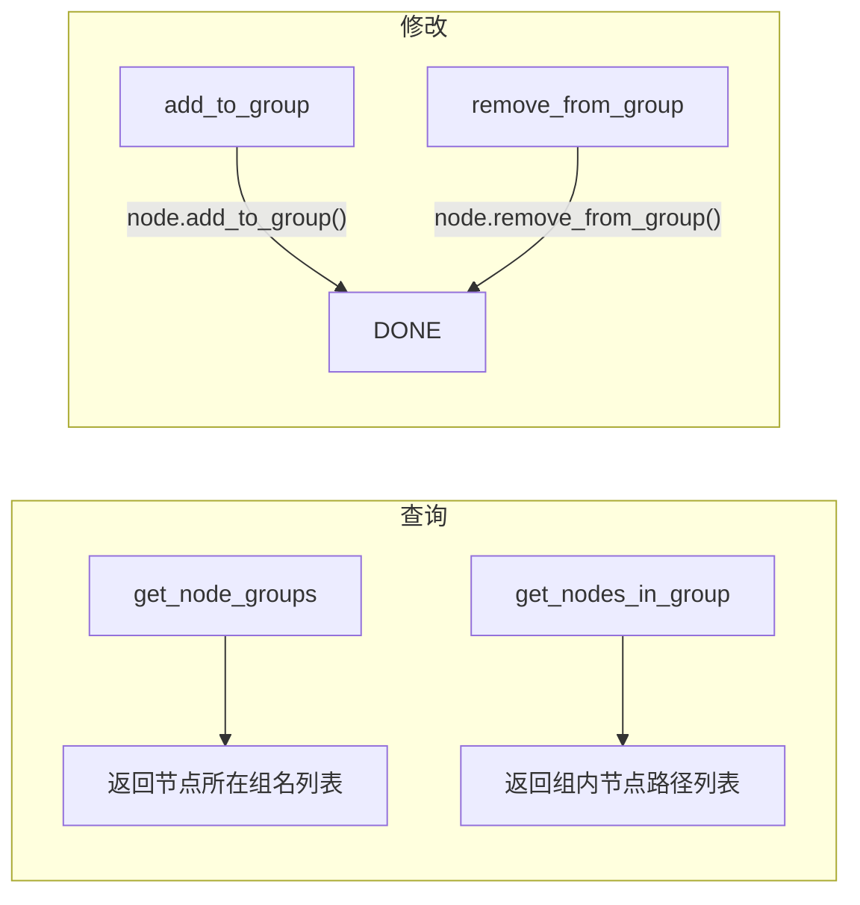

# 分组管理工具

> 管理 Godot 节点分组的工具集，用于将节点组织到逻辑组中以便批量操作。

## 工具列表

4 个工具，位于 `extensions/src/built_in/tools/group/`，category 均为 `node_tools/group`。

| 工具名 | 文件 | 功能 |
|--------|------|------|
| `add_to_group` | `add_to_group.hpp` | 将指定节点添加到组 |
| `remove_from_group` | `remove_from_group.hpp` | 从组中移除节点 |
| `get_nodes_in_group` | `get_nodes_in_group.hpp` | 列出组内所有节点 |
| `get_node_groups` | `get_node_groups.hpp` | 列出节点的所有分组 |

## 依赖关系



## 注册

全部通过 X-macro 注册（`register/register_existing.hpp`）。

## Godot API 映射

| 工具 | Godot API |
|------|-----------|
| `add_to_group` | `Node::add_to_group(group_name, persistent=true)` |
| `remove_from_group` | `Node::remove_from_group(group_name)` |
| `get_nodes_in_group` | `SceneTree::get_nodes_in_group(group_name)` → `Array[Node]` |
| `get_node_groups` | `Node::get_groups()` → `PackedStringArray` |

## 参数示例

```yaml
# add_to_group
args:
  node_path: "Root/Player"
  group_name: "enemies"
  persistent: true    # 可选，默认 true

# get_nodes_in_group
args:
  group_name: "enemies"
```
