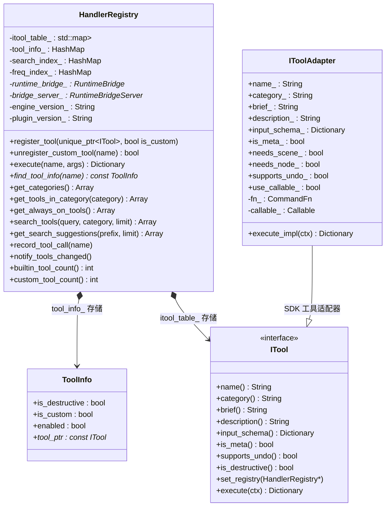
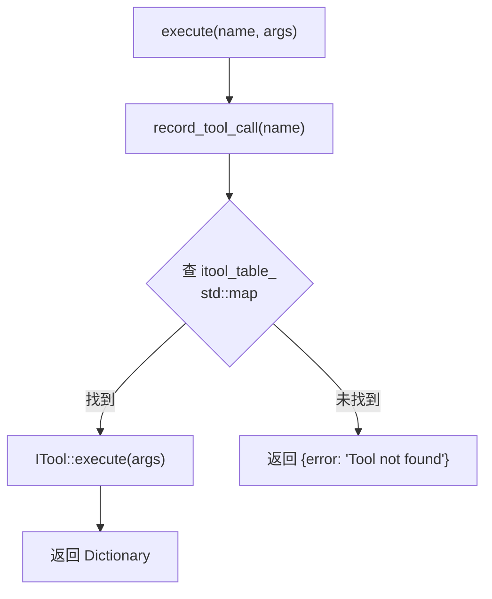
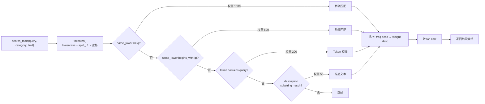
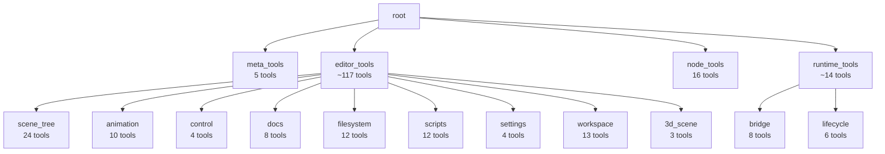

# HandlerRegistry — 中央命令注册表

> `extensions/src/server/registry/handler_registry.hpp` + `handler_registry.cpp`

所有 `ITool` 的分发、搜索、分类、双重分发（内置 X-macro 工具 + SDK 自定义工具）统一由 `HandlerRegistry` 管理。

## 类图



## 工具注册

### 注册流程

`register_tool()` (`handler_registry.cpp`) 接收 `unique_ptr<ITool>`：

1. 注入 registry 指针 — `tool->set_registry(this)`（元工具需要回调查询）
2. 通过 `ITool` 虚方法读取 name、category、brief、description、input_schema、is_meta 等
3. 填充 `ToolInfo` 结构体并存到 `tool_info_` HashMap
4. 构建 `search_index_`（预 tokenize name + brief + description）
5. 设 `categories_dirty_ = true` 标记分类树需重建
6. 调用 `notify_tools_changed()` 通知变化
7. 将 `unique_ptr<ITool>` 移至 `itool_table_`（`std::map`，支持不可复制的 unique_ptr）

`unregister_custom_tool(name)` (`handler_registry.cpp`) 移除 SDK 注册的工具并重建搜索索引。

### 内置工具注册

X-macro 宏定义于 `register_itools.cpp`：

```cpp
#define GODOT_MCP_TOOL(cls, is_destructive_val) \
    { \
        auto tool = std::make_unique<cls>(); \
        tool->set_is_destructive(is_destructive_val); \
        reg.register_tool(std::move(tool)); \
    }
```

`register_itools()` (`register_itools.cpp`) 通过 `#include` 4 个 X-macro 文件展开所有工具注册。

### SDK 工具注册

SDK 自定义工具通过 `McpToolRegistry` → `IToolAdapter`（`tool_adapter.hpp`）包装为 `ITool` 子类后调用同一 `register_tool()`，自动添加 `custom_` 前缀。

## 工具执行

`execute(name, args)` (`handler_registry.cpp`)：

1. 调用 `record_tool_call(name)` 记录调用频率
2. 在 `itool_table_` 中查找工具
3. 调用 `ITool::execute(args)`，返回结果
4. 工具不存在时返回 `{"error": "Tool not found: <name>"}`

> **注意**：当前 `execute()` 不包含 undo/redo 逻辑。工具的撤销能力通过各自的 `undoable_set()` 等函数内部实现，不由 HandlerRegistry 统一管理。



## 搜索引擎

### 搜索匹配流程



### 方法明细

| 方法 | 功能 |
|------|------|
| `tokenize(text)` | lowercase + 按 `_` `/` `.` `-` 空格 拆分 |
| `search_tools(query, category, limit)` | 四层权重匹配 → 排序 → 截断 |
| `get_search_suggestions(prefix, limit)` | 两阶段前缀匹配（name → token），按频率排序 |
| `record_tool_call(name)` | 频率计数器，影响搜索排序 |

## 分类树

`get_categories()` (`handler_registry.cpp`) 从所有工具的 `category` 字段（斜杠分隔路径）构建树形结构。



- 每个节点包含 `direct`（直接挂载数量）和 `total`（含子分类）
- 描述来自工具的 `category_description()`，一条工具链上仅取第一个非空值
- `prettify_segment()` (`handler_registry.cpp`) 自动美化：`editor_tools` → `Editor Tools`，`3d` → `3D`
- 输出按 name 字母排序

## 双重分发架构

```mermaid
component
    subgraph GDREGISTER["GDREGISTER 注册层"]
        GDCLASS["GDREGISTER + EditorPlugin"]
        SDK_CLASSES["McpToolDefinition<br/>McpToolRegistry"]
    end

    subgraph HANDLER["HandlerRegistry 调度层"]
        ITBL["itool_table_<br/>std::map&lt;String, unique_ptr&lt;ITool&gt;&gt;"]
        TOOLINFO["tool_info_<br/>HashMap&lt;String, ToolInfo&gt;"]
        SEARCH["search_index_<br/>freq_index_"]
    end

    subgraph BUILTIN["内置工具层"]
        XMACRO["X-macro #include"]
        ITOOLS["ITool 子类<br/>(152 个)"]
    end

    subgraph SDK["SDK 工具层"]
        REGISTRY["McpToolRegistry"]
        ADAPTER["IToolAdapter<br/>(CommandFn/Callable 包装)"]
    end

    XMACRO --> ITOOLS
    ITOOLS -->|"register_tool()"| ITBL
    REGISTRY -->|"register_tool(name, cmd_fn)"| ADAPTER
    ADAPTER -->|"register_tool()<br/>is_custom=true"| ITBL

    ITBL -->|"execute() 查表分发"| ITOOLS
    ITBL -->|"execute() 查表分发"| ADAPTER
    GDCLASS --> SDK_CLASSES
    SDK_CLASSES --> REGISTRY
```

两条注册路径汇聚于同一张 `itool_table_` 表：

| 路径 | 注册方式 | 标识 |
|------|---------|------|
| 内置工具 | X-macro `GODOT_MCP_TOOL` → `ITool` 子类 → `register_tool()` | `is_custom=false` |
| SDK 工具 | `McpToolRegistry` → `IToolAdapter`（包装 `CommandFn`/`Callable`）→ `register_tool()` | `is_custom=true`，name 前缀 `custom_` |

## 关键文件引用

| 功能 | 文件 |
|------|------|
| `ToolInfo` 结构体 | `handler_registry.hpp` |
| `HandlerRegistry` 类定义 | `handler_registry.hpp` |
| `unregister_custom_tool()` | `handler_registry.cpp` |
| `register_tool()` | `handler_registry.cpp` |
| `execute()` | `handler_registry.cpp` |
| `get_categories()` | `handler_registry.cpp` |
| `prettify_segment()` | `handler_registry.cpp` |
| `tokenize()` | `handler_registry.cpp` |
| `record_tool_call()` | `handler_registry.cpp` |
| `search_tools()` | `handler_registry.cpp` |
| `get_search_suggestions()` | `handler_registry.cpp` |
| `GODOT_MCP_TOOL` X-macro | `register_itools.cpp` |
| `IToolAdapter` 类 | `tool_adapter.hpp` |
| `ITool` 接口 | `tool_base.hpp` |
