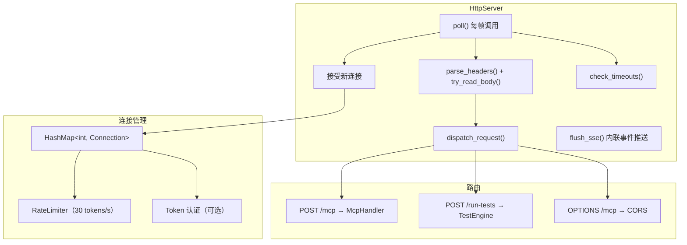
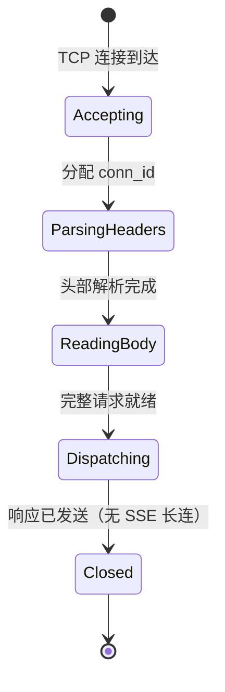

# HTTP 服务器（`HttpServer`）

> `extensions/src/server/ipc/http_server.cpp/.hpp` — MCP Streamable HTTP 传输层实现。

## 架构



## 连接生命周期



所有连接处理完一个请求后立即关闭（`keep_alive = false`），无持久 SSE 流。

## 关键设计

### 轮询驱动

`HttpServer::poll()` 由 `McpEditorPlugin::_process()` 每帧调用。**不是**异步事件驱动。

- `polling_` 标志防止重入（`EditorProgress → Main::iteration()` 场景）
- 每帧：接受新连接 → 读取数据 → 解析 HTTP → 分发请求 → 清理超时连接
- SSE 事件以内联方式在 `handle_post()` 中即时推送，不做持久流管理

### 连接管理

| 属性 | 值 |
|------|-----|
| 最大并发连接 | `kMaxConnections = 32`（`http_server.hpp:35`） |
| 连接超时 | 30 秒（`http_server.hpp:107`） |
| 最大请求体 | `kMaxBodyLength = 1 MB`（`http_server.hpp:38`） |
| 空闲超时 | 30 秒（`http_server.hpp:107`） |
| 速率限制 | 30 tokens/s，突发 30（`http_server.hpp:92-95`） |

### 速率限制

```cpp
struct RateLimiter {
    int tokens = 30;
    static constexpr int kMaxTokens = 30;
    static constexpr double kRefillRate = 30.0;
    bool try_consume(); // 返回 false 时返回 429
};
```

按连接**全局**限速，非 per-connection。

### Token 认证

通过环境变量 `GODOT_MCP_AUTH_TOKEN` 启用。客户端需在请求头携带 `Authorization: Bearer <token>`。使用常数时间比较防止时序侧信道攻击（`http_server.cpp:252-270`）。

### CORS

| 方法 | 值 |
|------|-----|
| `Access-Control-Allow-Methods` | `POST, OPTIONS` |
| `Access-Control-Allow-Headers` | `Content-Type, Accept, MCP-Protocol-Version` |
| `Access-Control-Expose-Headers` | `Last-Event-ID, MCP-Protocol-Version` |
| `Access-Control-Max-Age` | 86400 秒（24 小时） |

- `Access-Control-Allow-Origin` 通过 `validate_origin()` 和 `get_cors_origin()` 动态控制
- 仅允许 `localhost`、`127.0.0.1`、`::1`、`null` 来源，其余来源返回 `Access-Control-Allow-Origin:`

### Mcp-Method / Mcp-Name 头部校验

`http_parser.cpp:116-123` 解析 `Mcp-Method` 和 `Mcp-Name` 请求头。`handle_post()` 在分发前将它们与 JSON-RPC 请求体中的对应字段比对：

- **Mcp-Method**: 检查与 body 中的 `method` 字段一致
- **Mcp-Name**: 检查与 body 中 `params.name` 或 `params.uri` 一致
- 不一致时返回 `-32600 HeaderMismatch` 错误（`http_server.cpp:439-457`）

### SSE 内联推送

没有持久 SSE 连接。SSE 仅在 POST 请求的响应中以内联方式使用：当 `McpHandler::has_pending_events()` 为 true 时，`handle_post()` 将响应类型切换为 `text/event-stream`：

- `send_sse_headers()` 发送 HTTP 200 + `text/event-stream` 头 + `retry: 5000` 帧（`http_sse.cpp:13-46`）
- `flush_sse()` 逐帧消费 `mcp_handler_->consume_event()` 并格式化 SSE 帧（`http_sse.cpp:80-105`）
- 写入错误时设置 `sse_write_errored = true`，`flush_sse()` 提前停止
- `Last-Event-ID` 恢复**不支持**

### HTTP 解析

`parse_headers()` 手动解析 HTTP 请求行和头部（`http_parser.cpp`），不支持 chunked transfer encoding。

- 严格 `std::from_chars` 解析 `Content-Length`，拒绝负值或超限值（`http_parser.cpp:86-93`）
- `Content-Length` 重复时直接 `ERROR_PARSE`（`http_parser.cpp:67-71`）

## 路由表

| 路径 | 方法 | 处理函数 |
|------|------|---------|
| `/mcp` | POST | `handle_post()` → `McpHandler::handle_message()` |
| `/mcp` | OPTIONS | `handle_options()` → CORS 头 |
| `/run-tests` | POST | `handle_post()` → `handle_run_tests()` → `TestEngine::run()` |

## Connection 结构

定义于 `http_server.hpp:45-63`：

| 字段 | 类型 | 说明 |
|------|------|------|
| `tcp` | `Ref<StreamPeerTCP>` | TCP 套接字 |
| `read_buf` | `Vector<uint8_t>` | 头部原始字节缓冲区 |
| `last_activity_msec` | `uint64_t` | 最后活动时间戳（ms） |
| `headers_done` | `bool` | 头部解析完成标志 |
| `method` | `String` | HTTP 方法 |
| `path` | `String` | 请求路径 |
| `headers` | `HashMap<String,String>` | 解析后的键值对（key 已小写） |
| `body` | `Vector<uint8_t>` | 请求体数据 |
| `content_length` | `int` | 声明的内容长度 |
| `header_end_pos` | `int` | read_buf 中 `\r\n\r\n` 后的偏移 |
| `sse_write_errored` | `bool` | SSE 写入失败标志 |
| `sse_event_id` | `int` | SSE 事件序号计数器 |
| `sse_last_event_msec` | `uint64_t` | 上次 SSE 事件时间戳 |
| `keep_alive` | `bool` | 连接保活标志（实际均为 false） |
| `mcp_method` | `String` | `Mcp-Method` 请求头值 |
| `mcp_name` | `String` | `Mcp-Name` 请求头值 |

## 注意事项

- **非 keep-alive**：所有连接处理完一个请求后立即关闭（`keep_alive = false`），帧时序无法可靠处理快速 keep-alive
- **死连接清理**：使用 `dead` 列表模式，避免 `HashMap` range-for 内 `erase()` 导致 UB
- **`/run-tests` 绕过 MCP**：直接调用 `TestEngine::run()`，不经过 `McpHandler`
- **重入保护**：`polling_` 标志配合 `try/catch`，异常时确保 `polling_` 被复位（`http_server.cpp:240-244`）
- **批量请求 SSE**：批量请求中任一元素触发 pending events 时，整个响应切换为 SSE 模式
