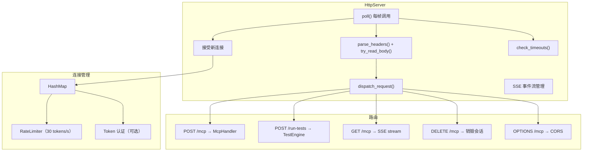
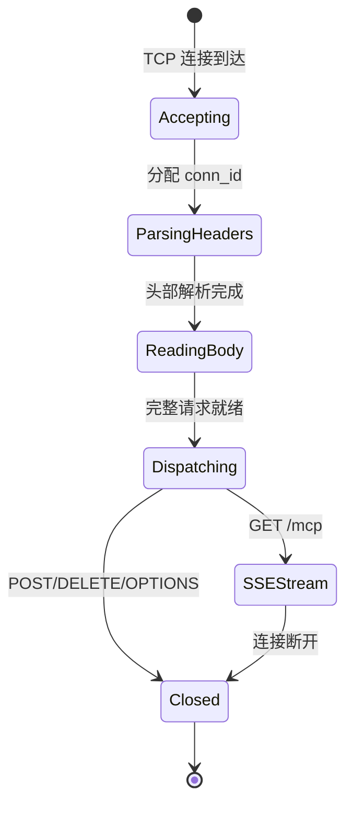

# HTTP 服务器（`HttpServer`）

> `extensions/src/server/ipc/http_server.cpp/.hpp` — MCP Streamable HTTP 传输层实现。

## 架构



## 连接生命周期



## 关键设计

### 轮询驱动

`HttpServer::poll()` 由 `McpEditorPlugin::_process()` 每帧调用。**不是**异步事件驱动。

- `polling_` 标志防止重入（`EditorProgress → Main::iteration()` 场景）
- 每帧：接受新连接 → 读取数据 → 解析 HTTP → 分发请求 → 刷新 SSE → 清理超时连接

### 连接管理

| 属性 | 值 |
|------|-----|
| 最大并发连接 | `kMaxConnections = 32` |
| 最大请求体 | `kMaxBodyLength = 1 MB` |
| 空闲超时 | 30 秒 |
| 速率限制 | 30 tokens/s，突发 30 |

### 速率限制

```cpp
struct RateLimiter {
    int tokens = 30;
    static constexpr int kMaxTokens = 30;
    static constexpr double kRefillRate = 30.0; // tokens/sec
    bool try_consume();  // 返回 false 时返回 429
};
```

### Token 认证

通过环境变量 `GODOT_MCP_AUTH_TOKEN` 启用。客户端需在请求头携带 `Authorization: Bearer <token>`。

### CORS

`OPTIONS /mcp` 返回标准 CORS 头，`Access-Control-Max-Age: 86400`。通过 `validate_origin()` 和 `get_cors_origin()` 控制允许的来源。

### SSE 事件流

`GET /mcp` 建立 SSE 连接。`HttpServer` 维护独立的 SSE 事件队列：

- `send_sse_headers()` → 200 `text/event-stream`
- `flush_sse()` 每帧将队列中的事件格式化为标准 SSE 帧并发送
- `send_sse_event()` → `id: N\nevent: message\ndata: <json>\n\n`
- 写入错误时标记 `sse_write_errored`，下一帧清理

### HTTP 解析

`parse_headers()` 手动解析 HTTP 请求行和头部（`http_parser.cpp`），不支持 chunked transfer encoding。

## 路由表

| 路径 | 方法 | 处理函数 |
|------|------|---------|
| `/mcp` | POST | `handle_post()` → `McpHandler::handle_message()` |
| `/mcp` | GET | `handle_get()` → SSE 流 |
| `/mcp` | DELETE | `handle_delete()` → 销毁会话 |
| `/mcp` | OPTIONS | `handle_options()` → CORS 头 |
| `/run-tests` | POST | `handle_post()` → `handle_run_tests()` → `TestEngine::run()` |

## 注意事项

- **非 keep-alive**：非 SSE 连接处理完一个请求后立即关闭（`keep_alive = false`），因为帧时序无法可靠处理快速 keep-alive
- **死连接清理**：使用 `dead` 列表模式，避免 `HashMap` range-for 内 `erase()` 导致 UB
- **`/run-tests` 绕过 MCP**：直接调用 `TestEngine::run()`，不经过 `McpHandler`
