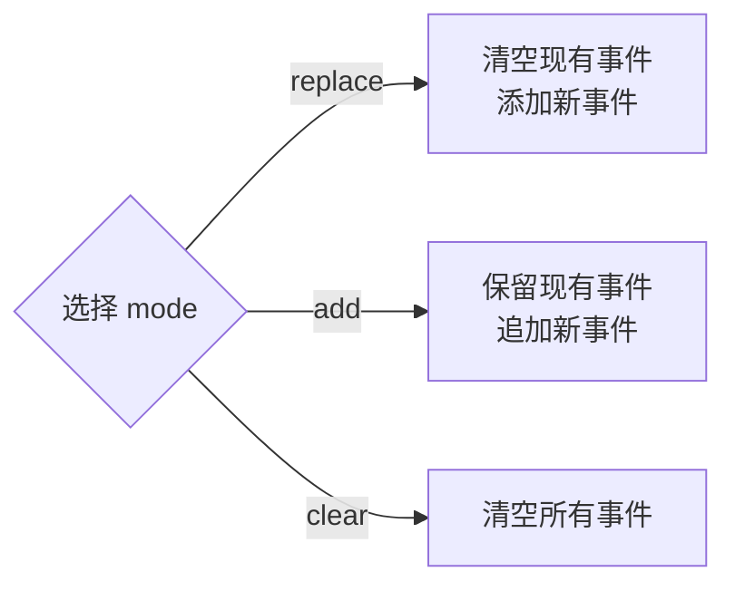

# Input Map 命令

> 4 个工具，管理 Godot 的输入动作映射（InputMap）。实现在 `extensions/gdext/src/commands/input_map.cpp`。

## 工具列表

| 工具 | 描述 |
|------|------|
| `list_input_actions` | 列出所有输入动作及其绑定的事件 |
| `add_input_action` | 添加新的输入动作（可指定 deadzone） |
| `set_input_action_events` | 设置/追加/清空输入动作绑定的事件 |
| `remove_input_action` | 移除输入动作 |

## `list_input_actions`

**参数**：
- `include_builtin`（可选 bool，默认 false）：是否包含 `ui_*` 内置动作

**返回**：每个动作的详细信息，包括 deadzone 和绑定的事件列表（事件包含 `type` 及对应属性）。

## `set_input_action_events`

**参数**：
- `name`：动作名称
- `mode`：`"replace"`（默认）| `"add"` | `"clear"`
- `events`：事件数组

**mode 值说明**：



每个事件项格式示例（来自 Godot InputEvent）：

```json
{
  "type": "InputEventKey",
  "keycode": 65,
  "ctrl_pressed": false,
  "alt_pressed": false,
  "shift_pressed": false
}
```

支持的事件类型：`InputEventKey`、`InputEventMouseButton`、`InputEventJoypadButton`、`InputEventJoypadMotion` 等。

## 实现细节

- 使用 `InputMap::singleton()` 访问 Godot 的全局输入映射
- `add_input_action` 支持指定 deadzone（默认 0.5）
- 内部通过 Godot 的 `InputEvent` 反序列化来解析事件配置
- 操作后自动标记场景为未保存（如果相关）
