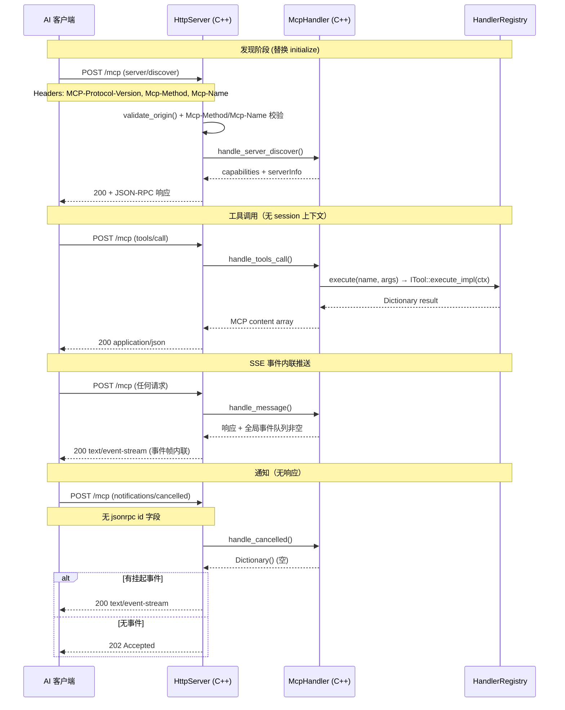

# MCP Streamable HTTP 传输 (2026-07-28)

> AI 客户端通过 MCP Streamable HTTP 协议直连 `godot_mcp_gdext.dll`。无 session、无 SSE 持久连接、无 `initialize` 握手。

## 通信流程



## HTTP 端点

| 方法 | 路径 | 用途 | 关键验证 |
|------|------|------|----------|
| `POST /mcp` | JSON-RPC 2.0 请求/通知 | `MCP-Protocol-Version`, `Content-Type: application/json`, `Accept: application/json`/`*/*`, `Mcp-Method`(可选), `Mcp-Name`(可选), `Origin` |
| `POST /run-tests` | C++ 测试引擎入口 | YAML body，仅开发环境启用 |
| `OPTIONS /mcp` | CORS 预检 | 标准 CORS 响应 `Allow: POST, OPTIONS` |

**已移除的端点**：~~`GET /mcp`~~（SSE 持久流）、~~`DELETE /mcp`~~（会话销毁）、~~`POST /mcp` (initialize/notifications/initialized)~~。

## 协议流程说明

### 1. 无 session 架构

根据 MCP 2026-07-28 规范，Streamable HTTP **不再使用 session UUID**。每个 POST 请求独立处理：

- `Mcp-Session-Id` header 完全移除
- 无 `initialize` / `notifications/initialized` 生命周期
- 无服务端会话存储（`sessions_` HashMap 删除）
- 所有状态（pending requests、cancelled requests）按 request `id` 键控，全局共享

### 2. server/discover 替换 initialize

客户端在连接后第一个请求应为 `server/discover`（替代传统的 `initialize`）：

```json
{"jsonrpc": "2.0", "id": 1, "method": "server/discover"}
```

响应包含 `capabilities` 和 `serverInfo`：

```json
{
  "jsonrpc": "2.0",
  "id": 1,
  "result": {
    "capabilities": {
      "tools": {"listChanged": true},
      "resources": {},
      "prompts": {},
      "logging": {},
      "completions": {}
    },
    "serverInfo": {"name": "godot-mcp", "version": "x.y.z"}
  }
}
```

### 3. 协议版本协商

`McpHandler::negotiate_protocol_version()` 处理 `MCP-Protocol-Version` header：

| 客户端版本 | 协商结果 |
|------------|----------|
| `2026-07-28` | `2026-07-28` |
| `2025-11-25` | `2025-11-25` |
| `2025-03-26` | `2025-03-26` |
| 空/未知 | `2025-03-26` (默认回退) |

协议版本在 `mcp_handler.hpp:100-115` 的 `kSupported` 数组中维护。

### 4. Mcp-Method / Mcp-Name 头校验

`http_parser.cpp:116-123` 从 HTTP 头解析 `Mcp-Method` 和 `Mcp-Name`：

```
Mcp-Method: tools/call
Mcp-Name: rename_node
```

**校验逻辑**（`http_server.cpp:438-457`）：

```
Mcp-Method → 与 body.method 比对，不匹配 → 400 HeaderMismatch
Mcp-Name  → 与 body.params.name 或 body.params.uri 比对，不匹配 → 400 HeaderMismatch
```

两个 header 均为可选。缺失时不校验。这允许 HTTP 中间件/代理预先路由而不解析 JSON body。

## JSON-RPC 2.0 错误码

| 常量 | 值 | 触发场景 |
|------|-----|----------|
| `kParseError` | -32700 | JSON body 解析失败（含非 UTF-8 / 格式错误） |
| `kInvalidRequest` | -32600 | 无效 method、缺少 jsonrpc 版本、类型错误、Mcp-Method/Mcp-Name 不匹配 |
| `kMethodNotFound` | -32601 | 未知 JSON-RPC method（如 `tools/unknown`） |
| `kInvalidParams` | -32602 | `tools/call` 缺少 `name`、参数错误、prompt 不存在 |
| `kInternalError` | -32603 | 工具执行抛出异常、registry 未初始化、内部状态错误 |
| `kResourceNotFound` | -32002 | `resources/read` 指定了不存在的 URI |
| `kServerTerminated` | -32001 | 请求已被 `notifications/cancelled` 取消 |

## SSE 内联事件推送

Streamable HTTP 2026-07-28 不维护持久 SSE 连接。事件在 **POST 响应体内联推送**：

### 触发条件

`McpHandler::global_event_queue_` 在以下情况会被填充：

- 元工具调用修改工具列表 → `notify_tools_list_changed()` → 入队 `notifications/tools/list_changed`
- 运行时桥接事件（`RuntimeBridge` 推送消息到事件队列）

### 响应格式

当 `has_pending_events()` 为 true 时，`HttpServer::handle_post()` 返回 `Content-Type: text/event-stream` 而非 `application/json`：

```
POST /mcp → 200 OK
Content-Type: text/event-stream
Connection: keep-alive

retry: 5000
event: message
data: {"jsonrpc":"2.0","method":"notifications/tools/list_changed","params":{}}

event: message
data: {"jsonrpc":"2.0","method":"notifications/message","params":{"level":"info","message":"Scene saved"}}

id: <incrementing>
event: message
data: <next jsonrpc notification>
```

**SSE 帧细节**（`http_sse.cpp`）：

- `event`: 固定为 `message`
- `data`: 完整的 JSON-RPC 2.0 notification 对象
- `id`: 递增整数（`conn.sse_event_id`），`Last-Event-ID` 恢复**不支持**
- `retry`: 5000 ms（客户端重连建议间隔）
- keepalive: 每 15 秒 `send_sse_comment()` 发送 `: keepalive` 注释帧（`kSseKeepaliveIntervalMsec`）

### 响应决策树

```
handle_post() 处理完 JSON-RPC 消息后:

  ┌─ has_pending_events() && has result JSON?
  │   → send_sse_headers() + flush_sse()  (200 text/event-stream)
  │
  ├─ has_pending_events() && no result?
  │   → send_sse_headers() + flush_sse()  (200 text/event-stream)
  │
  ├─ no events && has result?
  │   → 200 application/json (正常响应)
  │
  └─ no events && no result (通知)?
      → 202 Accepted (空 body)
```

### 核心数据结构

- **事件队列**：`std::deque<Dictionary> global_event_queue_`（`mcp_handler.hpp:96`），无 session 区分
- **consume_event()**：FIFO 出队，由 `flush_sse()` 逐条发送
- **并发安全**：纯主线程 `_process()` 驱动，无锁

## 端口与配置

| 参数 | 默认值 | 环境变量 |
|------|--------|----------|
| HTTP 端口 | `9600` | `GODOT_MCP_HTTP_PORT` |
| 桥接端口 | `9601` | `GODOT_MCP_BRIDGE_PORT` |
| 绑定地址 | `127.0.0.1` | — |
| 认证 Token | 空（不启用） | `GODOT_MCP_AUTH_TOKEN` |

## 连接与超时

| 参数 | 值 | 位置 |
|------|-----|------|
| 最大连接数 | 32 | `http_server.hpp:35` |
| 连接超时 | 30 秒 | `http_server.hpp:105` |
| 最大 body 大小 | 1 MB | `http_server.hpp:38` |
| 最大 header 数 | 100 | `http_server.hpp:39` |
| 速率限制 | 30 req/s | `http_server.hpp:92-95` |
| CORS Max-Age | 86400 秒 | `http_server.hpp:40` |
| 轮询驱动 | `McpEditorPlugin::_process()` | `editor_plugin.cpp` |
