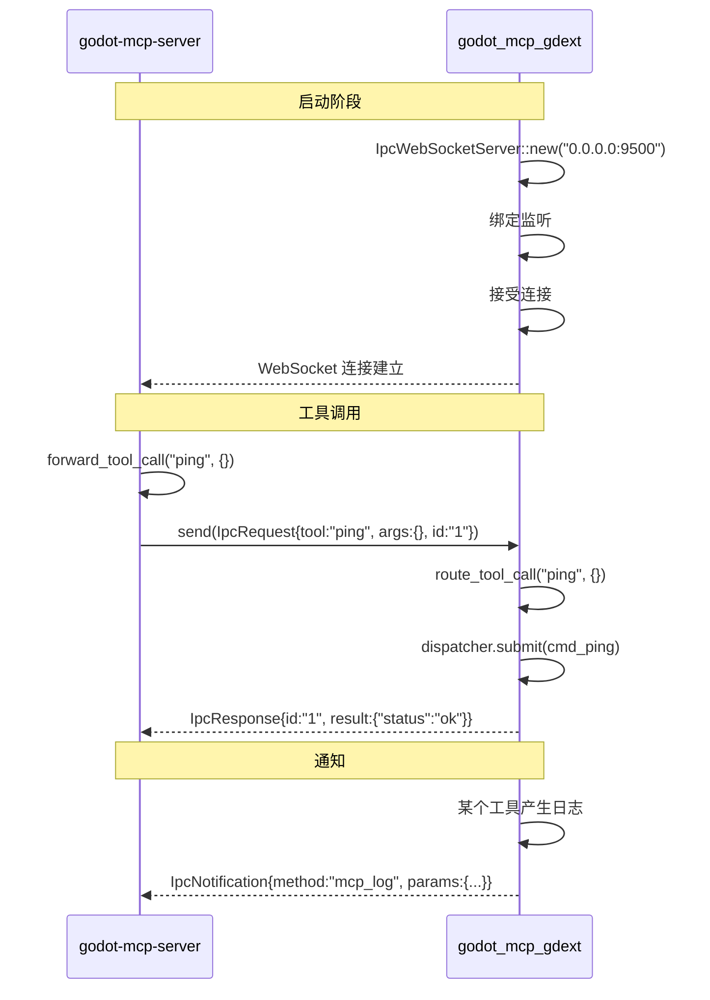

# IPC 桥接（WebSocket）

> 连接 `godot-mcp-server` 和 `godot_mcp_gdext` 的通信桥梁。



## 线路格式

### 请求（Server → GDExt）

```json
{
    "tool": "get_node_position",
    "args": {"node_path": "Player"},
    "id": "req-001"
}
```

### 响应（GDExt → Server）

```json
{
    "id": "req-001",
    "result": {"x": 100.0, "y": 200.0}
}
```

错误响应：
```json
{
    "id": "req-001",
    "result": {"error": "节点 'MissingNode' 未找到"}
}
```

### 通知（GDExt → Server）

```json
{
    "method": "mcp_log_message",
    "params": {"level": "info", "tool": "ping", "message": "Ping received"}
}
```

## 协议细节

- 使用 `serde_json::to_vec` / `from_slice` 序列化
- 消息以 `\n` 分隔（JSON Lines 风格）
- `IpcWebSocketServer` 通过 `PluginState` 静态变量在 Godot 生命周期内保持
- 仅接受一个连接（连接后拒绝其他客户端）
- 连接断开时自动退出事件循环
- `bridge.rs` 在连接断开时自动尝试重连