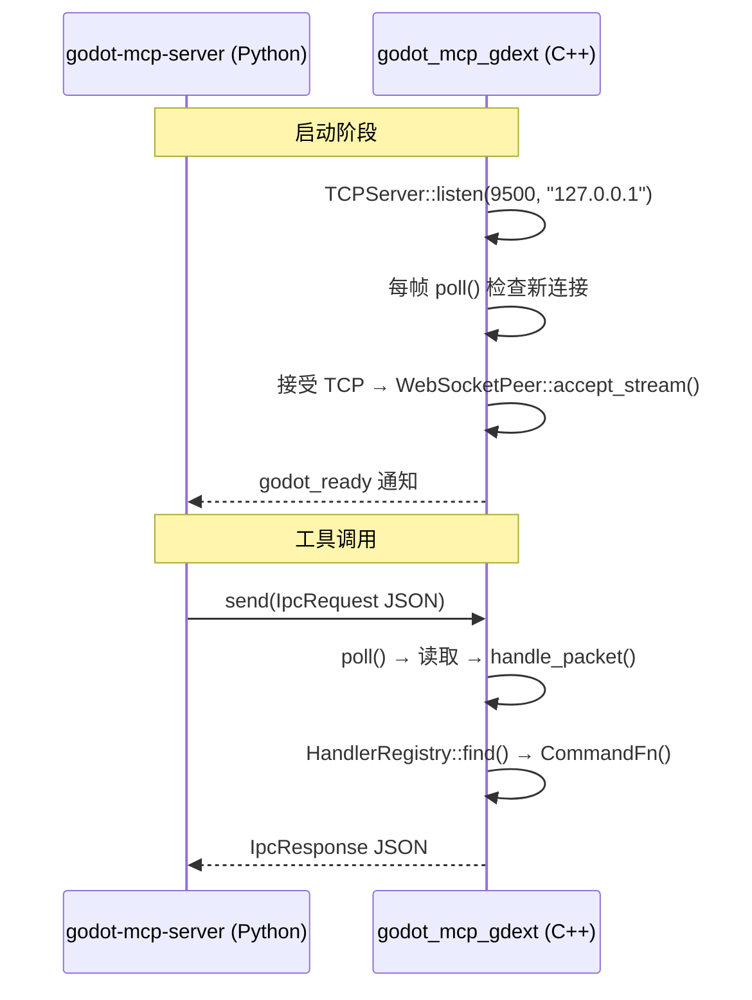
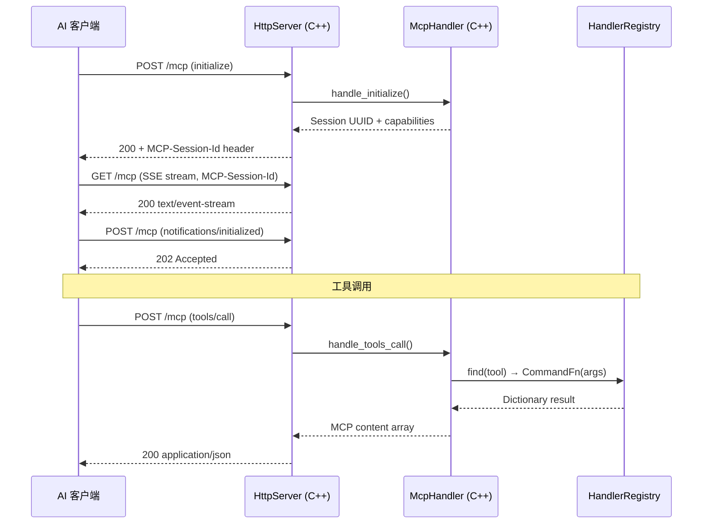

# IPC 桥接

> 连接 AI 客户端与 `godot_mcp_gdext`（C++）的两条通信路径。

## 路径 A: Legacy WebSocket (stdio 中转)



### C++ WsServer 消息处理

```cpp
// ws_server.cpp  handle_packet()
void WsServer::handle_packet(int peer_id, Ref<WebSocketPeer> peer, const String &text) {
    // 1. 解析 JSON
    Ref<JSON> json;
    json.instantiate();
    Error err = json->parse(text);
    if (err != OK) { /* 返回 INVALID_REQUEST 错误 */ }
    
    const Dictionary req = json->get_data();
    const String method = req["method"];
    
    // 2. 验证 method
    if (method != "tool_call") { /* 返回错误 */ }
    
    // 3. 提取 tool + args
    const Dictionary params = req["params"];
    const String tool = params["tool"];
    const Dictionary args = params["args"];
    
    // 4. 查找并执行
    const CommandFn *fn = registry_->find(tool);
    if (!fn) { /* UNKNOWN_TOOL 错误 */ }
    
    Dictionary result = (*fn)(args);  // 同步执行
    
    // 5. 返回响应
    Dictionary flat;
    if (result.has("error")) {
        flat["status"] = "error";
        flat["message"] = result["error"];
    } else {
        flat["status"] = "success";
        flat["data"] = result;
    }
    peer->send_text(JSON::stringify(flat));
}
```

### WebSocket 线路格式

**请求（Server → GDExt）**:

```json
{
    "id": "550e8400-e29b-41d4-a716-446655440000",
    "method": "tool_call",
    "params": {
        "tool": "get_node_position",
        "args": {"node_path": "Player"}
    }
}
```

**响应成功（GDExt → Server）**:

```json
{"id": "uuid", "status": "success", "data": {"x": 100.0, "y": 200.0}}
```

**响应错误（GDExt → Server）**:

```json
{"id": "uuid", "status": "error", "code": "TOOL_FAILED", "message": "..."}
```

**通知（GDExt → Server）**:

```json
{"type": "notification", "event": "godot_ready", "data": {"engine_version": "4.6.0", "plugin_version": "0.1.5-dev3"}}
```

### Python 侧 WebSocket 客户端

`GodotBridge`（`bridge.py`）:

```python
class GodotBridge:
    async def connect()          # ws://127.0.0.1:{port}
    async def close()            # 取消 reader_task + 关闭 ws
    async def call(tool, args)   # 发送 IpcRequest，等待 IpcResponse
```

- 使用 `asyncio.Future` 做请求-响应匹配（`_pending: dict[str, asyncio.Future]`）
- `_reader_loop()`: 后台读取 WebSocket 消息，分派到 notification/response 处理
- `_handle_notification()`: 处理 `tool_list_updated` 通知 → 更新 registry

## 路径 B: MCP Streamable HTTP (直连)



### HTTP 端点（均位于 `/mcp`）

| 方法 | 用途 | 关键验证 |
|------|------|----------|
| `POST /mcp` | 发送 JSON-RPC 请求/通知 | `MCP-Protocol-Version`, `Content-Type`, `Accept`, `Origin` |
| `GET /mcp` | 打开 SSE 流 | `Accept: text/event-stream`, `MCP-Session-Id` |
| `DELETE /mcp` | 终止会话 | `MCP-Session-Id` |
| `OPTIONS /mcp` | CORS 预检 | 标准 CORS 头 |

### MCP 会话管理

- 会话通过 `initialize` 请求创建，UUID v4 标识
- 支持协议版本 `"2025-11-25"` 和 `"2025-03-26"`
- 每个 session 维护独立的 SSE 事件队列
- `tools/list` 支持分页（50 个/页）
- 30 秒空闲超时，最大 32 个并发连接

### SSE 事件推送

`McpHandler::enqueue_event()` → `Session::sse_event_queue` → `HttpServer::flush_sse()` 格式化为标准 SSE 帧：

```
id: <incrementing>
event: message
data: <json>
```

## 类型定义

### C++（`protocol/ipc_types.hpp`）

```cpp
constexpr const char *kStatusSuccess = "success";
constexpr const char *kStatusError = "error";
constexpr const char *kErrCodeInvalidRequest = "INVALID_REQUEST";
constexpr const char *kErrCodeUnknownTool = "UNKNOWN_TOOL";
constexpr const char *kErrCodeToolFailed = "TOOL_FAILED";
constexpr const char *kErrCodeInternal = "INTERNAL_ERROR";
```

### Python（`server/src/godot_mcp_server/protocol.py`）

```python
class IpcRequest(BaseModel): id: str; method: str; params: dict
class IpcResponse(BaseModel): id: str; status: str; data: Any; code: str; message: str
class IpcNotification(BaseModel): type: str; event: str; data: dict
class ToolCallParams(BaseModel): tool: str; args: dict = {}
class ToolInfo(BaseModel): name: str; description: str; input_schema: dict; enabled: bool
class ToolListUpdate(BaseModel): tools: list[ToolState]
class ToolState(BaseModel): name: str; enabled: bool
```

## 错误码

| 错误场景 | C++ 错误码 |
|----------|-----------|
| 无效 JSON | `INVALID_REQUEST` |
| 未知 method | `INVALID_REQUEST` |
| 未知工具 | `UNKNOWN_TOOL` |
| 执行失败 | `TOOL_FAILED` |
| 内部错误 | `INTERNAL_ERROR` |
