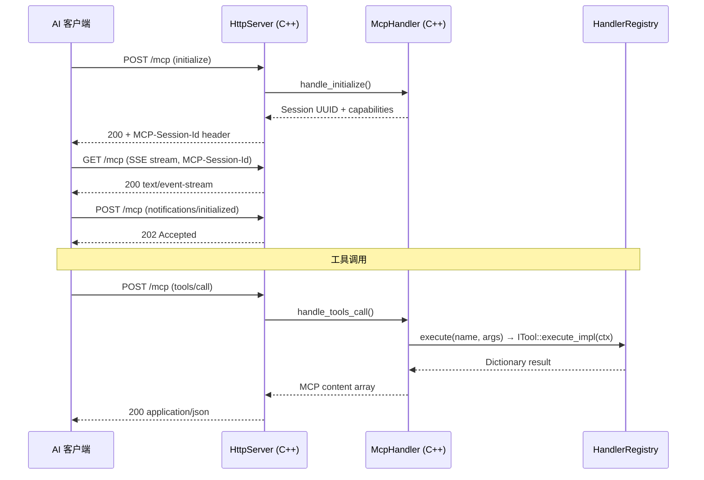

# MCP Streamable HTTP 传输

> AI 客户端通过 MCP Streamable HTTP 协议直连 `godot_mcp_gdext.dll`。

## 通信流程



## HTTP 端点（均位于 `/mcp`）

| 方法 | 用途 | 关键验证 |
|------|------|----------|
| `POST /mcp` | 发送 JSON-RPC 请求/通知 | `MCP-Protocol-Version`, `Content-Type`, `Accept`, `Origin` |
| `GET /mcp` | 打开 SSE 流 | `Accept: text/event-stream`, `MCP-Session-Id` |
| `DELETE /mcp` | 终止会话 | `MCP-Session-Id` |
| `OPTIONS /mcp` | CORS 预检 | 标准 CORS 头 |

## MCP 会话管理

- 会话通过 `initialize` 请求创建，UUID v4 标识
- 支持协议版本 `"2025-11-25"` 和 `"2025-03-26"`，默认回复 `"2025-03-26"`
- 每个 session 维护独立的 SSE 事件队列
- `tools/list` 返回全部工具（无分页实现）
- 30 秒空闲超时，最大 32 个并发连接

## SSE 事件推送

`McpHandler::enqueue_event()` → `Session::sse_event_queue` → `HttpServer::flush_sse()` 格式化为标准 SSE 帧：

```
id: <incrementing>
event: message
data: <json>
```

## JSON-RPC 错误码（定义在 `mcp_handler.hpp`）

| 常量 | 值 | 场景 |
|------|-----|------|
| `kParseError` | -32700 | JSON 解析失败 |
| `kInvalidRequest` | -32600 | 无效 method 或缺少必要字段 |
| `kMethodNotFound` | -32601 | 未知 JSON-RPC method |
| `kInvalidParams` | -32602 | tools/call 缺少参数或参数错误 |
| `kInternalError` | -32603 | 工具执行抛出异常或返回 error 字段 |
| `kResourceNotFound` | -32002 | resources/read 指定了不存在的资源 |
| `kServerTerminated` | -32001 | 请求被客户端取消（notifications/cancelled） |
