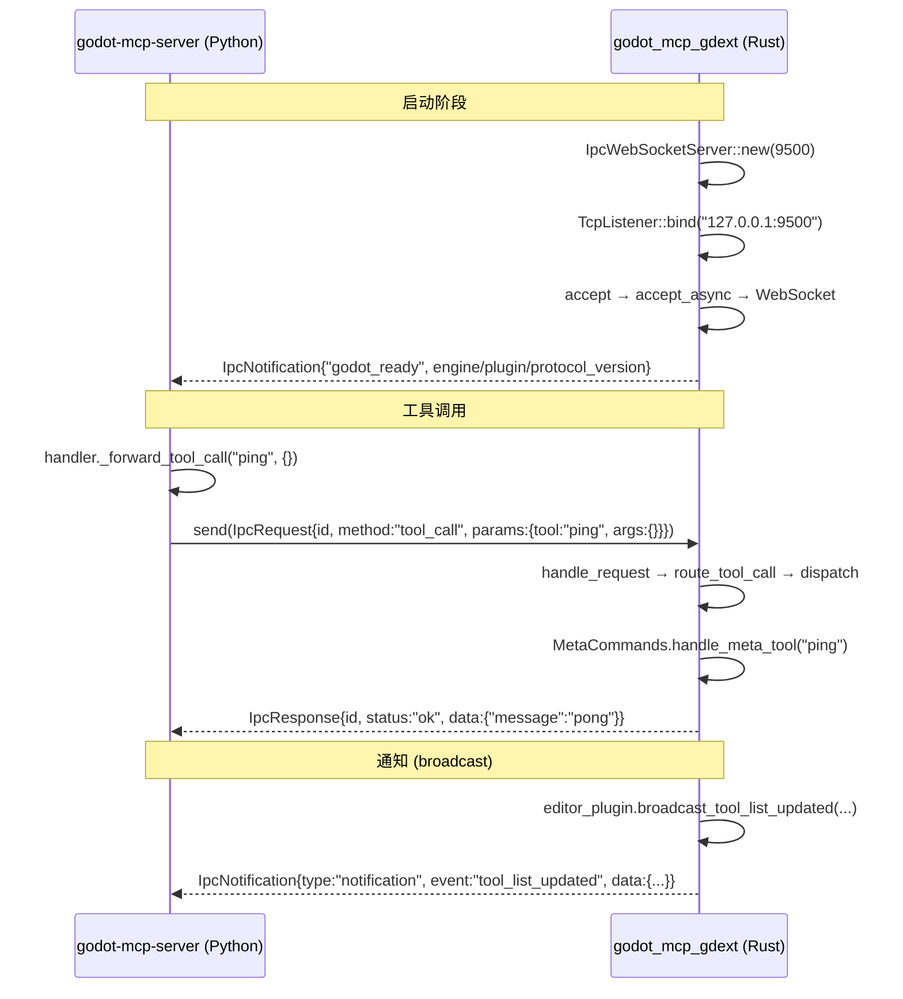

# IPC 桥接（WebSocket）

> 连接 `godot-mcp-server`（Python）和 `godot_mcp_gdext`（Rust）的通信桥梁。



## 线路格式

### 请求（Server → GDExt）

```json
{
    "id": "550e8400-e29b-41d4-a716-446655440000",
    "method": "tool_call",
    "params": {
        "tool": "get_node_position",
        "args": {"node_path": "Player"}
    }
}
```

### 响应（GDExt → Server）

成功：
```json
{
    "id": "550e8400-e29b-41d4-a716-446655440000",
    "status": "ok",
    "data": {"x": 100.0, "y": 200.0}
}
```

错误：
```json
{
    "id": "550e8400-e29b-41d4-a716-446655440000",
    "status": "error",
    "code": -1,
    "message": "节点 'MissingNode' 未找到"
}
```

### 通知（GDExt → Server）

```json
{
    "type": "notification",
    "event": "godot_ready",
    "data": {
        "engine_version": "4.6.0",
        "plugin_version": "0.1.4",
        "protocol_version": "1.0"
    }
}
```

```json
{
    "type": "notification",
    "event": "tool_list_updated",
    "data": {
        "tools": [{"name": "ping", "enabled": true}]
    }
}
```

## 传输细节

- **协议**: WebSocket (`ws://127.0.0.1:9500`)
- **端口**: 9500（gdext 侧硬编码，server 侧可通过 `--port` 配置）
- **编码**: JSON，UTF-8
- **心跳**: 30s 间隔 Ping，90s 超时断开
- **连接**: 接受第一个连接后继续监听——`handle_connection` 为每个连接 spawn 独立任务

## 类型定义

### Rust 侧（`crates/core/src/protocol.rs`）

| 类型 | 字段 | serde 标记 |
|------|------|-----------|
| `IpcRequest` | `id: String`, `method: String`, `params: Value` | 标准序列化 |
| `IpcResponse` | `id: String`, `result: IpcResult` | `#[serde(flatten)]` |
| `IpcResult` | `Success{data}` / `Error{code, message}` | `#[serde(tag = "status")]` |
| `IpcNotification` | `msg_type`, `event`, `data` | `msg_type` 序列化为 `"type"` |
| `ToolCallParams` | `tool: String`, `args: Value` | `args` 有默认值 `{}` |

### Python 侧（`server/src/godot_mcp_server/protocol.py`）

```python
class IpcRequest(BaseModel):
    id: str
    method: str
    params: dict[str, Any]

class IpcResponse(BaseModel):
    id: str
    status: str = "ok"
    data: Any = None
    code: int = 0
    message: str = ""
```

## 心跳机制

```rust
let mut heartbeat = tokio::time::interval(Duration::from_secs(30));
let mut last_activity = tokio::time::Instant::now();

loop {
    tokio::select! {
        msg = read.next() => { last_activity = now(); ... }
        _ = heartbeat.tick() => {
            if last_activity.elapsed() > HEARTBEAT_TIMEOUT { break; }
            write.send(Message::Ping(vec![])).await;
        }
    }
}
```

## 错误处理

| 情况 | 行为 |
|------|------|
| 无效 JSON | 跳过当前消息，继续处理 |
| WebSocket 断开 | `reader_loop` 退出，server 侧触发重连 |
| 心跳超时（90s 无活动） | 主动关闭连接 |
| 无效 tool_call 参数 | 返回 `IpcResult::Error { code: -3 }` |
| 未知工具 | 返回 `Err("Unknown tool: ...")` → `IpcResult::Error { code: -1 }` |