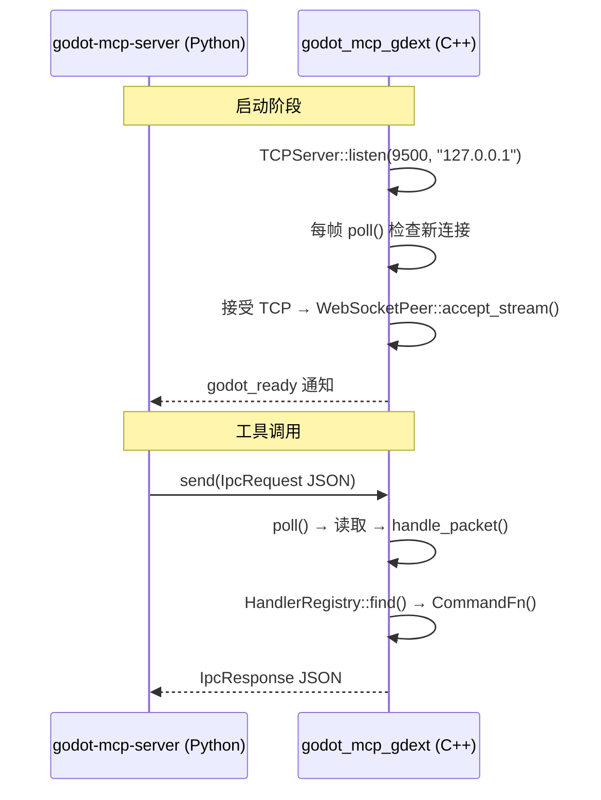
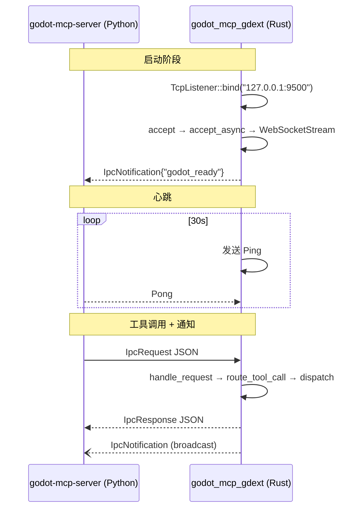

# IPC 桥接（WebSocket）

> 连接 `godot-mcp-server`（Python）和 `godot_mcp_gdext`（C++ 当前 / Rust 遗留）的通信桥梁。

## C++（当前）—— 同步 WebSocket



C++ 版本使用 Godot 4.6 内置的 `TCPServer` + `WebSocketPeer`：

- **同步架构**：所有事件通过 `WsServer::poll()` 在 Godot 主线程上处理
- **无心跳**（当前版本）：依赖 TCP 自身连接管理
- **单线程**：无需 tokio 运行时

### C++ 消息处理

```cpp
// ws_server.cpp  handle_packet()
void WsServer::handle_packet(int peer_id, Ref<WebSocketPeer> peer, const String &text) {
    // 1. 解析 JSON
    Ref<JSON> json;
    json.instantiate();
    Error err = json->parse(text);
    if (err != OK) { /* 返回 INVALID_REQUEST 错误 */ }
    
    const Dictionary req = json->get_data();
    const String method = req["method"];
    
    // 2. 验证 method
    if (method != "tool_call") { /* 返回错误 */ }
    
    // 3. 提取 tool + args
    const Dictionary params = req["params"];
    const String tool = params["tool"];
    const Dictionary args = params["args"];
    
    // 4. 查找并执行
    const CommandFn *fn = registry_->find(tool);
    if (!fn) { /* UNKNOWN_TOOL 错误 */ }
    
    Dictionary result = (*fn)(args);  // 同步执行
    
    // 5. 返回响应
    Dictionary flat;
    if (result.has("error")) {
        flat["status"] = "error";
        flat["message"] = result["error"];
    } else {
        flat["status"] = "success";
        flat["data"] = result;
    }
    peer->send_text(JSON::stringify(flat));
}
```

## Rust（遗留）—— 异步 tokio-tungstenite



Rust 版本使用 tokio-tungstenite：

- **异步架构**：每个连接 `spawn` 一个独立任务
- **心跳**：30 秒 Ping 间隔，90 秒超时断开
- **广播**：通过 `broadcast::channel` 向所有连接推送通知
- **多线程**：tokio 工作线程（2 核）+ 主线程 dispatcher

## 线路格式（两版本通用）

### 请求（Server → GDExt）

```json
{
    "id": "550e8400-e29b-41d4-a716-446655440000",
    "method": "tool_call",
    "params": {
        "tool": "get_node_position",
        "args": {"node_path": "Player"}
    }
}
```

### 响应成功（GDExt → Server）

```json
{"id": "uuid", "status": "success", "data": {"x": 100.0, "y": 200.0}}
```

### 响应错误（GDExt → Server）

```json
{"id": "uuid", "status": "error", "code": "TOOL_FAILED", "message": "..."}
```

### 通知（GDExt → Server）

```json
{"type": "notification", "event": "godot_ready", "data": {"engine_version": "4.6.0", "plugin_version": "0.1.5-dev.1"}}
```

## 传输细节对比

| 方面 | C++（当前） | Rust（遗留） |
|------|-----------|-------------|
| 库 | Godot 内置 `TCPServer` + `WebSocketPeer` | tokio-tungstenite |
| 架构 | 同步 poll，主线程 | 异步，tokio 工作线程 |
| 心跳 | 无（当前版本） | 30s Ping / 90s 超时 |
| 广播 | 无（当前版本） | broadcast::channel |
| 端口 | 9500（默认），`GODOT_MCP_PORT` 环境变量可覆盖 | 9500（硬编码） |

## 类型定义

### C++（`protocol/ipc_types.hpp`）

```cpp
constexpr const char *kStatusSuccess = "success";
constexpr const char *kStatusError = "error";
constexpr const char *kErrCodeInvalidRequest = "INVALID_REQUEST";
constexpr const char *kErrCodeUnknownTool = "UNKNOWN_TOOL";
constexpr const char *kErrCodeToolFailed = "TOOL_FAILED";
constexpr const char *kErrCodeInternal = "INTERNAL_ERROR";
```

- `make_success_result(data)` / `make_error_result(code, message)`
- `make_response(id, result)` / `make_notification(event, data)`

### Rust 遗留（`crates/core/src/protocol.rs`）

Pydantic 风格 serde 类型：`IpcRequest`、`IpcResponse`、`IpcResult`（带 status tag）、`IpcNotification`、`ToolCallParams`。

### Python（`server/src/godot_mcp_server/protocol.py`）

```python
class IpcRequest(BaseModel): id: str; method: str; params: dict
class IpcResponse(BaseModel): id: str; status: str = "ok"; data: Any; code: int; message: str
class IpcNotification(BaseModel): type: str; event: str; data: dict
class ToolCallParams(BaseModel): tool: str; args: dict = {}
```

## 错误码对比

| 错误场景 | C++ | Rust |
|----------|-----|------|
| 无效 JSON | `INVALID_REQUEST` | 静默跳过或返回 error |
| 未知 method | `INVALID_REQUEST` | 回退将 method 当 tool 名 |
| 未知工具 | `UNKNOWN_TOOL` | `IpcResult::Error { code: -1 }` |
| 执行失败 | `TOOL_FAILED` | `IpcResult::Error { code: -2 }` |
| 内部错误 | `INTERNAL_ERROR` | `IpcResult::Error { code: -3 }` |
