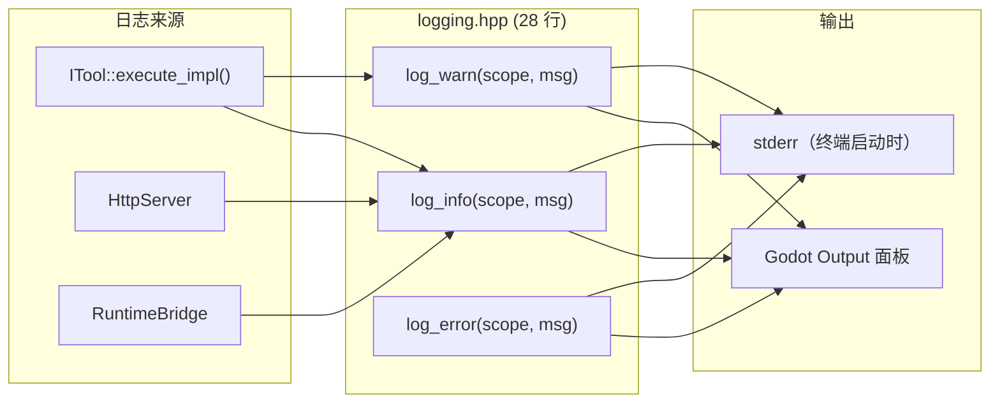

# 日志

> 直接调用 `UtilityFunctions::print`/`push_warning`/`push_error`。

## 数据流



## 实现

```cpp
// logging.hpp — 整个文件 28 行
namespace godot_mcp {

inline void log_info(const String &scope, const String &message) {
    UtilityFunctions::print("[godot-mcp][", scope, "] ", message);
}
inline void log_warn(const String &scope, const String &message) {
    UtilityFunctions::push_warning("[godot-mcp][", scope, "] ", message);
}
inline void log_error(const String &scope, const String &message) {
    UtilityFunctions::push_error("[godot-mcp][", scope, "] ", message);
}

}  // namespace godot_mcp
```

- 直接调用 Godot 日志 API——所有代码在主线程运行，无安全风险
- 消息格式：`[godot-mcp][scope] message`
- 输出到 Godot 编辑器 Output 面板 + Godot 的 stderr（如果从终端启动）


