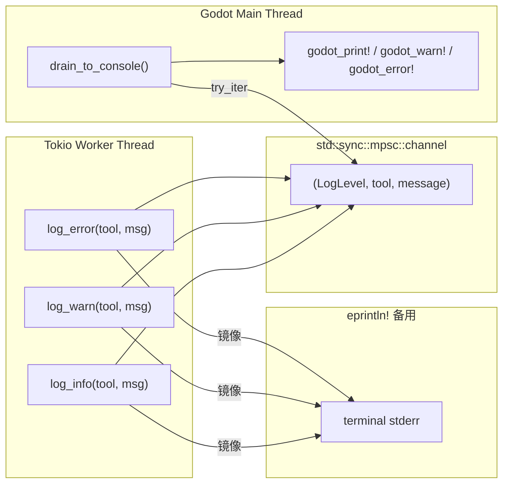

# 日志（跨线程）

> 因为 Godot 的 `godot_print!` 宏如果从 tokio 工作线程调用会崩溃，所以日志通过 mpsc 通道转发。



## 接口

```rust
pub fn log_info(tool_name: &str, msg: &str);
pub fn log_warn(tool_name: &str, msg: &str);
pub fn log_error(tool_name: &str, msg: &str);
```

所有三个函数：
1. 将消息**截断**至 512 字符（`MAX_PAYLOAD_LEN`）
2. 向全局 `mpsc::channel` 发送 `LogRecord`
3. 同时 `eprintln!` 到终端（立即可用，不依赖帧泵）

格式：`[Godot MCP][tool_name][LEVEL] message`

## 主线程泵

```rust
pub fn drain_to_console() {
    if let Ok(receiver) = RECEIVER.lock() {
        for record in receiver.try_iter() {
            match record.level {
                Info => godot_print!("[Godot MCP][{tool}][INFO] {msg}"),
                Warn => godot_warn!("[Godot MCP][{tool}][WARN] {msg}"),
                Error => godot_error!("[Godot MCP][{tool}][ERROR] {msg}"),
            }
        }
    }
}
```

在 `process_frame` 处理函数中与 `dispatcher.process_pending()` 一起调用。

## 通道实现

使用 `OnceLock` 懒初始化：

```rust
static SENDER: OnceLock<Sender<LogRecord>> = OnceLock::new();
static RECEIVER: OnceLock<Mutex<Receiver<LogRecord>>> = OnceLock::new();
```

首次调用 `log_info/log_warn/log_error` 时自动创建通道。

## 为什么需要两路输出

- **mpsc + godot_print!**：日志显示在 Godot 编辑器的输出控制台中
- **eprintln!**：立即写入 stderr——如果 MCP 客户端捕获 stderr，日志会出现在客户端终端中

如果通道满了或主线程来不及泵，stderr 输出确保消息不会完全丢失。

## 日志使用规则

| 级别 | 场景 |
|------|------|
| `info` | 正常操作信息（工具调用、场景打开） |
| `warn` | 可恢复的问题（设置失败但仍有可用默认值） |
| `error` | 操作失败（节点未找到、文件加载失败） |

所有工具都应该在成功时至少调用一次 `log_info`，在失败时调用 `log_error`。`ws_server.rs::route_tool_call()` 自动记录每个工具调用的进入和结果。表示