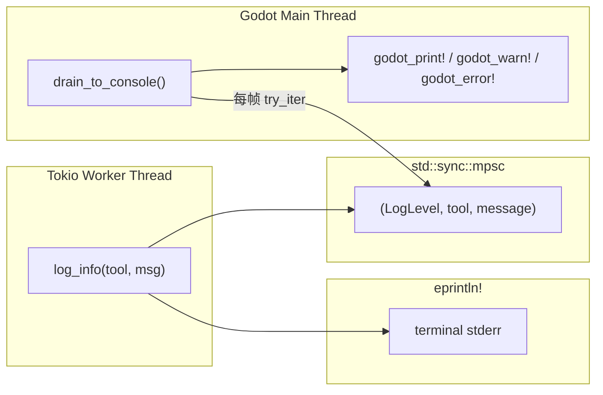

# 日志

> **C++ 版本（当前）极其简单：直接调用 `UtilityFunctions::print`/`push_warning`/`push_error`。** Rust 遗留版本的复杂跨线程日志是 tokio 架构的产物。

## C++（当前）—— 直接日志

```cpp
// logging.hpp — 整个文件 28 行
namespace godot_mcp {

inline void log_info(const String &scope, const String &message) {
    UtilityFunctions::print("[godot-mcp][", scope, "] ", message);
}
inline void log_warn(const String &scope, const String &message) {
    UtilityFunctions::push_warning("[godot-mcp][", scope, "] ", message);
}
inline void log_error(const String &scope, const String &message) {
    UtilityFunctions::push_error("[godot-mcp][", scope, "] ", message);
}

}  // namespace godot_mcp
```

- 直接调用 Godot 日志 API——所有代码在主线程运行，无安全风险
- 消息格式：`[godot-mcp][scope] message`
- 输出到 Godot 编辑器 Output 面板 + Godot 的 stderr（如果从终端启动）

## Rust（遗留）—— 跨线程 mpsc 通道

Rust 版本的日志由于需要从 tokio 工作线程发出，不能直接调用 `godot_print!`（会崩溃），因此实现了一个复杂的跨线程日志系统：



**规则**：
1. 工作线程调用 `log_info/log_warn/log_error` → 消息进入 mpsc 通道，同时 `eprintln!` 到 stderr
2. 主线程每帧通过 `drain_to_console()` 排空并转发到 `godot_print!`/`godot_warn!`/`godot_error!`
3. **绝不在 tokio 工作线程上调用 `godot_print!`**

### 关键细节

- 消息截断至 512 字符（`MAX_PAYLOAD_LEN`）
- 使用 `OnceLock` 懒初始化全局通道
- `drain_to_console()` 在 `process_frame` 信号处理函数中与 `dispatcher.process_pending()` 一起调用

## 对比

| 方面 | C++（当前） | Rust（遗留） |
|------|-----------|-------------|
| 行数 | 28（logging.hpp） | 137（logging.rs） |
| 复杂度 | 三个 inline 函数 | 通道 + 泵 + OnceLock + 截断 |
| 线程安全 | 天生（主线程） | mpsc 通道 + 主线程泵 |
| 即时性 | 即时输出 | 1 帧延迟（到 Godot 控制台） |
| stderr 输出 | Godot 自带 | 手写 `eprintln!` 镜像 |
