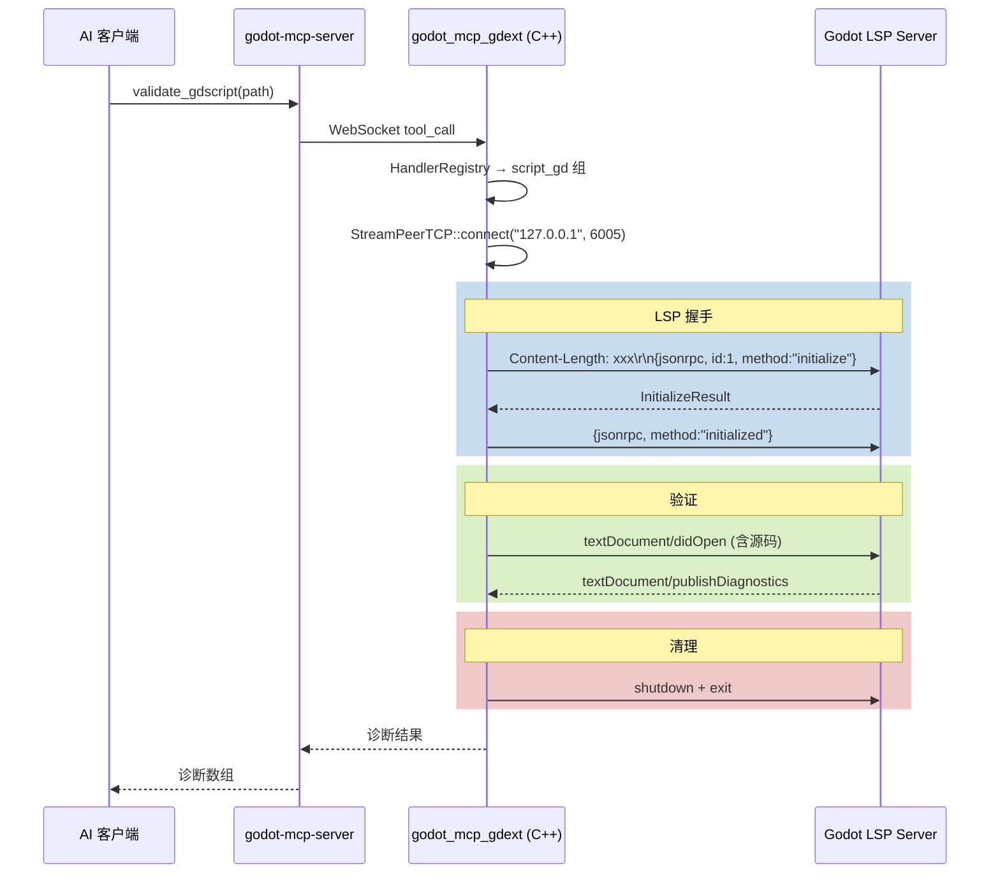

# GDScript LSP 验证客户端

> 使用 Godot 内置的 `StreamPeerTCP` 连接 GDScript LSP 服务器。

### 实现

### key 细节

- **传输**：`StreamPeerTCP`（Godot 内置 TCP 客户端）而非 tokio
- **超时**：连接超时 2 秒，等待诊断最长 3 秒
- **LSP 帧格式**：HTTP 风格 `Content-Length: xxx\r\n\r\n<body>`
- **端口**：`127.0.0.1:6005`（Godot LSP 默认端口）
- **同步**：所有 I/O 都在主线程阻塞——因为 LSP 验证是独立操作，不影响其他工具

## 注意事项

- Godot 编辑器设置中必须启用 Language Server（`编辑器 → 网络 → Language Server → 启用`）
- 如果 LSP 服务器未运行，连接会超时并返回错误
- 只支持 GDScript 验证（不验证 C#）
- 诊断结果：行号、列号、严重级别、消息
- 所有 I/O 在主线程阻塞——LSP 验证是独立操作，不影响其他工具
