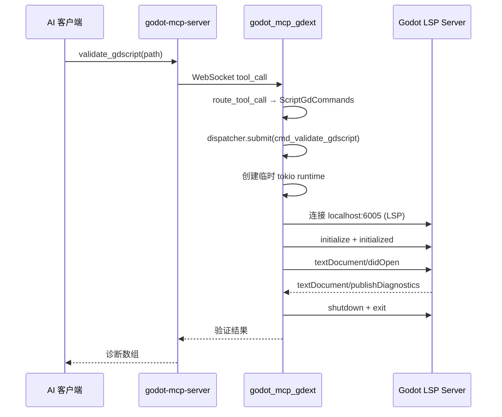
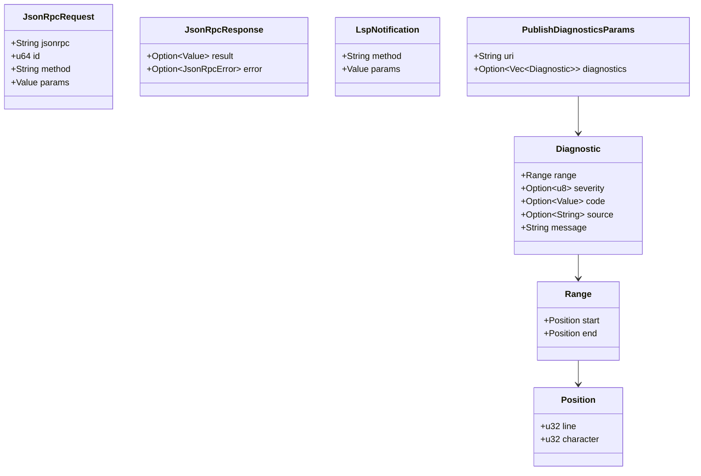

# GDScript LSP 验证客户端

> `crates/gdext/src/lsp/` — 通过 Godot 内置 LSP 服务器实现 GDScript 语法验证。

## 架构

## 文件

| 文件 | 说明 |
|------|------|
| `client.rs` | LSP 客户端实现：连接、初始化、didOpen、诊断收集、关闭 |
| `protocol.rs` | LSP 协议类型定义：`Diagnostic`, `Range`, `Position`, `JsonRpcRequest`, `JsonRpcResponse`, `LspNotification` |
| `mod.rs` | 重导出 `validate_via_lsp` |

## LSP 协议类型

## `validate_via_lsp` 流程

1. **TCP 连接**：连接到 `127.0.0.1:6005`（Godot LSP 默认端口），超时 2 秒
2. **initialize**：发送 Initialize 请求，等待 `InitializeResult` 响应
3. **initialized**：发送初始化完成通知
4. **textDocument/didOpen**：发送文件源码，请求 LSP 诊断
5. **等待诊断**：最多等待 3 秒收集 `publishDiagnostics` 通知
6. **清理**：发送 `didClose`、`shutdown`、`exit`

## 约束

- 需要编辑器设置 → 网络 → Language Server → 启用
- 会创建临时 tokio 运行时（因为 `validate_gdscript` 在工作线程被 dispatcher 异步调用，但内部需要同步的 tokio 操作）
- 只支持 GDScript 验证
- 诊断结果包含行号、列号、严重级别和消息

## 注意

- LSP 通信使用 HTTP 风格的 `Content-Length: xxx\r\n\r\n<body>` 帧格式
- Initialize 响应中可能会混入多余的 notification（需要过滤）
- 如果 LSP 服务器未运行，连接会超时并返回错误
