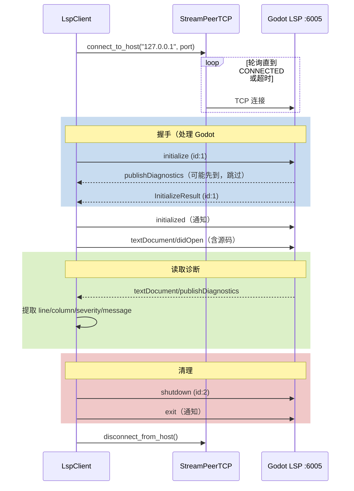

# GDScript LSP 客户端（未使用）

> ⚠️ **死代码**：`LspClient` 被编译进二进制（`extensions/CMakeLists.txt:82`），但**全代码库无任何调用方**。实际 GDScript 验证由 `validate_gd_script` 工具通过 `godot --check-only` 实现（见 `validate_gd_script.hpp`），不走 LSP。

## 源码位置

| 文件 | 行数 | 内容 |
|------|------|------|
| `extensions/src/lsp/client.hpp` | 23 | `LspClient` 类声明，仅一个 `validate()` 方法 |
| `extensions/src/lsp/client.cpp` | 189 | 完整 LSP 握手 + 诊断逻辑 |

## 类接口

```cpp
// client.hpp:13
class LspClient {
public:
    Dictionary validate(const String &path,
                        const String &source,
                        const String &file_uri,
                        const String &root_uri,
                        uint16_t port = 6005,
                        int timeout_ms = 5000);
};
```

| 参数 | 默认值 | 说明 |
|------|--------|------|
| `port` | `6005` | Godot 编辑器内置 LSP 默认端口（`client.hpp:19`） |
| `timeout_ms` | `5000` | 连接 + 握手 + 诊断的统一超时（`client.hpp:20`） |

连接目标固定为 `127.0.0.1`（`client.cpp:101`）。

## 实现细节



### LSP 帧格式

HTTP 风格 header，所有消息通过 `send_message()` 发送（`client.cpp:23-31`）：

```
Content-Length: <字节数>\r\n\r\n<JSON body>
```

### 关键处理

| 机制 | 说明 | 源码 |
|------|------|------|
| 同步阻塞 | 所有 I/O 在主线程轮询 + `delay_msec(50)` 步进 | `client.cpp:104-111` |
| 帧读取 | `read_until("\r\n\r\n")` 读 header → `read_exactly(n)` 读 body | `client.cpp:33-87` |
| Godot #78764 绕过 | 握手时循环读消息，跳过无 `id` 的通知（`publishDiagnostics` 可能在 `initialize` 响应前到达） | `client.cpp:121-137` |
| 诊断提取 | 从 `publishDiagnostics.params.diagnostics` 提取 `line`/`column`/`severity`/`message`/`source` | `client.cpp:159-174` |
| 提前退出 | 收到诊断且无更多数据时立即 break | `client.cpp:175` |
| 返回值 | `{"ok": bool, "diagnostics": Array}` | `client.cpp:183-186` |

### 为什么是死代码

| 验证项 | 结果 |
|--------|------|
| `#include "lsp/client.hpp"` | 全代码库零匹配 |
| `LspClient` 类名引用 | 仅 `client.hpp`/`client.cpp` 内部 |
| `validate_gd_script` 工具 | 使用 `OS::execute("godot", ["--check-only", ...])` 命令行验证（`validate_gd_script.hpp:67-76`），**不使用 LSP** |
| CMakeLists 编译 | `src/lsp/client.cpp` 已包含（`extensions/CMakeLists.txt:82`），编译进 DLL 但无调用方 |

> 如需启用 LSP 验证，需创建一个 `ITool` 工具调用 `LspClient::validate()`。当前项目未这样做。
