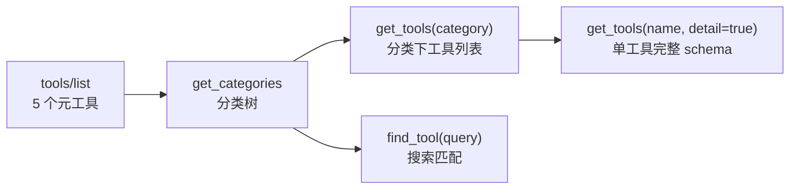
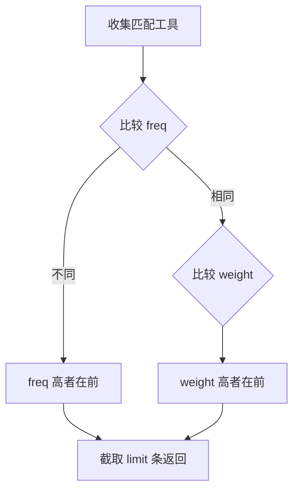

# 元工具

> 发现工具的系统级工具，`is_meta() == true`，始终在 `tools/list` 中可见。`HandlerRegistry::get_always_on_tools()` 按 `is_meta` 标记过滤。

## 工具列表

共 **5 个**元工具（`is_meta()==true`），全部在 `meta_tools` 分类（`register/register_meta.hpp`）。`list_settings` 的 `is_meta()=false`，通过发现链按需加载。

| 工具名 | 文件 | 分类 | 功能 |
|--------|------|------|------|
| `get_info` | `meta/get_info.hpp` | `meta_tools` | 连接状态、引擎版本、项目配置、编辑器状态、桥接状态 |
| `get_tools` | `meta/get_tools.hpp` | `meta_tools` | 两种模式：无 name 时列出分类下工具；有 name+detail=true 时返回单工具完整 schema |
| `get_categories` | `meta/get_categories.hpp` | `meta_tools` | 分类树，支持 path 钻取和 max_depth 控制 |
| `find_tool` | `meta/find_tool.hpp` | `meta_tools` | 搜索引擎：4 阶段权重 + 频率排序 |
| `call_tool` | `meta/call_tool.hpp` | `meta_tools` | 兜底调用任意工具 |

## 渐进式披露



| 阶段 | 操作 | 返回 |
|------|------|------|
| 1 | `tools/list` | 5 个元工具（`is_meta=true`） |
| 2 | `get_categories` | 分类树（默认 max_depth=3） |
| 3 | `get_tools(category)` | 指定分类下工具（id/name/description） |
| 4 | `find_tool(query)` | 按频率+权重排序的搜索结果 |
| 5 | `get_tools(name, detail=true)` | 单工具完整参数 schema + 用法示例 |

## `get_info` 返回结构

返回 `ToolResult::ok(result)`：

```json
{
  "connection": { "status": "ok" },
  "engine": {
    "version": "4.6.stable",
    "hash": "abc123..."
  },
  "plugin": {
    "builtin_tools": 152,
    "custom_tools": 0,
    "version": "0.2.2-dev3"
  },
  "project": {
    "name": "MyGame",
    "path": "C:/Users/.../example",
    "main_scene": "res://main.tscn"
  },
  "editor": {
    "current_scene": "res://main.tscn",
    "is_playing": false,
    "open_scenes": ["res://main.tscn"],
    "error_count": 0
  },
  "bridge": {
    "status": 0,
    "port": 9601,
    "connected": false,
    "server_status": 2,
    "server_port": 9601,
    "server_connected": false,
    "instance_count": 0,
    "server_listening": true
  }
}
```

- `engine.version`：来自 `Engine::get_version_info()["string"]`
- `engine.hash`：同上 `["hash"]`
- `plugin.builtin_tools` / `custom_tools` / `version`：来自 `HandlerRegistry` 计数
- `project.path`：`globalize_path("res://")` 绝对路径
- `editor.current_scene`：当前编辑场景的文件路径，无场景则为空字符串
- `bridge` 结构体包含两个桥的信息：`status/port/connected` 来自旧版 `RuntimeBridge`（TCP 客户端，向后兼容），`server_status/server_port/server_connected/instance_count/server_listening/instances` 来自 `RuntimeBridgeServer`（TCP 服务器，多实例支持）

## `call_tool` 兜底调用

参数（`call_tool.hpp`）：

| 参数 | 类型 | 必需 | 说明 |
|------|------|------|------|
| `tool_name` | string | 是 | 要调用的工具名 |
| `arguments` | object | 否 | 工具参数键值对 |

内部将 `tool_name` + `arguments` 转发到 `HandlerRegistry::execute()`。

## 搜索引擎（`find_tool`）

参数（`find_tool.hpp`）：

| 参数 | 类型 | 必需 | 默认 | 说明 |
|------|------|------|------|------|
| `query` | string | 是 | — | 搜索词 |
| `category` | string | 否 | `""` | 分类过滤前缀 |
| `limit` | int | 否 | 20 | 最大返回数 |

### 4 阶段权重匹配

`HandlerRegistry::search_tools()` 对每个工具取**最高权重**（非累加）：

| 阶段 | 匹配方式 | 权重 |
|------|---------|------|
| 1 | 工具名精确匹配（大小写不敏感） | 1000 |
| 2 | 工具名前缀匹配 | 500 |
| 3 | name + brief + description 分词后 Token 包含 | 200 |
| 4 | description 子串匹配 | 50 |

### 排序算法



**排序规则**：先按调用频率（`freq_index_`）降序，频率相同再按权重降序。

```cpp
if (a.freq != b.freq) return a.freq > b.freq;
return a.weight > b.weight;
```

返回每条结果包含 `name`、`brief`、`category`、`description`、`frequency` 字段。

## 客户端自动配置（底部面板）

通过 Godot 底部面板（`McpDock`）的配置生成器，可一键生成 11 个 MCP 客户端的项目级配置。实现在 `client_config_registry.hpp`（声明式描述符 + 策略模式）：

| 客户端 | 配置文件路径 | 格式 |
|--------|-------------|:----:|
| Claude Code | `.mcp.json` | JSON |
| Cursor | `.cursor/mcp.json` | JSON |
| VS Code Copilot | `.vscode/mcp.json` | JSON |
| Cline | `.cline/mcp.json` | JSON |
| OpenCode | `.opencode/opencode.json` | JSON |
| Codex | `.codex/config.toml` | TOML |
| Trae | `.trae/mcp.json` | JSON |
| Qoder | `.qoder/mcp.json` | JSON |
| CodeBuddy | `.codebuddy/mcp_settings.json` | JSON |
| Pi | `.pi/settings.json` | JSON |
| OpenClaw | `.openclaw/openclaw.json` | JSON |

所有配置文件为**项目级路径**，避免污染用户全局 MCP 配置。`write_to_project=true` 时按格式（json 深合并 / toml 追加 / 直接写入）落盘。

## `get_categories`

参数（`get_categories.hpp:20-37`）：

| 参数 | 类型 | 默认 | 说明 |
|------|------|------|------|
| `path` | string | `""` | 分类路径，空则从根开始。如 `node_tools/property/Node/CanvasItem` |
| `max_depth` | int | 3 | 最大展开深度，`-1` 为无限 |

## `get_tools`

有两种模式：

**模式 1：按分类列出工具**（无 `name` 参数）

| 参数 | 类型 | 必需 | 说明 |
|------|------|------|------|
| `category` | string | 是 | 分类路径，如 `meta_tools`、`node_tools/property/CanvasItem` |

返回该分类下（不含子分类）工具的 `{ id, name, description }` 列表。

**模式 2：查询单工具详情**（带 `name` + `detail=true`）

| 参数 | 类型 | 必需 | 说明 |
|------|------|------|------|
| `name` | string | 是 | 工具名 |
| `detail` | bool | 是 | 必须为 `true` |

返回 `{ id, name, description, parameters[], required[], return_value, category_id, category_path, usage_example }`。

> **注意**：`list_settings` 工具不属于元工具（`is_meta()=false`，category 为 `editor_tools/settings`），详见 [settings-tools.md](settings-tools.md)。
