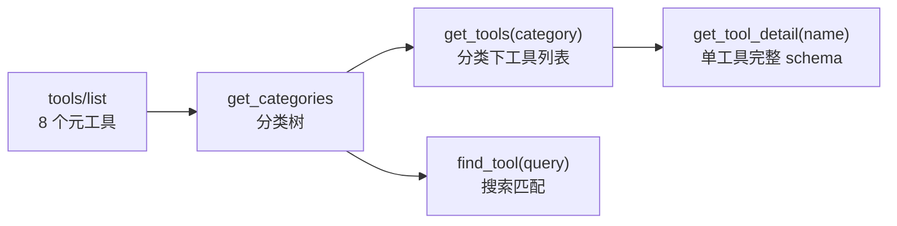
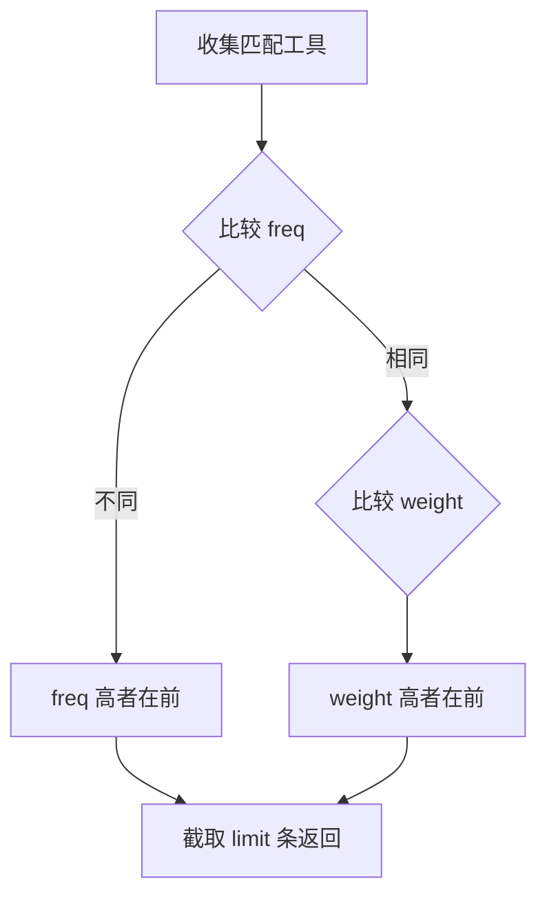

# 元工具

> 发现工具的系统级工具，`is_meta() == true`，始终在 `tools/list` 中可见。`HandlerRegistry::get_always_on_tools()` 按 `is_meta` 标记过滤（`handler_registry.cpp:371-380`）。

## 工具列表

共 **8 个**元工具：7 个在 `meta_tools` 分类（`register/register_meta.hpp`），1 个在 `editor_tools/settings`（`register/register_existing.hpp:119`）。

| 工具名 | 文件 | 分类 | 功能 |
|--------|------|------|------|
| `get_info` | `meta/get_info.hpp` | `meta_tools` | 连接状态、引擎版本、项目配置、编辑器状态、桥接状态 |
| `get_tools` | `meta/get_tools.hpp` | `meta_tools` | 按分类路径列出该分类下所有工具（不含子分类） |
| `get_categories` | `meta/get_categories.hpp` | `meta_tools` | 分类树，支持 path 钻取和 max_depth 控制 |
| `get_tool_detail` | `meta/get_tool_detail.hpp` | `meta_tools` | 指定工具的完整元数据（参数、类型、用法示例） |
| `find_tool` | `meta/find_tool.hpp` | `meta_tools` | 搜索引擎：4 阶段权重 + 频率排序 |
| `call_tool` | `meta/call_tool.hpp` | `meta_tools` | 兜底调用任意工具 |
| `generate_client_config` | `meta/generate_client_config.hpp` | `meta_tools` | 生成 11 个 MCP 客户端的连接配置 |
| `list_settings` | `editor_tools/settings/list_settings.hpp` | `editor_tools/settings` | 列出项目设置（`is_meta=true`，`register_existing.hpp:119`） |

## 渐进式披露



| 阶段 | 操作 | 返回 |
|------|------|------|
| 1 | `tools/list` | 8 个元工具（`is_meta=true`） |
| 2 | `get_categories` | 分类树（默认 max_depth=3） |
| 3 | `get_tools(category)` | 指定分类下工具（id/name/description） |
| 4 | `find_tool(query)` | 按频率+权重排序的搜索结果 |
| 5 | `get_tool_detail(name)` | 单工具完整参数 schema + 用法示例 |

## `get_info` 返回结构

来自 `get_info.hpp:30-88`，返回 `ToolResult::ok(result)`：

```json
{
  "connection": { "status": "ok" },
  "engine": {
    "version": "4.6.stable",
    "hash": "abc123..."
  },
  "plugin": {
    "builtin_tools": 153,
    "custom_tools": 0,
    "version": "0.2.2-dev1"
  },
  "project": {
    "name": "MyGame",
    "path": "C:/Users/.../example",
    "main_scene": "res://main.tscn"
  },
  "editor": {
    "current_scene": "res://main.tscn",
    "is_playing": false,
    "open_scenes": ["res://main.tscn"],
    "error_count": 0
  },
  "bridge": {
    "status": 0,
    "port": 9601,
    "connected": false
  }
}
```

- `engine.version`：来自 `Engine::get_version_info()["string"]`（`get_info.hpp:39`）
- `engine.hash`：同上 `["hash"]`（`get_info.hpp:40`）
- `plugin.builtin_tools` / `custom_tools` / `version`：来自 `HandlerRegistry` 计数（`get_info.hpp:45-47`）
- `project.path`：`globalize_path("res://")` 绝对路径（`get_info.hpp:54`）
- `editor.current_scene`：当前编辑场景的文件路径，无场景则为空字符串（`get_info.hpp:62-64`）
- `bridge.status`：`RuntimeBridge::status()` 的 int 值（`get_info.hpp:81`）

## `call_tool` 兜底调用

参数（`call_tool.hpp:21-37`）：

| 参数 | 类型 | 必需 | 说明 |
|------|------|------|------|
| `tool_name` | string | 是 | 要调用的工具名 |
| `arguments` | object | 否 | 工具参数键值对 |

内部将 `tool_name` + `arguments` 转发到 `HandlerRegistry::execute()`（`call_tool.hpp:57`）。

## 搜索引擎（`find_tool`）

参数（`find_tool.hpp:21-41`）：

| 参数 | 类型 | 必需 | 默认 | 说明 |
|------|------|------|------|------|
| `query` | string | 是 | — | 搜索词 |
| `category` | string | 否 | `""` | 分类过滤前缀 |
| `limit` | int | 否 | 20 | 最大返回数 |

### 4 阶段权重匹配

`HandlerRegistry::search_tools()`（`handler_registry.cpp:378-462`）对每个工具取**最高权重**（非累加）：

| 阶段 | 匹配方式 | 权重 | 代码行 |
|------|---------|------|--------|
| 1 | 工具名精确匹配（大小写不敏感） | 1000 | `:393-396` |
| 2 | 工具名前缀匹配 | 500 | `:399-402` |
| 3 | name + brief + description 分词后 Token 包含 | 200 | `:404-416` |
| 4 | description 子串匹配 | 50 | `:419-421` |

### 排序算法



**排序规则**：先按调用频率（`freq_index_`）降序，频率相同再按权重降序（`handler_registry.cpp:442-445`）。

```cpp
// handler_registry.cpp:442-445
if (a.freq != b.freq) return a.freq > b.freq;  // 频率优先
return a.weight > b.weight;                      // 权重次之
```

返回每条结果包含 `name`、`brief`、`category`、`description`、`frequency` 字段（`:449-460`）。

## `generate_client_config`

参数（`generate_client_config.hpp:22-51`）：

| 参数 | 类型 | 必需 | 说明 |
|------|------|------|------|
| `client` | string (enum) | 是 | 客户端名称 |
| `write_to_project` | bool | 否 | 默认 false，true 时写入项目配置文件 |

支持 **11 个客户端**（`client_config_registry.hpp:151-163`）：

`claude_code`、`cursor`、`vscode_copilot`、`cline`、`opencode`、`codex`、`trae`、`qoder`、`codebuddy`、`pi`、`openclaw`

返回 `{ client, config_path, config_content, format, scope, url }`。`write_to_project=true` 时按格式（json 深合并 / toml 追加 / 直接写入）落盘。

## `get_categories`

参数（`get_categories.hpp:20-37`）：

| 参数 | 类型 | 默认 | 说明 |
|------|------|------|------|
| `path` | string | `""` | 分类路径，空则从根开始。如 `node_tools/property/Node/CanvasItem` |
| `max_depth` | int | 3 | 最大展开深度，`-1` 为无限 |

## `get_tools`

参数（`get_tools.hpp:20-32`）：

| 参数 | 类型 | 必需 | 说明 |
|------|------|------|------|
| `category` | string | 是 | 分类路径，如 `meta_tools`、`node_tools/property/CanvasItem` |

返回该分类下（不含子分类）工具的 `{ id, name, description }` 列表。

## `get_tool_detail`

参数（`get_tool_detail.hpp:21-33`）：

| 参数 | 类型 | 必需 | 说明 |
|------|------|------|------|
| `name` | string | 是 | 工具名 |

返回 `{ id, name, description, parameters[], required[], return_value, category_id, category_path, usage_example }`。

## `list_settings`

参数（`list_settings.hpp:27-44`）：

| 参数 | 类型 | 默认 | 说明 |
|------|------|------|------|
| `filter` | string | `""` | 分类前缀过滤，如 `display/window` |
| `search` | string | `""` | 文本搜索（大小写不敏感） |
| `limit` | int | 200 | 最大返回数（上限 5000） |

返回匹配设置的 `{ setting, type, value, basic, restart_if_changed }` 列表。`is_meta=true` 使其始终在 `tools/list` 可见，但分类归属 `editor_tools/settings`。
