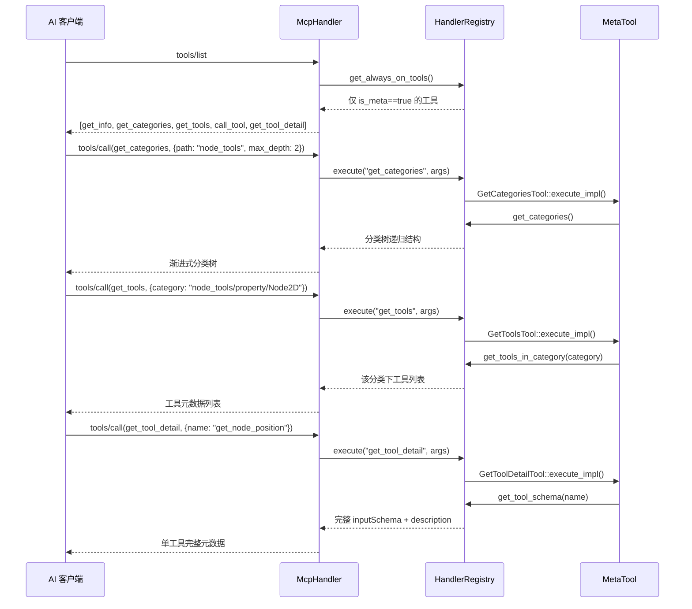

# 元工具

> 发现工具的系统级工具，始终可见（`is_meta() == true`），用于工具发现、分类浏览和信息查询。

## 工具列表

5 个元工具，位于 `extensions/src/built_in/tools/meta/`，category 均为 `meta_tools`。

| 工具名 | 文件 | 功能 |
|--------|------|------|
| `get_info` | `get_info.hpp` | 返回连接状态、引擎版本、项目配置、编辑器状态 |
| `get_categories` | `get_categories.hpp` | 返回工具分类树，支持 path 钻取和 max_depth 控制 |
| `get_tools` | `get_tools.hpp` | 按分类路径列出该分类下所有工具（不含子分类） |
| `get_tool_detail` | `get_tool_detail.hpp` | 返回指定工具的完整元数据 |
| `call_tool` | `call_tool.hpp` | 兜底调用任意工具（当 AI 客户端不支持直接 tool call 时使用） |

## 调用流程



## 渐进式披露策略

| 阶段 | 操作 | 返回 |
|------|------|------|
| 1 | `tools/list` | 仅 5 个元工具（`is_meta=true`） |
| 2 | `get_categories` | 分类树（首层：meta_tools, node_tools, editor_tools） |
| 3 | `get_tools(category)` | 指定分类下所有工具 |
| 4 | `get_tool_detail(name)` | 单工具完整 schema |

## 注册

所有元工具带 `// @tool register` 注释，由 codegen 自动注册。元工具通过 `is_meta() → true` 标记始终可见。

## get_info 返回值结构

```json
{
  "connection": { "status": "connected", "transport": "streamable_http" },
  "engine": {
    "version": "4.6",
    "version_string": "4.6.stable.official...",
    "build": "custom_build",
    "godot_version": { "major": 4, "minor": 6, "patch": 0, ... }
  },
  "plugin": {
    "version": "0.2.0-dev3",
    "builtin_tool_count": 124,
    "custom_tool_count": 0
  },
  "project": {
    "name": "...",
    "path": "res://",
    "data_dir": "C:/Users/.../project_data"
  },
  "editor": {
    "scene_open": true,
    "scene_root_path": "/root/Main",
    "scene_count": 2,
    "open_scenes": ["/root/Main", "/root/Editor"],
    "playing": false,
    "play_mode": "stopped"
  }
}
```

## call_tool 兜底

`call_tool` 将参数中的 `tool` 字段作为工具名重新分派到 `HandlerRegistry::execute()`。用于 AI 客户端不支持 MCP native tool call 时的备用调用：

```json
// 请求
{ "tool": "get_scene_tree", "args": {} }

// 内部
HandlerRegistry::execute("get_scene_tree", {})
```
