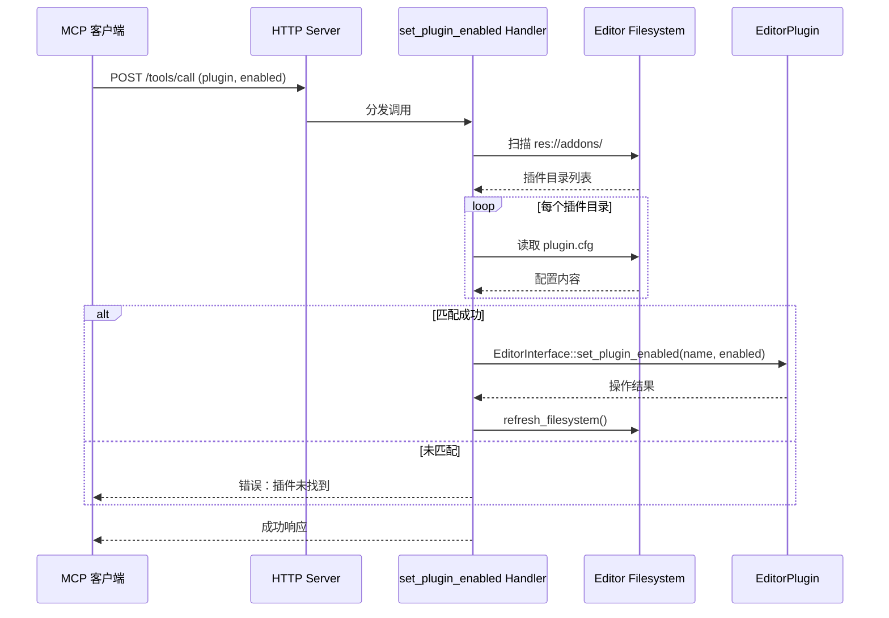

# 插件管理工具

> 2 个工具，管理 `res://addons/` 中的编辑器插件。位于 `extensions/src/built_in/tools/editor_tools/plugin/`，通过 X-macro 注册。

## 工具列表

| 工具 | 描述 |
|------|------|
| `list_plugins` | 列出 `res://addons/` 中所有插件及其启用状态 |
| `set_plugin_enabled` | 启用或禁用编辑器插件 |

## `list_plugins`

扫描 `res://addons/` 目录下每个子目录的 `plugin.cfg` 文件。

**返回**：插件列表，每个插件包含 name、version、author、description 和 enabled 状态。

```json
{
  "plugins": [
    {
      "name": "Godot MCP",
      "version": "0.2.2-dev1",
      "author": "",
      "description": "Model Context Protocol bridge for Godot Engine.",
      "enabled": true
    }
  ]
}
```

## `set_plugin_enabled`

**参数**：

- `plugin`：插件名称（匹配 `plugin.cfg` 中的 `name` 字段）
- `enabled`：`true` 启用，`false` 禁用

**实现**：

1. 扫描 `res://addons/` 查找匹配插件
2. 读取其 `plugin.cfg` 确认名称
3. 调用 `EditorInterface::set_plugin_enabled(name, enabled)`
4. 刷新文件系统

## 工作流程

以下序列图展示了调用 `set_plugin_enabled` 时各组件间的交互：



## 实现细节

- 插件状态通过 `ConfigFile` 读取 `plugin.cfg`
- 启用/禁用通过 `EditorInterface::set_plugin_enabled()` API
- 操作后调用 `refresh_filesystem` 确保编辑器立即感知变更
- 未找到匹配插件时返回错误信息
