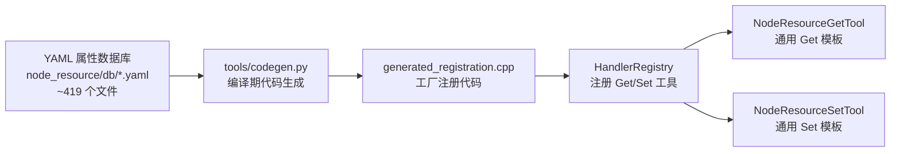
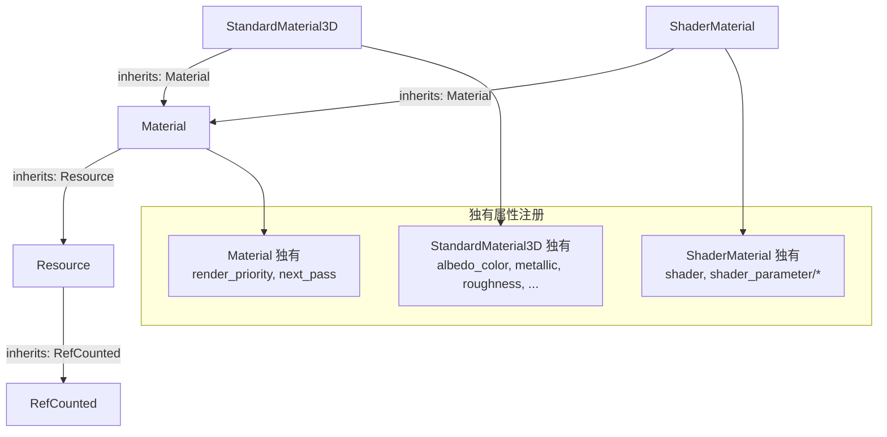

# 资源属性工具系统

> 为每个 Godot 资源类型的每个独有属性创建 Get/Set 工具，通过 YAML 数据库 + 代码生成实现完全自动化注册。当前覆盖 ~419 个资源类型，与 [节点属性系统](../design/node-property-system.md) 架构一致。

## 架构



## 与节点属性系统的区别

| 维度 | 节点属性 | 资源属性 |
|------|---------|---------|
| YAML 位置 | `node_props/db/`（283 文件） | `node_resource/db/`（419 文件） |
| 工具类 | `NodePropertyGetTool` / `NodePropertySetTool` | `NodeResourceGetTool` / `NodeResourceSetTool` |
| 模板文件 | `node_props/node_property_tool.hpp` | `node_tools/node_resource_tool.hpp` |
| 场景依赖 | `needs_scene: true` + `needs_node: true` | `needs_scene: true` + `needs_node: true` |
| 分类前缀 | `node_tools/property/` | `node_tools/resource/` |
| 别名系统 | 支持（CanvasItem → Node2D/Control） | 不支持（资源无抽象派生概念） |

## YAML 数据库

### 存储位置

```
extensions/src/built_in/tools/node_resource/db/
  ├── Resource.yaml         # 基类（resource_local_to_scene, resource_path, resource_name）
  ├── Material.yaml         # 材质基类
  ├── StandardMaterial3D.yaml
  ├── ShaderMaterial.yaml
  ├── Texture2D.yaml        # 纹理基类
  ├── ImageTexture.yaml
  ├── NoiseTexture2D.yaml
  ├── Animation.yaml        # 动画资源
  ├── AnimationLibrary.yaml
  ├── Curve.yaml
  ├── Curve2D.yaml
  ├── Gradient.yaml
  ├── TileSet.yaml
  ├── Mesh.yaml
  ├── ArrayMesh.yaml
  ├── VisualShader.yaml     # 可视化着色器
  ├── FontFile.yaml
  ├── AudioStreamWAV.yaml
  ├── GDScript.yaml
  ├── CSharpScript.yaml
  ├── ...                   # 共 ~419 个文件
```

### YAML Schema 定义

```yaml
# db/Material.yaml — 示例
class: Material
inherits: Resource
properties:
  - name: render_priority
    type: 2
    type_name: int
  - name: next_pass
    type: 17
    type_name: Material
description: "Base class for materials."
aliases: []
```

## 工具生成

### 命名格式

```
<action>_<resource_type_lower>_<property_name>
```

| 资源类型 | 属性 | Get 工具 | Set 工具 |
|---------|------|---------|---------|
| Resource | `resource_path` | `get_resource_resource_path` | `set_resource_resource_path` |
| Resource | `resource_name` | `get_resource_resource_name` | `set_resource_resource_name` |
| Material | `render_priority` | `get_material_render_priority` | `set_material_render_priority` |
| StandardMaterial3D | `albedo_color` | `get_standardmaterial3d_albedo_color` | `set_standardmaterial3d_albedo_color` |
| Curve | `max_value` | `get_curve_max_value` | `set_curve_max_value` |
| Gradient | `colors` | `get_gradient_colors` | `set_gradient_colors` |

### 继承链去重

codegen 沿 `inherits` 链向上收集属性，只注册当前类型独有的属性：



## 实现细节

### 模板类

`node_resource_tool.hpp` 定义 `NodeResourceGetTool` 和 `NodeResourceSetTool`，结构与 `NodePropertyGetTool`/`NodePropertySetTool` 一致：

```cpp
class NodeResourceGetTool : public ITool {
    String name_;
    String category_;
    String resource_type_;  // 期望资源类型（如 "Material"）
    String prop_name_;

    Dictionary execute_impl(const ToolContext &ctx) override {
        // 类型安全检查
        Variant val = ctx.node->get(prop_name_);
        Dictionary data;
        data[prop_name_] = variant_to_json(val);
        return ToolResult::ok(data);
    }
};
```

### 注册

```cpp
// 由 codegen 在 generated_registration.cpp 中生成：
reg.register_tool(std::make_unique<NodeResourceGetTool>(
    "get_material_render_priority", "node_tools/resource/Resource/Material",
    "Material", "render_priority"));
reg.register_tool(std::make_unique<NodeResourceSetTool>(
    "set_material_render_priority", "node_tools/resource/Resource/Material",
    "Material", "render_priority"));
```

## 规模

| 指标 | 数据 |
|------|:----:|
| 资源类型 YAML 文件 | ~419 |
| 推断注册工具数 | ~3000+（含 Get + Set 双向） |

设计细节（继承链去重算法、codegen 流程、构建集成）与[节点属性系统](../design/node-property-system.md) 完全一致。
