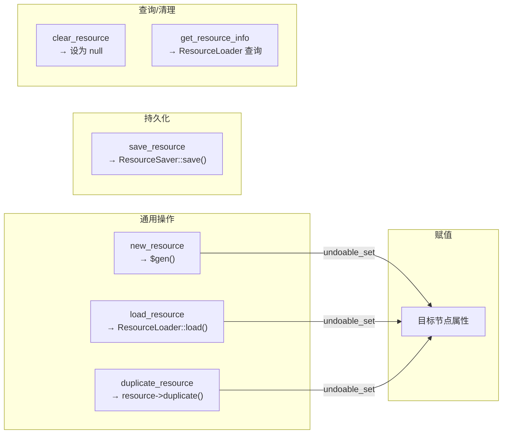

# 资源管理工具

> 管理 Godot 资源的加载、创建、复制、保存和查询。6 个工具，位于 `extensions/src/built_in/tools/node_tools/general/`。

## 工具列表

| 工具名 | 文件 | 功能 |
|--------|------|------|
| `load_resource` | `load_resource.hpp` | 从文件加载资源并赋值到节点属性 |
| `new_resource` | `new_resource.hpp` | 创建指定类型的新资源并赋值到节点属性 |
| `duplicate_resource` | `duplicate_resource.hpp` | 复制节点属性上的资源为独立实例 |
| `save_resource` | `save_resource.hpp` | 将节点属性上的资源保存到文件 |
| `clear_resource` | `clear_resource.hpp` | 清除节点属性上的资源引用 |
| `get_resource_info` | `get_resource_info.hpp` | 获取资源文件的元信息 |

## 注册

六个工具均带 `// @tool register` 注释，category 均为 `node_tools/general`，由 codegen 自动注册。

## 依赖关系

## 工具说明

### `load_resource`
通过 `ResourceLoader::load(res_path)` 从磁盘加载资源文件（`.tres`、`.res`、`.png`、`.ogg` 等），然后用 `undoable_set()` 赋值到指定节点属性。

### `new_resource`
用 `ClassDB::instantiate(type_name)` 创建指定类型的空资源实例，通过 `undoable_set()` 赋值。

### `duplicate_resource`
读取节点属性的当前资源引用，调用 `resource->duplicate()` 创建独立副本（不共享），然后通过 `undoable_set()` 替换原属性。

### `save_resource`
读取节点属性的当前资源引用，调用 `ResourceSaver::save(resource, path)` 保存到磁盘文件。写后自动调用 `notify_file_changed(path)` 通知编辑器刷新。

### `clear_resource`
将节点属性设为 `Variant()`（null）。通过 `notify_file_changed()` 通知变更。

### `get_resource_info`
不需要场景。通过 `ResourceLoader::get_singleton()->has(path)` 和 `load(path)` 查询资源的类型、大小、路径等信息。

## 注意事项

- `load_resource`、`new_resource`、`duplicate_resource`、`save_resource`、`clear_resource` 均需要场景（`needs_scene: true`）
- `get_resource_info` 不需要场景，适合文件系统浏览
- 所有修改节点属性的工具优先使用 `undoable_set()` 支持撤销
