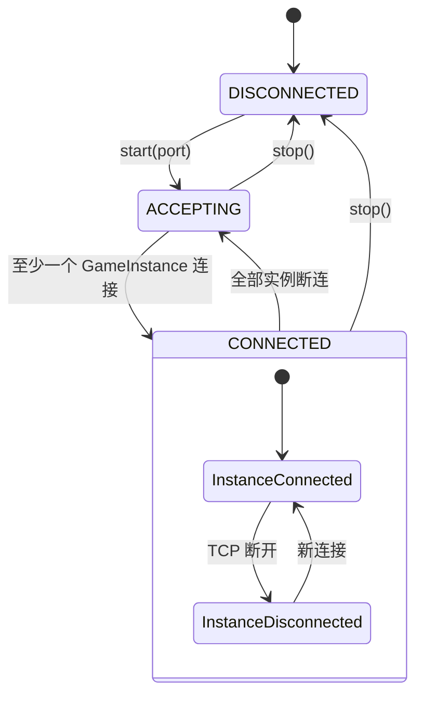
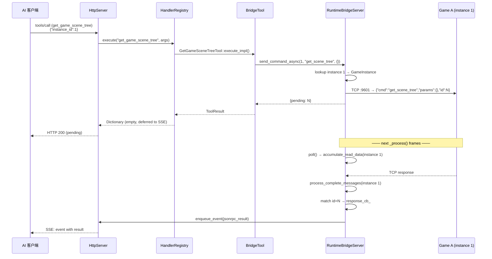

# 运行时桥接

> 编辑器 ↔ 多游戏进程的双向 TCP 通信通道，使 AI 客户端能查询和控制多个运行中的游戏实例（如多人游戏测试）。

## 架构概览

```
  Editor Process (:9601 server)              Game Process A (:9601 client)
  ┌─────────────────────────────┐     TCP JSON    ┌──────────────────────────┐
  │  RuntimeBridgeServer        │ ◄────────────── │  GameBridgeNode (Node)  │
  │  - TcpServer on :9601       │    {"cmd":...,   │  - TCP client            │
  │  - ConnectionPool           │    "params":..., │  - connects to editor    │
  │  - 每个 GameInstance 独立读  │    "id":...}     │  - 7 个命令 handler      │
  │  - async frame-driven       │                │  - node_to_dict() 序列化  │
  └─────────────────────────────┘                └──────────────────────────┘
                                                       │
                                              Game Process B
                                              ┌──────────────────────────┐
                                              │  GameBridgeNode (Node)   │
                                              │  - TCP client            │
                                              │  - 独立 instance_id      │
                                              └──────────────────────────┘
```

编辑器侧运行 `TcpServer` 侦听 9601，多个游戏进程作为 TCP 客户端主动连接编辑器。每个连接分配唯一 `instance_id`，用于工具调用时的实例路由。

## 组件详情

### GameBridgeNode（游戏进程侧）

- 继承 `Node`，`GDCLASS` 注册（`game_bridge.hpp:12`）
- `register_types.cpp` 在 `LEVEL_SCENE` 阶段实例化，仅**非编辑器进程**
- 通过 `call_deferred("_self_add")` 加入场景树（`game_bridge.cpp:70-84`），根节点未就绪时延迟重试
- `_process()` 每帧：`connect_if_needed()` + `read_from_server()`（`game_bridge.cpp:63-68`）
- 端口环境变量：`GODOT_MCP_BRIDGE_PORT`（默认 9601）
- **从 TCPServer 改为 TCPClient**：不再监听端口，改为连接编辑器的 9601
- 接收缓冲区上限 **1048576 字节（1MB）**
- `read_from_server()` 通过 `read_text_`/`read_offset_` 增量累积解码

**7 个命令**（`game_bridge.cpp:213-226`）：

| 命令 | 功能 |
|------|------|
| `get_scene_tree` | 获取运行时场景树（递归，`max_depth` 参数） |
| `get_property` | 读取节点属性值 |
| `set_property` | 设置节点属性（`json_to_variant` 转换值） |
| `call_method` | 在节点上调用方法（参数经 `json_to_variant` 转换） |
| `screenshot` | 截取视口图像（PNG/JPG，Base64 编码返回） |
| `simulate_input` | 模拟键盘/鼠标/动作输入 |
| `set_pause` | 设置游戏暂停状态 |

**桥接工具**（`runtime_tools/bridge/*.hpp`，8 个）：

| 工具 | 对应命令 | 说明 |
|------|----------|------|
| `wait_for_bridge` | — | 等待指定 instance_id 的游戏连接就绪 |
| `get_game_scene_tree` | `get_scene_tree` | 参数新增 `instance_id` |
| `get_game_node_property` | `get_property` | 参数新增 `instance_id` |
| `set_game_node_property` | `set_property` | 参数新增 `instance_id` |
| `call_method_in_game` | `call_method` | 参数新增 `instance_id` |
| `capture_game_screenshot` | `screenshot` | 参数新增 `instance_id` |
| `simulate_game_input` | `simulate_input` | 参数新增 `instance_id` |
| `list_game_instances` | — | 元工具，列出所有已连接的游戏实例 |

### RuntimeBridgeServer（编辑器侧）

- 纯 C++ 类（非 Godot 节点），`McpEditorPlugin` 通过成员变量持有
- **状态机**：`DISCONNECTED → ACCEPTING → CONNECTED`（含多实例连接池）



- **`start(port)`**：创建 `TcpServer` 并绑定端口 9601
- **`poll()`**：每帧执行 `accept_new_connections()`（接受新游戏连接）+ 为每个实例执行 `accumulate_read_data()`（非阻塞读取）+ `process_timeouts()`
- **`send_command_async(instance_id, cmd, params)`**：通过 `instance_id` 找到对应 `GameInstance`，发送 TCP 帧，返回 `{pending: request_id}`



## 多实例路由

每个桥接工具新增 `instance_id` 参数（必填，int）：

```json
{"name": "get_game_scene_tree", "arguments": {"instance_id": 1, "node_path": "/root"}}
```

新增元工具 `list_game_instances` 用于发现当前连接的游戏：

```json
// Response:
{
  "instances": [
    {"id": 1, "connected_at": 1234567, "game_name": "MyGame"},
    {"id": 2, "connected_at": 1234590, "game_name": "MyGame"}
  ]
}
```

## 已知限制

1. **`pause_project` 响应格式不一致**：该工具直接返回 `send_command()` 原始 `{ok, data}` 响应，未经 `make_response()` 展平为 `{success, data}` 格式（`pause_project.hpp:49`）。
2. **连接顺序随机**：多个游戏实例启动顺序不可控，AI 客户端应通过 `list_game_instances` 主动发现后再路由。
