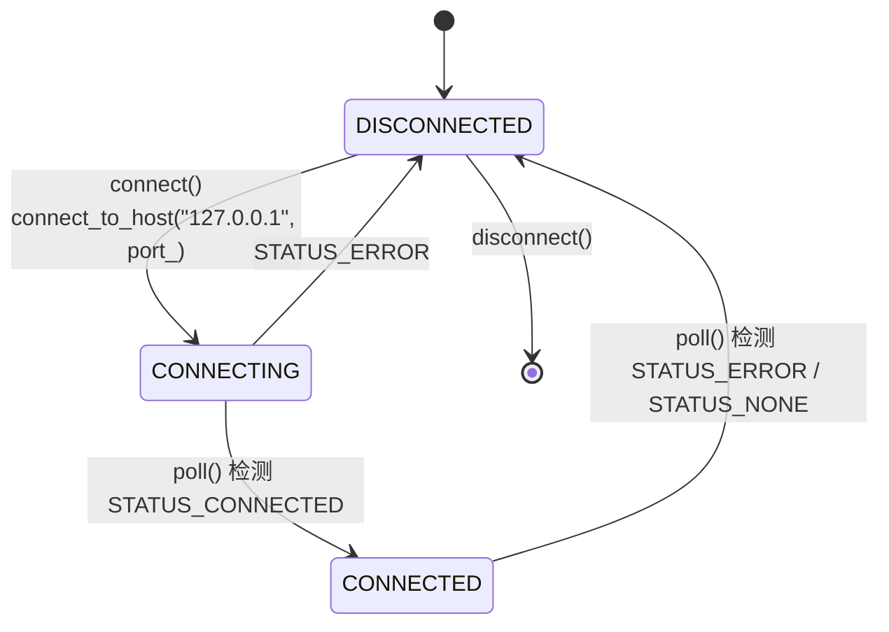
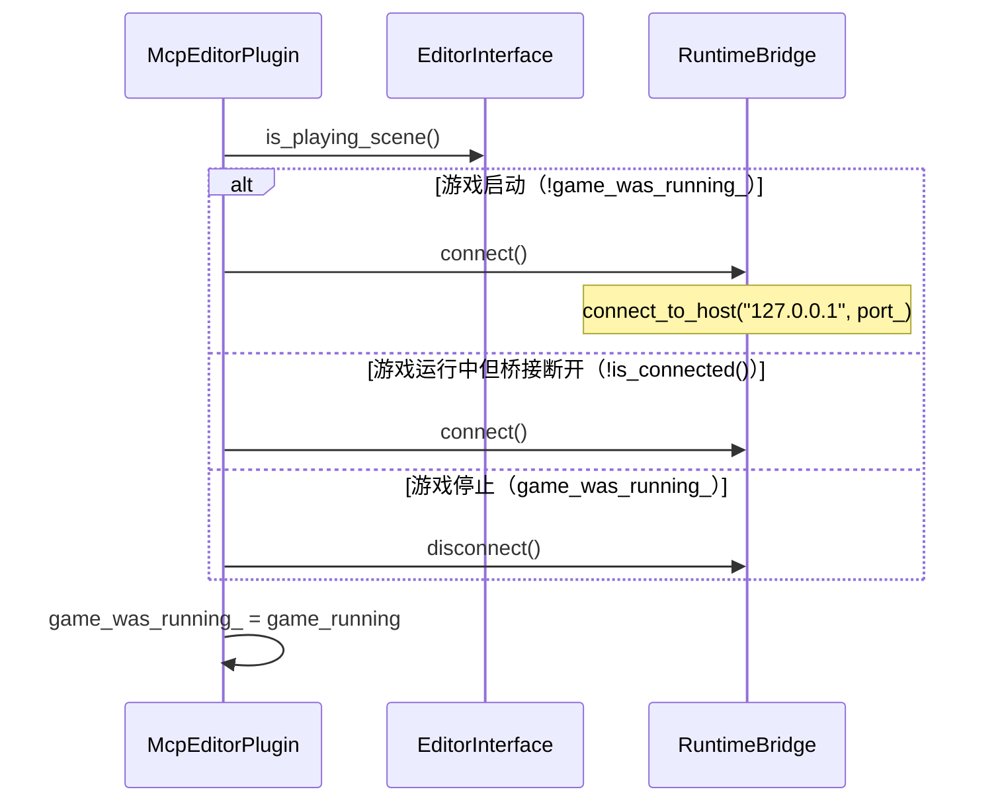
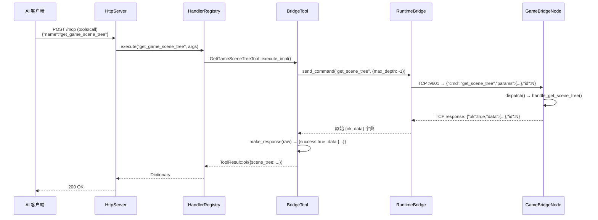

# 运行时桥接

> 编辑器 ↔ 游戏进程的双向 TCP 通信通道，使 AI 客户端能查询和控制运行中的游戏。

## 架构概览

```
  Editor Process (:9601 client)         Game Process (:9601 server)
  ┌─────────────────────────────┐     TCP JSON    ┌──────────────────────────┐
  │  RuntimeBridge (TCP client) │ ←────────────── │  GameBridgeNode (Node)  │
  │  - McpEditorPlugin 持有     │   {"cmd":...,   │  - TCPServer on :9601    │
  │  - poll() 每帧驱动连接      │    "params":...,│  - 单客户端              │
  │  - send_command() 同步调用   │    "id":...}    │  - 7 个命令 handler      │
  │  - make_response() 由工具调用│                │  - node_to_dict() 序列化 │
  └─────────────────────────────┘                └──────────────────────────┘
```

## 组件详情

### GameBridgeNode（游戏进程侧）

- 继承 `Node`，`GDCLASS` 注册（`game_bridge.hpp:12`）
- `register_types.cpp` 在 `LEVEL_SCENE` 阶段实例化，仅**非编辑器进程**
- 通过 `call_deferred("_self_add")` 加入场景树（`game_bridge.cpp:70-84`），根节点未就绪时延迟重试
- `_process()` 每帧：`accept_clients()` + `read_clients()`（`game_bridge.cpp:63-68`）
- 端口环境变量：`GODOT_MCP_BRIDGE_PORT`（默认 9601）（`game_bridge.cpp:40-48`）
- `start_server()` 监听 `localhost:port_`（`game_bridge.cpp:90-99`）
- **单客户端**：`client_` 为单个 `Ref<StreamPeerTCP>`，已有连接时拒绝新连接（`game_bridge.cpp:113-128`）
- 接收缓冲区上限 **1048576 字节（1MB）**（`game_bridge.hpp:53`）
- `read_clients()` 通过 `read_text_`/`read_offset_` 增量累积解码（仅处理新收到的字节，避免每帧重新解码整个缓冲），尝试 JSON 解析，成功后清理已处理数据并分发（`game_bridge.cpp:139-214`）

**7 个命令**（`game_bridge.cpp:213-226`）：

| 命令 | 功能 | 实现位置 |
|------|------|----------|
| `get_scene_tree` | 获取运行时场景树（递归，`max_depth` 参数） | `handle_get_scene_tree` |
| `get_property` | 读取节点属性值 | `handle_get_property` |
| `set_property` | 设置节点属性（`json_to_variant` 转换值） | `handle_set_property` |
| `call_method` | 在节点上调用方法（参数经 `json_to_variant` 转换） | `handle_call_method` |
| `screenshot` | 截取视口图像（PNG/JPG，Base64 编码返回） | `handle_screenshot` |
| `simulate_input` | 模拟键盘/鼠标/动作输入 | `handle_simulate_input` |
| `set_pause` | 设置游戏暂停状态 | `handle_set_pause` |

**桥接工具**（`runtime_tools/bridge/*.hpp`，7 个）：

| 工具 | 对应命令 | 调用方式 |
|------|----------|----------|
| `wait_for_bridge` | — | 轮询桥接状态，等待游戏进程连接 |
| `get_game_scene_tree` | `get_scene_tree` | `make_response(send_command(...))` |
| `get_game_node_property` | `get_property` | `make_response(send_command(...))` |
| `set_game_node_property` | `set_property` | `make_response(send_command(...))` |
| `call_method_in_game` | `call_method` | `make_response(send_command(...))` |
| `capture_game_screenshot` | `screenshot` | `make_response(send_command(...))` |
| `simulate_game_input` | `simulate_input` | `make_response(send_command(...))` |

> `set_pause` 命令由 `runtime_tools/lifecycle/pause_project` 工具使用，直接返回 `send_command()` 原始 `{ok, data}` 响应，不经 `make_response()` 展平（`pause_project.hpp:49`）。

### RuntimeBridge（编辑器侧）

- 纯 C++ 类（非 Godot 节点），`McpEditorPlugin` 通过成员变量持有（`editor_plugin.hpp:45`）
- **状态机**：`DISCONNECTED → CONNECTING → CONNECTED`（`bridge.hpp:12`）



- **`connect()`**（无参数）：创建 `StreamPeerTCP`，连接 `127.0.0.1:port_`（`bridge.cpp:41-55`）。端口由 `set_port()` 设置，主机硬编码为 `127.0.0.1`。
- **`send_command(cmd, params, timeout_ms=5000)`**（`bridge.cpp:66-94`）：
  1. 构建 JSON 命令：`{"cmd":"...", "params":{...}, "id":<递增>}`
  2. TCP 发送
  3. 调用 `read_response()` 忙等待读取响应
  4. **返回原始 `{ok, data}` 字典**，不做展平
- **`read_response(timeout_ms)`**（私有，`bridge.cpp:113-199`）：忙等待（`OS::delay_msec(5)` 轮询，最长 `timeout_ms`），累积数据并通过 `try_parse_line` lambda 尝试 JSON 解析。该 lambda 使用 `consumed_offset` 跟踪已解析位置（O(n²)→O(n) 优化——每次只扫描新数据，而非从头重新扫描整个缓冲）
- **`make_response(raw)`**（静态，`bridge.cpp:134-148`）：将桥接原始响应展平为工具友好信封：
  - 成功：`{ok:true, data:X}` → `{success:true, data:X}`
  - 失败：`{ok:false, error:msg}` → `{success:false, error:{code:"BRIDGE_ERROR", message:msg}}`
  - **由各工具自行调用**（如 `get_game_scene_tree.hpp:50`），非 `send_command()` 内部调用
- **`poll()`**（`bridge.cpp:15-39`）：在 `McpEditorPlugin::_process()` 中每帧调用，推进 CONNECTING → CONNECTED 状态转换及断线检测

### 连接生命周期

`McpEditorPlugin::_try_bridge_connect()` 每帧执行（`editor_plugin.cpp:223-236`）：



## 数据流（工具调用）



## 已知限制

1. **同步阻塞**：`send_command()` 忙等待最长 5 秒（`timeout_ms` 默认 5000），多工具串行调用会阻塞 MCP 响应。
2. **`pause_project` 响应格式不一致**：该工具直接返回 `send_command()` 原始 `{ok, data}` 响应，未经 `make_response()` 展平为 `{success, data}` 格式（`pause_project.hpp:49`）。
