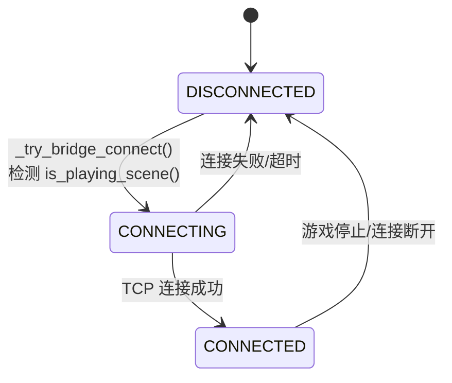
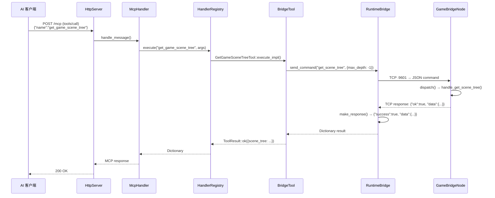

# 运行时桥接

> 编辑器 ↔ 游戏进程的双向 TCP 通信通道，使 AI 客户端能查询和控制运行中的游戏。

## 架构概览

```
  Editor Process (:9601 client)         Game Process (:9601 server)
  ┌─────────────────────────────┐     TCP JSON    ┌──────────────────────────┐
  │  RuntimeBridge (TCP client) │ ←────────────── │  GameBridgeNode (Node)  │
  │  - McpEditorPlugin 持有     │   {"cmd":...,   │  - TCPServer on :9601    │
  │  - poll() 每帧驱动连接      │    "params":...,│  - 7 个命令 handler      │
  │  - send_command() 同步调用   │    "id":...}    │  - node_to_dict() 序列化 │
  │  - make_response() 展平     │                │                         │
  └─────────────────────────────┘                └──────────────────────────┘
```

## 组件详情

### GameBridgeNode（游戏进程侧）

- 继承 `Node`，`GDCLASS` 注册
- `register_types.cpp` 在 `LEVEL_SCENE` 阶段实例化，仅**非编辑器进程**
- 通过 `call_deferred("_self_add")` 加入场景树
- `_process()` 每帧：`accept_clients()` + `read_clients()` + 响应发送
- 端口环境变量：`GODOT_MCP_BRIDGE_PORT`（默认 9601）
- 最大客户端数 4，接收缓冲区 8192 字节

**7 个命令**：

| 命令 | 功能 | 实现位置 |
|------|------|----------|
| `get_scene_tree` | 获取运行时场景树（递归，`max_depth` 参数） | `handle_get_scene_tree` |
| `get_property` | 读取节点属性值 | `handle_get_property` |
| `set_property` | 设置节点属性（`json_to_variant` 转换值） | `handle_set_property` |
| `call_method` | 在节点上调用方法（参数经 `json_to_variant` 转换） | `handle_call_method` |
| `screenshot` | 截取视口图像（PNG/JPG，Base64 编码返回） | `handle_screenshot` |
| `simulate_input` | 模拟键盘/鼠标/动作输入 | `handle_simulate_input` |
| `set_pause` | 设置游戏暂停状态 | `handle_set_pause` |

**运行时桥接工具**（`runtime_tools/bridge/*.hpp`）：

| 工具 | 对应命令 |
|------|----------|
| `get_game_scene_tree` | `get_scene_tree` |
| `get_game_node_property` | `get_property` |
| `set_game_node_property` | `set_property` |
| `call_method_in_game` | `call_method` |
| `capture_game_screenshot` | `screenshot` |
| `simulate_game_input` | `simulate_input` |

### RuntimeBridge（编辑器侧）

- 纯 C++ 类（非 Godot 节点），`McpEditorPlugin` 通过成员变量持有
- **状态机**：`DISCONNECTED → CONNECTING → CONNECTED`



- **`send_command(cmd, params, timeout_ms=5000)`**：
  1. 构建 JSON 命令：`{"cmd":"...", "params":{...}, "id":<递增>}`
  2. TCP 发送
  3. 忙等待读取响应（`OS::delay_msec(50)` 轮询，最长 `timeout_ms`）
  4. `make_response()` 展平：`{ok, data}` → `{success, data}`
- **`poll()`**：每帧在 `McpEditorPlugin::_process()` 中调用，维护连接状态

### 连接生命周期

`McpEditorPlugin::_try_bridge_connect()` 每帧执行：
1. 检查 `ei->is_playing_scene()`
2. 游戏启动 → `runtime_bridge_.connect(host, port)`
3. 游戏停止 → `runtime_bridge_.disconnect()`
4. 检测到时断开自动重连

## 数据流（工具调用）



## 已知问题

1. **`set_game_node_property` 不生效**：`handle_set_property` 未调 `json_to_variant()` 转换参数值（已于 `feature/runtime` 修复）。
2. **运行时工具响应嵌套 `data`**：桥接 JSON-RPC 完整响应直接嵌入 MCP 响应，未展平（`make_response()` 已修复）。
3. **桥接断开**：`stop_project` 需调用 `runtime_bridge_.disconnect()` 断开连接（已修复）。
4. **id 类型**：`send_command` 的 id 应为 int64，手动构造 JSON 时可能类型不匹配（已修复）。
5. **同步阻塞**：`send_command()` 忙等待最长 5 秒，多工具串行调用会阻塞 MCP 响应。
