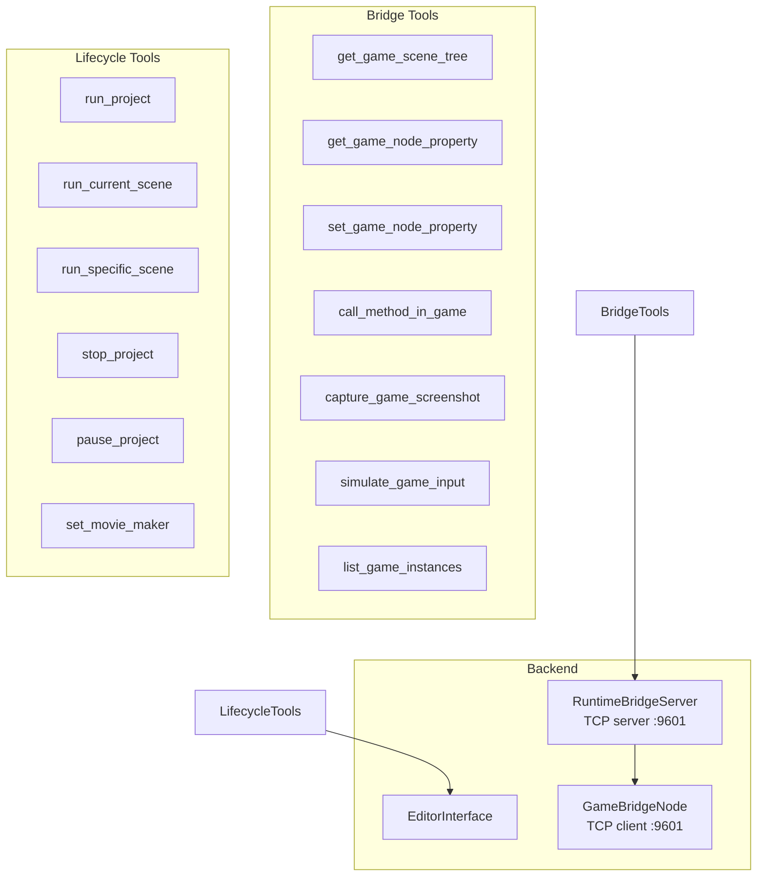
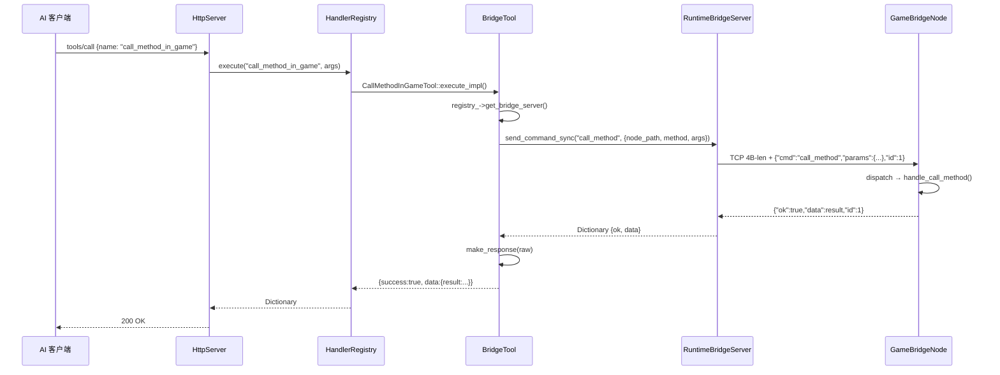

# 运行时工具

> 通过 14 个 ITool 封装对运行中游戏的查询与控制。分为两组：**桥接工具**（经 RuntimeBridgeServer ↔ TCP ↔ GameBridgeNode 与游戏进程通信，8 个）和**生命周期工具**（通过 EditorInterface 直接控制编辑器播放状态，6 个）。

## 架构



## 注册

所有工具注册在 `register_existing.hpp`：

| 行 | 类名 | 工具名 | is_destructive | 组 |
|----|------|--------|:--------------:|:--:|
| 167 | `WaitForBridgeTool` | `wait_for_bridge` | false | bridge |
| 168 | `GetGameSceneTreeTool` | `get_game_scene_tree` | false | bridge |
| 169 | `GetGameNodePropertyTool` | `get_game_node_property` | false | bridge |
| 170 | `SetGameNodePropertyTool` | `set_game_node_property` | true | bridge |
| 171 | `CallMethodInGameTool` | `call_method_in_game` | false | bridge |
| 172 | `CaptureGameScreenshotTool` | `capture_game_screenshot` | false | bridge |
| 173 | `SimulateGameInputTool` | `simulate_game_input` | false | bridge |
| 174 | `ListGameInstancesTool` | `list_game_instances` | false | bridge |
| 177 | `RunProjectTool` | `run_project` | false | lifecycle |
| 178 | `RunCurrentSceneTool` | `run_current_scene` | false | lifecycle |
| 179 | `RunSpecificSceneTool` | `run_specific_scene` | false | lifecycle |
| 180 | `StopProjectTool` | `stop_project` | false | lifecycle |
| 181 | `PauseProjectTool` | `pause_project` | false | lifecycle |
| 182 | `SetMovieMakerTool` | `set_movie_maker` | false | lifecycle |

## 桥接工具（8 个）

所有桥接工具共同的调用模式：

1. 从 `registry_->get_bridge_server()` 获取 `RuntimeBridgeServer` 指针
2. 检查 `bridge_server->has_instances()` — 若无可连接的实例则返回 `GAME_NOT_RUNNING`
3. 调用 `bridge_server->send_command_sync(instance_id, cmd, params, max_poll_ms=200)` 同步发送 JSON 命令到游戏进程并进行短时轮询
4. 经 `bridge_server->make_response()` 格式化返回

### get_game_scene_tree（`get_game_scene_tree.hpp:11`）

- 参数：`max_depth`（int，默认 -1，-1 为无限递归）
- 命令：`"get_scene_tree"`
- 返回：游戏节点树结构（name、type、path、children 递归）

### get_game_node_property（`get_game_node_property.hpp`）

- 参数：`node_path`（string，必填），`property`（string，必填）
- 命令：`"get_property"`
- 实现：GameBridgeNode 端 `node.get(property)` → `variant_to_json()`

### set_game_node_property（`set_game_node_property.hpp`）

- 参数：`node_path`（string，必填），`property`（string，必填），`value`（dynamic，必填）
- 命令：`"set_property"`
- 实现：GameBridgeNode 端 `json_to_variant(value)` → `node.set(property, val)`
- is_destructive: true

### call_method_in_game（`call_method_in_game.hpp`）

- 参数：`node_path`（string，必填），`method`（string，必填），`args`（array，可选）
- 命令：`"call_method"`
- 实现：GameBridgeNode 端 `callv(method, json_converted_args)`

### capture_game_screenshot（`capture_game_screenshot.hpp`）

- 参数：`format`（string，可选，默认 "png"），`instance_id`（integer，可选，默认 0）
- 命令：`"screenshot"`
- 返回：base64 编码的图像数据
- 实现：GameBridgeNode 端 `get_viewport()->get_texture()->get_image()` → `save_png_to_buffer()` → `base64_encode()`

### simulate_game_input（`simulate_game_input.hpp`）

- 参数：`actions`（array，必填），每个元素含 `type`（key/mouse_button/mouse_motion/action）及对应属性
- 命令：`"simulate_input"`
- 实现：GameBridgeNode 端构造 `InputEvent` 子类 → `Input::parse_input_event()`

### list_game_instances（`list_game_instances.hpp`）

- 参数：无
- **不发送 TCP 命令**，直接查询连接池
- 返回所有已连接的游戏实例及其 `id`、`connected_at`、`uptime_msec`
- 实现：`registry_->get_bridge_server()` → `bridge_server->get_connected_instances()` 直接从连接池返回实例列表
- 这是一个实用工具，不依赖 GameBridgeNode TCP 通信

### wait_for_bridge（`wait_for_bridge.hpp:16`）

- 参数：`timeout_ms`（int，默认 8000）
- **不发送 TCP 命令**，调用 `bridge_server_->start_watcher()` 启动帧驱动轮询
- 用于 `run_project`/`run_current_scene`/`run_specific_scene` 之后，等待桥接就绪
- 已连接时立即返回 `{"message": "Bridge already connected"}`
- 超时返回 `BRIDGE_TIMEOUT` 错误
- 实现：每帧 `_process()` 中 `bridge_server_->poll()` 检查游戏是否启动并尝试连接，watcher 完成后通过回调通知，不阻塞主线程

## 生命周期工具（6 个）

所有生命周期工具直接使用 `EditorInterface::get_singleton()`，不依赖 RuntimeBridge。

### run_project（`run_project.hpp:12`）

```cpp
EditorInterface::get_singleton()->play_main_scene();
```

- 等效键盘 F5
- 写入前检查 `application/run/main_scene` 文件存在性

### run_current_scene（`run_current_scene.hpp`）

```cpp
EditorInterface::get_singleton()->play_current_scene();
```

- 等效键盘 F6
- 无需参数

### run_specific_scene（`run_specific_scene.hpp`）

- 参数：`scene_path`（string，必填）
- 实现：通过 `EditorInterface` 的自定义场景播放 API

### stop_project（`stop_project.hpp`）

```cpp
EditorInterface::get_singleton()->stop_playing_scene();
```

- 等效键盘 F8

### pause_project（`pause_project.hpp`）

- 参数：`paused`（bool）
- 实现：`RuntimeBridge::send_command("set_pause", params)` — 通过 TCP 桥接控制游戏进程暂停状态

### set_movie_maker（`set_movie_maker.hpp`）

- 参数：`enabled`（bool）
- 实现：`EditorInterface::get_singleton()->set_movie_maker_enabled(enabled)`
- 用于运行项目时写入视频输出

## 桥接协议与 RuntimeBridgeServer

桥接工具的底层通信由 `extensions/src/runtime/bridge.cpp` 的 `RuntimeBridgeServer` 类处理：

- TCP JSON 协议，4 字节大端长度前缀 + JSON body（非阻塞，帧驱动）
- `RuntimeBridgeServer` 作为 TCP server 监听 `:9601`，等待游戏进程连接
- `GameBridgeNode` 作为 TCP client 主动连接编辑器
- 连接管理：每帧 `_process()` 中 `poll()` 检查连接状态，自动接受/断开
- 命令格式：`{"cmd": "...", "params": {...}, "id": N}`
- 响应格式：`{"ok": true/false, "data": ..., "id": N}`
- 支持多实例：多个游戏实例可同时连接，通过 `instance_id` 区分
- 超时：connect 10000ms，send_command_async 100ms（挂起超时），send_command_sync 200ms（轮询预算）

详见 [runtime-bridge.md](runtime-bridge.md)。

## 工具调用数据流



## 相关源文件

| 文件 | 工具 |
|------|------|
| `runtime_tools/bridge/wait_for_bridge.hpp` | wait_for_bridge |
| `runtime_tools/bridge/get_game_scene_tree.hpp` | get_game_scene_tree |
| `runtime_tools/bridge/get_game_node_property.hpp` | get_game_node_property |
| `runtime_tools/bridge/set_game_node_property.hpp` | set_game_node_property |
| `runtime_tools/bridge/call_method_in_game.hpp` | call_method_in_game |
| `runtime_tools/bridge/capture_game_screenshot.hpp` | capture_game_screenshot |
| `runtime_tools/bridge/simulate_game_input.hpp` | simulate_game_input |
| `runtime_tools/bridge/list_game_instances.hpp` | list_game_instances |
| `runtime_tools/lifecycle/run_project.hpp` | run_project |
| `runtime_tools/lifecycle/run_current_scene.hpp` | run_current_scene |
| `runtime_tools/lifecycle/run_specific_scene.hpp` | run_specific_scene |
| `runtime_tools/lifecycle/stop_project.hpp` | stop_project |
| `runtime_tools/lifecycle/pause_project.hpp` | pause_project |
| `runtime_tools/lifecycle/set_movie_maker.hpp` | set_movie_maker |
| `register_existing.hpp` | 167-182 注册行 |
