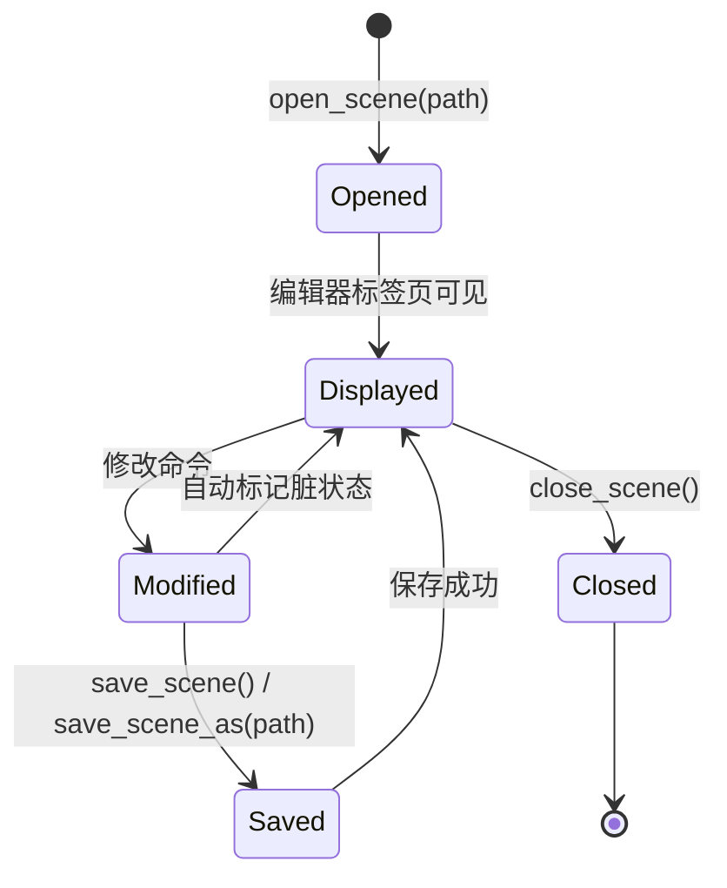

# Scene / Node / Property 命令模式

## Godot 原生 Dictionary/JSON

Godot 的 `Dictionary`/`Variant`/`JSON` 类原生支持所有类型转换，无需手写序列化函数：

```cpp
// C++: 使用 Godot 原生类型
Dictionary args;
args["x"] = 100.0;
args["y"] = 200.0;

Variant v = Variant(args);  // 不需要 j2v
double x = Dictionary(v)["x"];  // 不需要 v2j

// JSON 序列化
String json = JSON::stringify(result_dict);

// JSON 解析
Ref<JSON> parser;
parser.instantiate();
parser->parse(text);
Dictionary data = parser->get_data();
```

## 节点路径解析

`resolve_node(root, path)` 支持多种路径格式：

| 输入 | 行为 |
|------|------|
| `""` 或 `"."` | 返回 `root` |
| `"/"` | 返回 `root` |
| `"/root"` | 返回 `root` |
| `"RootName"` | 匹配根节点的 `name` 属性 |
| `"RootName/Child/Grandchild"` | 前缀自动剥离后从根节点开始查找 |
| 任意 `NodePath` | 正常的 Godot NodePath 解析 |

## 场景文件操作

### EditorInterface 场景方法

| 方法 | 工具 |
|------|------|
| `edit_node(node)` | 选择当前场景中的节点 |
| `get_current_scene()` | 获取当前打开场景的根节点 |
| `save_scene()` | 保存当前场景 |
| `save_scene_as(path)` | 另存为 |
| `open_scene_from_path(path)` | 在编辑器标签中打开 |
| `reload_scene_from_path(path)` | 重新加载 |
| `mark_scene_as_unsaved()` | 标记为未保存 |
| `get_edited_scene_root()` | 获取编辑中的场景根节点 |

### 场景文件生命周期

以下流程图展示了场景从打开到关闭的完整生命周期：



## 文件系统通知

写入文件后调用，让编辑器检测文件变化：

```cpp
EditorInterface::get_singleton()->get_resource_filesystem()->update_file(path);
```

## C++ 共享工具函数

| 函数 | 说明 |
|------|------|
| `ensure_parent_dir(path)` | 创建 `res://` 路径的父目录 |
| `relative_path(node, root)` | 编辑器路径 → 场景相对路径 |
| `get_root()` | 获取当前编辑场景根节点 |
| `mark_dirty()` | 标记场景未保存 |
| `undoable_set(node, prop, value, name)` | 可撤销属性设置 |
| `fix_owners_recursive(node, owner)` | 递归修正节点 owner |
