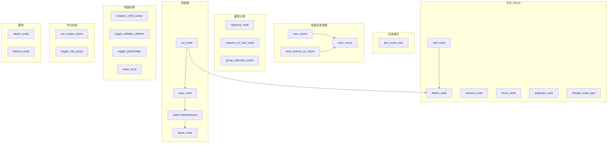

# 场景树工具

> 与 Godot 编辑器场景树交互的工具集，支持场景创建/保存、节点 CRUD、剪贴板操作、场景实例化、脚本操作等。20 个工具，位于 `extensions/src/built_in/tools/editor_tools/scene_tree/`。

## 工具列表

### Batch 1: 基础工具（6）

| 工具名 | 文件 | 功能 | Undo |
|--------|------|------|:----:|
| `get_scene_tree` | `get_scene_tree.hpp` | 递归列出当前场景所有节点（名称、类型、路径、子节点） | ❌ |
| `new_scene` | `new_scene.hpp` | 创建新场景，指定根节点类型和名称 | ✅ 内置 |
| `save_scene` | `save_scene.hpp` | 保存当前场景到 `res://` 路径 | ❌ |
| `save_branch_as_scene` | `save_branch_as_scene.hpp` | 将节点分支保存为 `.tscn` 文件 | ✅ 替换 |
| `add_node` | `add_node.hpp` | 向指定父节点添加子节点 | ✅ |
| `delete_node` | `delete_node.hpp` | 删除场景中的节点 | ✅ |

### Batch 2: 核心操作（6）

| 工具名 | 文件 | 功能 | Undo |
|--------|------|------|:----:|
| `rename_node` | `rename_node.hpp` | 重命名节点 | ✅ |
| `move_node` | `move_node.hpp` | 调整节点在同级中的顺序（上移/下移/指定索引） | ✅ |
| `duplicate_node` | `duplicate_node.hpp` | 复制节点（`Node::duplicate` + `add_sibling`） | ✅ |
| `reparent_node` | `reparent_node.hpp` | 更改节点的父节点 | ✅ |
| `reparent_to_new_node` | `reparent_to_new_node.hpp` | 用新创建的父节点包裹选中节点 | ✅ |
| `change_node_type` | `change_node_type.hpp` | 修改节点类型（`Node::replace_by`） | ✅ |

### Batch 3: 剪贴板 + 场景实例（7）

| 工具名 | 文件 | 功能 | Undo |
|--------|------|------|:----:|
| `copy_node` | `copy_node.hpp` | 复制节点到内部剪贴板（`PackedScene::pack`） | ❌ |
| `cut_node` | `cut_node.hpp` | 剪切节点（复制 + 删除，同一 undo action） | ✅ |
| `paste_node` | `paste_node.hpp` | 从剪贴板粘贴（子节点/同级/替换模式） | ✅ |
| `instance_child_scene` | `instance_child_scene.hpp` | 实例化 `.tscn` 文件为子节点 | ✅ |
| `set_unique_name` | `set_unique_name.hpp` | 切换节点的 `%` 唯一名称 | ✅ |
| `toggle_editable_children` | `toggle_editable_children.hpp` | 切换子场景的可编辑状态 | ✅ |
| `make_local` | `make_local.hpp` | 将实例场景转为本地（断开外部引用） | ✅ |

### Batch 4: 脚本 + 分组（4）

| 工具名 | 文件 | 功能 | Undo |
|--------|------|------|:----:|
| `group_selected_nodes` | `group_selected_nodes.hpp` | 将多个节点编组到新父节点下 | ✅ |
| `toggle_edit_group` | `toggle_edit_group.hpp` | 切换节点的编组编辑状态（`_edit_group_` meta） | ✅ |
| `toggle_placeholder` | `toggle_placeholder.hpp` | 切换实例场景的占位符加载模式 | ✅ |
| `attach_script` | `attach_script.hpp` | 附加 GDScript 到节点 | ✅ |
| `detach_script` | `detach_script.hpp` | 移除节点的脚本 | ✅ |

## 跳过/未实现的场景操作

| 操作 | 原因 |
|------|------|
| `set_scene_root`（设为场景根节点） | 需要 `EditorNode::set_edited_scene()`，GDExtension 不可访问 |
| `copy/cut/paste` 节点（编辑器内部剪贴板） | 用 `PackedScene::pack()` 自实现剪贴板 |
| `batch_rename` / `multi_edit` | 批量变体，UI 依赖强，AI 可逐节点操作替代 |
| `expand_collapse` | 纯 UI 状态 |
| `open_documentation` / `show_in_file_system` | 低价值信息操作 |

## 注册

所有工具通过 X-macro 注册（`register/register_existing.hpp`），category 均为 `editor_tools/scene_tree`。

「脚本」工具（`attach_script`、`detach_script`）也使用 `editor_tools/scene_tree` category，放在同一分类下以便 AI 发现。

## Undo/Redo 模式

所有场景树修改操作统一使用 `EditorUndoRedoManager`（而非 `undoable_set`——后者只适用于属性设置）：

```cpp
EditorUndoRedoManager *ur = EditorInterface::get_singleton()->get_editor_undo_redo();
ur->create_action("操作名", UndoRedo::MERGE_DISABLE, context_node);
ur->add_do_method(parent, "add_child", child, true);
ur->add_do_method(child, "set_owner", edited_scene);
ur->add_do_method(editor_selection, "clear");
ur->add_do_method(editor_selection, "add_node", child);
ur->add_do_reference(child);        // 保护 do 创建的新对象
ur->add_undo_method(parent, "remove_child", child);
ur->add_undo_reference(child);       // 保护 do 移除的旧对象（需 undo 时恢复）
ur->commit_action();
```

### 核心规则

| 场景 | 操作 |
|------|------|
| Do 创建了新对象 | `add_do_reference(obj)` — 防止新对象被 GC 回收 |
| Do 移除了树中对象 | `add_undo_reference(obj)` — 防止被移除的对象被释放（undo 时需要恢复） |
| 对象已在树中且不移动 | 不需要 reference |
| 双向交换 | 双方都需要 reference（如 change_node_type） |

参考：Godot 4 官方 `SceneTreeDock` 源码（`_do_create()`、`_delete_confirm()`、`_do_reparent()`、`TOOL_DUPLICATE`、`TOOL_REPLACE` 等）。

## 依赖关系



## 关键实现细节

### 剪贴板实现

Godot 编辑器内部使用 `SceneTreeDock::node_clipboard`（`static Vector<Node *>`），非 ClassDB 公开 API，GDExtension 不可访问。

MCP 替代方案：

```
copy_node:
  Node *dup = node->duplicate(15);
  Ref<PackedScene> scene = memnew(PackedScene);
  scene->pack(dup);
  s_clipboard = scene;          // static Ref<PackedScene>

paste_node:
  Node *instance = s_clipboard->instantiate(GEN_EDIT_STATE_INSTANCE);
  parent->add_child(instance, true);
  // 包裹在 EditorUndoRedoManager 中
```

### 节点锁定/编组

Godot 使用 `Object::set_meta()` 存储编辑状态，GDExtension 可直接访问：

| 状态 | 实现 |
|------|------|
| 锁定节点 | `node->set_meta("_edit_lock_", Variant())` |
| 解锁节点 | `node->remove_meta("_edit_lock_")` |
| 编组编辑 | `node->set_meta("_edit_group_", Variant())` |
| 取消编组 | `node->remove_meta("_edit_group_")` |

### `make_local` 实现

```cpp
// 1. 断开外部场景文件引用
node->set_scene_file_path("");

// 2. 递归修复所有权：node 下所有子节点的 owner 设为 node
_replace_owner_recursive(node, node, edited_scene);
// _replace_owner_recursive 是一个辅助函数，遍历子节点并调用 set_owner

// 3. 断开继承信号
// 由 tool_base 辅助函数处理（遍历信号连接并移除继承的）
```

### `attach_script` / `detach_script` 实现

```cpp
// attach_script: 从文件加载脚本并设置
Ref<Script> script = ResourceLoader::load(script_path);
undo_redo->create_action("Attach Script");
undo_redo->add_do_method(node, "set_script", script);
undo_redo->add_undo_method(node, "set_script", Variant());
undo_redo->commit_action();

// detach_script: 移除脚本
undo_redo->create_action("Detach Script");
undo_redo->add_do_method(node, "set_script", Variant());
undo_redo->add_undo_method(node, "set_script", existing_script);
undo_redo->commit_action();
```
