# 脚本工具

> 13 个工具，位于 `extensions/src/built_in/tools/editor_tools/scripts/`，分为 GDScript 线（7 工具）和 C# 线（5 工具），共享通用工具函数。每个工具源文件通过 `ScriptLang` 模板参数在 X-macro 展开时实例化为两种语言变体。

## 架构总览

```mermaid
flowchart TB
    subgraph SrcFiles["源文件（8 工具 .hpp + 1 utils .hpp）"]
        READ["read_script.hpp<br/>模板: ScriptLang L"]
        WRITE["write_script.hpp<br/>模板: ScriptLang L"]
        PATCH["patch_script.hpp<br/>模板: ScriptLang L"]
        VAL["validate_script.hpp<br/>模板: ScriptLang L"]
        LIST["list_scripts.hpp<br/>模板: ScriptLang L"]
        GREP["grep_scripts.hpp<br/>同时搜 .gd/.cs"]
        GLOB["glob_scripts.hpp<br/>同时匹配 .gd/.cs"]
        RUN["run_editor_script.hpp<br/>非模板，直接执行"]
    end

    subgraph XMACRO["X-macro GODOT_MCP_TOOL 展开"]
        RG["ReadGdScriptTool(GDSCRIPT)"]
        WG["WriteGdScriptTool(GDSCRIPT)"]
        PG["PatchGdScriptTool(GDSCRIPT)"]
        VG["ValidateGdScriptTool(GDSCRIPT)"]
        LG["ListGdScriptsTool(GDSCRIPT)"]
        GS["GrepScriptsTool"]
        GB["GlobScriptsTool"]
        RE["RunEditorScriptTool"]
        RC["ReadCsharpScriptTool(CSHARP)"]
        WC["WriteCsharpScriptTool(CSHARP)"]
        PC["PatchCsharpScriptTool(CSHARP)"]
        VC["ValidateCsharpScriptTool(CSHARP)"]
        LC["ListCsharpScriptsTool(CSHARP)"]
    end

    UTILS["script_utils.hpp<br/>通用工具函数"]

    READ & WRITE & PATCH & VAL & LIST & GREP & GLOB --> UTILS
    READ --> RG & RC
    WRITE --> WG & WC
    PATCH --> PG & PC
    VAL --> VG & VC
    LIST --> LG & LC
    GREP --> GS
    GLOB --> GB
    RUN --> RE
```



## 注册

所有 13 个工具通过 X-macro 注册（`register/register_existing.hpp:102-114`），category 均为 `editor_tools/scripts`。

| 工具 | is_destructive |
|------|:--------------:|
| `ReadGdScriptTool` | false |
| `WriteGdScriptTool` | **true** |
| `PatchGdScriptTool` | **true** |
| `ValidateGdScriptTool` | false |
| `ListGdScriptsTool` | false |
| `GrepScriptsTool` | false |
| `GlobScriptsTool` | false |
| `RunEditorScriptTool` | **true** |
| `ReadCsharpScriptTool` | false |
| `WriteCsharpScriptTool` | true |
| `PatchCsharpScriptTool` | true |
| `ValidateCsharpScriptTool` | false |
| `ListCsharpScriptsTool` | false |

## 工具详解

### `read_gd_script`
`register_existing.hpp:103` — 模板参数 `ScriptLang::GDSCRIPT`

- 读取 `.gd` 文件内容。使用 `FileAccess::open(path, READ)` → `get_as_text()`
- 验证：`ends_with(".gd")`、`FileAccess::file_exists()`、`fs_utils::validate_res_path()`
- 返回：`path`、`content`、`line_count`、`language`

### `write_gd_script`
`register_existing.hpp:104` — 模板参数 `ScriptLang::GDSCRIPT`

- **销毁性**：覆盖写入 `.gd` 文件
- `content` 为空时自动生成最小脚本 `extends Node\n`
- 使用 `ensure_parent_dir()` 创建父目录；写入后调用 `notify_file_changed()` 刷新 Godot 文件系统
- 使用 `FileAccess::open(path, WRITE)` → `store_string(content)`

### `patch_gd_script`
`register_existing.hpp:105` — 模板参数 `ScriptLang::GDSCRIPT`

- **销毁性**：精准文本替换
- **参数**: `path`、`old_text`（不能为空）、`new_text`、`occurrence`（0=全部，>0=第 N 个）、`whole_word`（标识符边界匹配）
- **实现细节**（`patch_gd_script.hpp:101-150`）：
  - 使用 `String::find()` + 手动字符串拼接，避免 `String::replace()` 在 occurrence>0 时重扫已替换文本
  - `whole_word`：通过 `at_word_boundary()` 检查匹配位置前后字符（`is_ident_char`：a-z/A-Z/0-9/\_）
  - `occurrence <= 0`：从左到右遍历所有匹配，逐个拼接 `left + new_text + ...`
  - `occurrence > 0`：找到第 N 个匹配，`substr(0, idx) + new_text + substr(idx + old_len)`

### `validate_gd_script`
`register_existing.hpp:106` — 模板参数 `ScriptLang::GDSCRIPT`

- 只读：`OS::execute("godot", PackedStringArray("--check-only", "--script", path, "--path", res_path, "--headless", "--quit"))`
- 返回 `valid: bool` + `exit_code`
- 使用 `globalize_path()` 转换 `res://` 为绝对路径

### `list_gd_scripts`
`register_existing.hpp:107` — 模板参数 `ScriptLang::GDSCRIPT`

- 递归遍历项目目录，过滤 `.gd` 文件
- **参数**: `directory`（默认 `res://`）、`include_addons`（默认 false）、`max_results`（默认 200）
- 使用 `walk_project_dir()`（来自 `filesystem_utils.hpp`）
- 返回 `files` 数组，每项含 `path`、`name`、`language`；含 `truncated` 标记

### `grep_scripts`
`register_existing.hpp:108` — `scripts/grep_scripts.hpp`

- 在 `.gd`/`.cs` 文件中搜索文本内容
- **参数**: `pattern`、`language`（gdscript/csharp/all）、`directory`、`case_sensitive`、`max_results`（默认 100）
- 实现：先 `walk_project_dir` 搜集文件，逐文件 `split("\n")` 逐行匹配 `find()`，不区分大小写时双方 `.to_lower()`
- 返回 `matches` 数组（每项含 `path`、`line`、`content`、`language`）

### `run_editor_script`

`register_existing.hpp:109` — `scripts/run_editor_script.hpp`

- **销毁性**（`is_destructive = true`）
- 参数：`script_path`（string，必填）、`args`（array，可选）
- 执行 `EditorScript` 子类脚本：`resource_loader->load(script_path)` → `script->new()` → `cast_to<EditorScript>` → `_run()`
- 返回脚本执行结果或错误信息
- 用于需要在编辑器上下文运行的自定义 GDScript（如资产批量处理）
- 常与 `write_gd_script` 组合使用（先写入脚本再执行）

### `glob_scripts`
`register_existing.hpp:109` — `scripts/glob_scripts.hpp`

- 按 glob 模式匹配脚本文件名（使用 `String::match()`，支持 `*` 和 `?`）
- **参数**: `pattern`、`language`、`directory`、`include_addons`、`max_results`
- 先 `walk_project_dir` 搜集文件，逐文件 `get_file_name().match(pattern)` 过滤
- 返回 `files` 数组 + `truncated` 标记

## C# 工具（5 个，不含 RunEditorScriptTool，后者同时支持 GDScript）

### `read_csharp_script`
`register_existing.hpp:110` — 模板参数 `ScriptLang::CSHARP`

- 与 `read_gd_script` 结构相同，仅校验 `.cs` 扩展名，`language` 返回 `"csharp"`

### `write_csharp_script`
`register_existing.hpp:111` — 模板参数 `ScriptLang::CSHARP`

- **销毁性注册**（`is_destructive = true`，会覆盖写入文件）
- `content` 为空时使用 `script_utils::sanitize_class_name()` 生成默认模板：
  ```
  using Godot;

  namespace Game;

  public partial class <ClassName> : Node
  {
  }
  ```

### `patch_csharp_script`
`register_existing.hpp:112` — 模板参数 `ScriptLang::CSHARP`

- **销毁性注册**（`is_destructive = true`）
- 与 `patch_gd_script` 逻辑相同，但**不包含** `whole_word` 参数
- `occurrence <= 0` 时使用 `String::replace()` 批量替换（与 GDScript 的手动拼接不同）

### `validate_csharp_script`
`register_existing.hpp:113` — 模板参数 `ScriptLang::CSHARP`

- **只读占位实现**（`description` 声称使用 `dotnet build --no-restore`，实际执行 `dotnet build --no-restore --no-build --project res://`）
- 先检查 `script_utils::has_dotnet()`（检查 `ProjectSettings` 中 `dotnet/project/assembly_name` 是否存在）
- 若无 .NET 配置，返回 `NO_DOTNET` 错误

### `list_csharp_scripts`
`register_existing.hpp:114` — 模板参数 `ScriptLang::CSHARP`

- 与 `list_gd_scripts` 结构相同，仅过滤 `.cs` 扩展名

## 共享工具函数

`scripts/script_utils.hpp`

| 函数 | 功能 | 实现 |
|------|------|------|
| `has_dotnet()` | 检查项目是否启用了 .NET | `ps->has_setting("dotnet/project/assembly_name")` |
| `detect_language(path)` | 根据扩展名判断语言 | `.gd`→gdscript，`.cs`/`.csharp`→csharp |
| `get_file_base_name(path)` | 提取文件名（不含扩展名） | 从最后一个 `/` 后截取到最后一个 `.` |
| `sanitize_class_name(name)` | 清理字符串为合法 C# 类名 | 只保留 `[a-zA-Z0-9_]`，空则返回 `"ScriptClass"`，数字开头加 `_` |

## 文件系统依赖

所有脚本工具通过 `walk_project_dir()`（`cmd_utils.hpp`）遍历项目目录，该函数接受 `extensions` 数组、`include_addons` 标记、`max_results` 限制。写入操作统一使用 `cmd_utils` 的 `validate_res_path()`、`ensure_parent_dir()`、`notify_file_changed()`。

## 注意事项

- `write_gd_script`、`patch_gd_script` 和 `run_editor_script` 是标记为销毁性的脚本工具，前两者覆盖写入文件，后者执行编辑器脚本
- `validate_script` 在编辑器内子进程调用 `godot --check-only`，性能开销较大
- `validate_csharp_script` 当前实际上只检查 dotnet 配置是否存在，未实现真正的语法验证
- `grep_scripts` 使用大小写不敏感比对时，双方 `.to_lower()` 后再 `find()`，性能随文件量线性增长
- 所有工具在主线程同步执行
