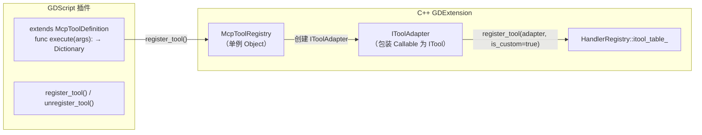

# SDK 层（GDScript 自定义工具）

> 允许 GDScript 插件通过 `McpToolDefinition` 和 `McpToolRegistry` 注册自定义 MCP 工具。

## 架构



## 继承链

`McpToolDefinition` 继承 Godot 内置 `EditorScript`，而非自定义 `RefCounted`：

```
McpToolDefinition
  └── EditorScript  (Godot 内置，必须 @tool)
        └── RefCounted
              └── Object
```

这意味着 `McpToolDefinition` 天然获得：

| 方法 | 来源 | 说明 |
|------|------|------|
| `get_scene()` | EditorScript | 当前编辑场景根节点（等价于 `EditorInterface.get_edited_scene_root()`） |
| `get_editor_interface()` | EditorScript | EditorInterface 单例 |
| `_run()` | EditorScript | Godot 编辑器原生入口（Ctrl+Shift+X 直接运行） |
| 引用计数 | RefCounted | 自动内存管理 |

**额外好处**：因为继承 `EditorScript`，用户可以在 Godot 脚本编辑器中按 `Ctrl+Shift+X` 直接运行工具脚本的 `_run()` 方法，即使没有 MCP 客户端也可以测试逻辑。

## 两种注册模式

### Mode A：继承 `McpToolDefinition`（推荐）

```gdscript
@tool
extends McpToolDefinition

func _init():
    tool_name = "my_custom_tool"
    category = "editor_tools/my_category"
    brief = "Does something useful"
    description = "A longer description of what this tool does"
    input_schema = {
        "type": "object",
        "properties": {
            "param1": {"type": "string", "description": "A parameter"}
        },
        "required": ["param1"]
    }
    is_meta = false
    supports_undo = false
    is_destructive = false

func execute(args: Dictionary) -> Dictionary:
    var root = get_scene()        # 来自 EditorScript
    var ei = get_editor_interface()  # 来自 EditorScript
    # 业务逻辑
    return {"success": true, "data": {"result": "done"}}
```

- 调用 `register_tool()` 注册到 `McpToolRegistry` 单例
- `execute()` 通过 `GDVIRTUAL` 虚方法分发（`mcp_tool_definition.cpp:49`）
- 自动添加 `custom_` 前缀避免与内置工具命名冲突
- **必须加 `@tool`**（EditorScript 要求 `@tool` 才能生效）

### Mode B：Callable 注册

```gdscript
McpToolRegistry.get_singleton().register_tool(
    "my_tool",              # name
    "editor_tools/tools",   # category
    "Brief",                # brief
    "Description",          # description
    {"type": "object", "properties": {}},  # input_schema
    Callable(self, "_my_handler"),  # handler
    false                   # is_meta
)
```

## IToolAdapter 适配器

`tool_adapter.hpp` 将 SDK 的 `Callable` 或 `CommandFn` 包装为 `ITool` 接口，存入 `HandlerRegistry::itool_table_` 与内置工具统一调度：

```cpp
class IToolAdapter : public ITool {
    // 从 SDK 元数据返回 name/category/brief/description/input_schema
    // execute_impl() 调 Callable::call(args) 或 CommandFn(args)
};
```

## 关键文件

| 文件 | 用途 |
|------|------|
| `extensions/src/sdk/mcp_tool_definition.hpp/.cpp` | GDScript 可继承的 EditorScript 子类 |
| `extensions/src/sdk/mcp_tool_registry.hpp/.cpp` | 单例注册表，管理自定义工具生命周期 |
| `extensions/src/built_in/tool_adapter.hpp/.cpp` | Callable → ITool 适配器 |

## 注意事项

- `McpToolDefinition` 必须加 `@tool`（因为继承链要求 `EditorScript` 需要 `@tool`）
- 自定义工具名自动加 `custom_` 前缀（`mcp_tool_registry.cpp:65`）
- 重复注册同名工具会覆盖旧工具（发出警告）
- 工具变更通过 `notify_tools_changed()` → `McpHandler::notify_tools_list_changed()` → SSE 推送 `notifications/tools/list_changed` 通知所有已初始化会话
- `McpToolRegistry` 单例在 `register_types.cpp` 的 `LEVEL_EDITOR` 阶段初始化
