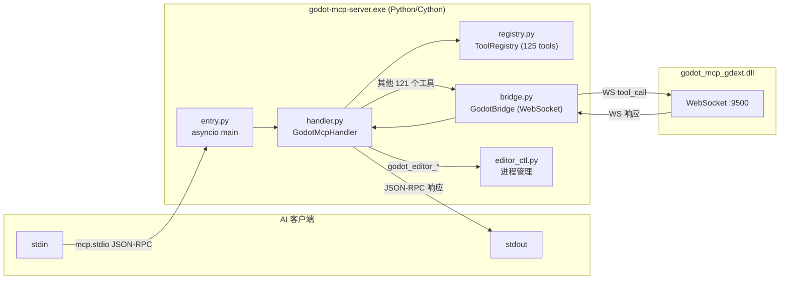

# `server/` — MCP 服务器（Python/Cython）

> Python 实现的 MCP 服务器，通过 Cython `--embed` 编译为独立 `.exe`。



## 文件

### `entry.py`

Cython 入口文件，编译为 `entry.c` → `godot-mcp-server.exe`：

- `_setup_paths()`: 配置 PYTHONHOME、添加 `.venv/site-packages` 和 `src/` 到 `sys.path`
- `main()`: 创建 `mcp.Server("godot-mcp-server")`，注册 `list_tools`/`call_tool` 回调，通过 `mcp.server.stdio.stdio_server()` 启动事件循环
- 使用 Python `mcp` 包（社区 MCP SDK）

### `handler.py`

`GodotMcpHandler` — MCP 请求分发器：

```
handle_tool_call(name, args)
  ├─ get_server_version → 直接返回版本号（不进 WebSocket）
  ├─ godot_editor_open → resolve path → subprocess.Popen
  ├─ godot_editor_close → taskkill / pkill
  ├─ godot_editor_restart → kill → wait 0.5s → open
  └─ 其他 → _forward_tool_call(name, args)
       └─ _ensure_bridge() → bridge.call() → WebSocket → gdext
```

**重连逻辑**：
- 指数退避：1s → 2s → 4s → 8s → 16s → 30s（上限），最多 5 次
- `_OFFLINE_MESSAGES`：ping/get_engine_version/get_plugin_version 有中文离线消息
- `_disconnect()`: WebSocket 断开时清理 bridge 状态

### `bridge.py`

`GodotBridge` — WebSocket 客户端（`websockets` 库）：

```python
class GodotBridge:
    async def connect()          # ws://127.0.0.1:{port}
    async def close()            # 取消 reader_task + 关闭 ws
    async def call(tool, args)   # 发送 IpcRequest，等待 IpcResponse
```

- 使用 `asyncio.Future` 做请求-响应匹配（`_pending: dict[str, asyncio.Future]`）
- `_reader_loop()`: 后台读取 WebSocket 消息，分派到 notification/response 处理
- `_handle_response()`: 按 `id` 匹配 pending future，设置 result 或 error
- `_handle_notification()`: 处理 `tool_list_updated` 通知 → 更新 registry

### `registry.py`

`ToolRegistry` — 工具 Schema 的唯一权威来源：

| 方法 | 说明 |
|------|------|
| `get_all_tools()` | 返回所有 `ToolInfo` |
| `has_tool(name)` | 检查工具是否存在 |
| `is_tool_enabled(name)` | 检查工具是否启用 |
| `set_tool_enabled(name, bool)` | 启用/禁用工具 |
| `register_tool(name, desc, schema)` | 动态注册新工具 |
| `update_from_notification(update)` | 从 gdext 通知同步启用状态 |

### `editor_ctl.py`

编辑器进程管理（纯 Python，无 Godot 依赖）：

| 函数 | 说明 |
|------|------|
| `resolve_godot_path(override)` | 返回 GODOT_PATH 环境变量或 override |
| `resolve_project_path(args)` | 计算项目目录路径 |
| `kill_process_by_name(name)` | 跨平台进程终止（taskkill/pkill） |
| `godot_editor_open(path, project)` | subprocess.Popen 启动编辑器 |
| `godot_editor_close(path)` | 按可执行文件名杀进程 |

`GODOT_PATH` 环境变量**必须**在 MCP 客户端 `env` 配置中设置（stdio 服务器不继承 shell 环境变量）。

版本号从 `pyproject.toml` 读取：`SERVER_VERSION = _pyproject["project"]["version"]`

### `protocol.py`

Pydantic 模型，定义 WebSocket IPC 协议类型：

| 类 | 字段 | 说明 |
|-----|------|------|
| `IpcRequest` | `id`, `method`, `params` | WebSocket 请求 |
| `IpcResponse` | `id`, `status`, `data`, `code`, `message` | WebSocket 响应 |
| `IpcNotification` | `type`, `event`, `data` | WebSocket 通知 |
| `ToolCallParams` | `tool`, `args` | 工具调用参数 |
| `ToolInfo` | `name`, `description`, `input_schema`, `enabled` | 工具信息 |
| `ToolListUpdate` | `tools: list[ToolState]` | 工具列表更新 |
| `ToolState` | `name`, `enabled` | 单个工具状态 |

## 构建流程

CMake 自动处理（`CMakeLists.txt`）：

1. Cython `--embed` 编译 `entry.py` → `entry.c`
2. Patch `entry.c` 嵌入 PYTHONHOME（`tools/patch_entry_c.py`）
3. 用系统 C 编译器编译 `entry.c` → `godot-mcp-server.exe`
4. 复制 `python3xy.dll` 到 exe 同目录

需要 `server/.venv`（含 Cython 包）。

## 关键细节

- **125 个工具注册在 Python 侧**，与 gdext 侧无硬性同步——如果 WebSocket 收到未知工具，gdext 返回错误
- **不验证**工具是否存在于 gdext 端
- 服务器使用 `asyncio` 事件循环，所有 I/O 操作异步
