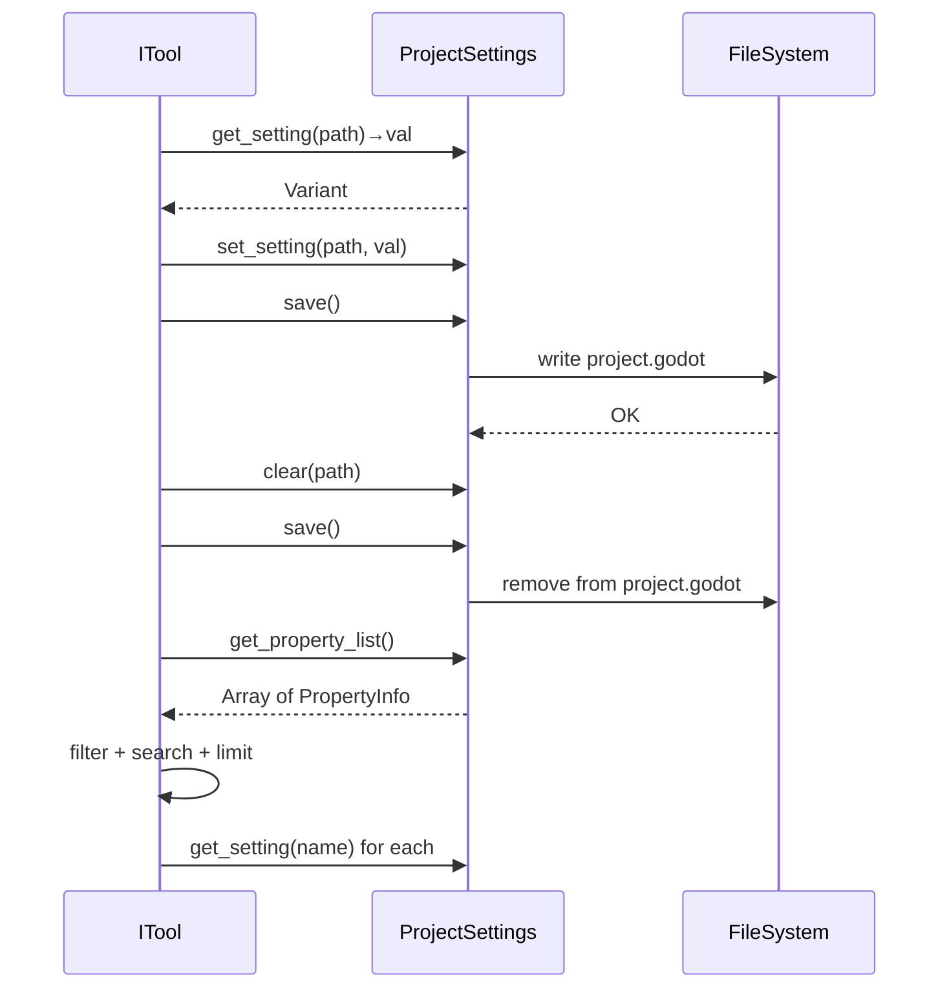

# 项目设置工具

> 通过 `ProjectSettings` API 对 Godot 项目设置进行读写、重置和搜索，支持动态运行时查询（无需硬编码 YAML 定义）。

## 架构概览

```
editor_tools/settings/
  get_setting.hpp       GetSettingTool       — 通用读取器
  set_setting.hpp       SetSettingTool       — 通用写入器，带撤销
  reset_setting.hpp     ResetSettingTool     — 重置为默认值
  list_settings.hpp     ListSettingsTool     — 列表 + 搜索（is_meta=true）
```

所有工具注册在 `register_existing.hpp:117-120`：

| 注册行 | 类名 | 工具名 | is_destructive |
|--------|------|--------|:--------------:|
| 117 | `GetSettingTool` | `get_setting` | false |
| 118 | `SetSettingTool` | `set_setting` | true |
| 119 | `ResetSettingTool` | `reset_setting` | false |
| 120 | `ListSettingsTool` | `list_settings` | false |

## 工具详情

### get_setting (`get_setting.hpp:14`)

```cpp
class GetSettingTool : public ITool {
    // category: "editor_tools/settings"
    // needs_scene: false, needs_node: false
}
```

- 参数：`setting_path`（string，必填）
- 实现：`ProjectSettings::get_singleton()->get_setting(path)` → `variant_to_json()`
- 错误处理：设置不存在时返回 `SETTING_NOT_FOUND`

### set_setting (`set_setting.hpp:13`)

```cpp
class SetSettingTool : public ITool {
    // is_destructive: true
    // needs_scene: false, needs_node: false
}
```

- 参数：`setting_path`（string，必填），`value`（dynamic，必填）
- 实现：`json_to_variant(value)` → `ProjectSettings::set_setting()` → `save()`
- 返回值包含 `previous_value`（可用于撤销）
- 支持 feature tag 后缀（如 `.debug`、`.web`）

### reset_setting (`reset_setting.hpp:12`)

```cpp
class ResetSettingTool : public ITool {
    // needs_scene: false, needs_node: false
}
```

- 参数：`setting_path`（string，必填）
- 实现：`ProjectSettings::clear(path)` → 从 `project.godot` 移除
- 返回 `previous_value`

### list_settings (`list_settings.hpp:13`)

```cpp
class ListSettingsTool : public ITool {
    // is_meta: true（始终在 tools/list 中可见）
    // needs_scene: false, needs_node: false
}
```

- 参数：`filter`（string，可选前缀过滤），`search`（string，可选文本搜索），`limit`（int，默认 200，上限 5000）
- 实现：
  1. 遍历 `ProjectSettings::get_singleton()->get_property_list()`
  2. 跳过 `editor_settings_override/` 前缀的条目
  3. 只返回包含 `PROPERTY_USAGE_EDITOR`（usage & 4）的设置
  4. 标记 `basic`（usage & 256）和 `restart_if_changed`（usage & 2048）

## 数据流



## 相关源文件

| 文件 | 行 | 说明 |
|------|----|------|
| `get_setting.hpp` | 14-61 | GetSettingTool 实现 |
| `set_setting.hpp` | 13-76 | SetSettingTool 实现 |
| `reset_setting.hpp` | 12-66 | ResetSettingTool 实现 |
| `list_settings.hpp` | 13-107 | ListSettingsTool 实现 |
| `register_existing.hpp` | 117-120 | 注册行 |
