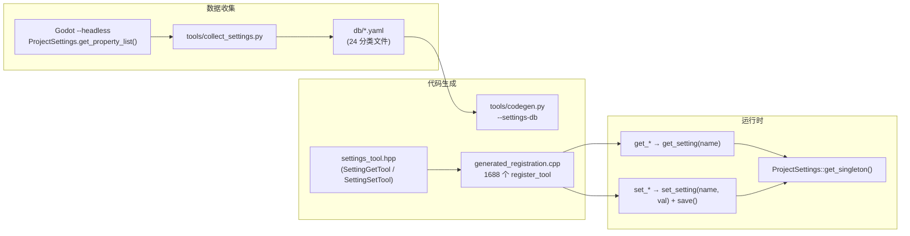

# 项目设置工具

> 通过 codegen 从 YAML 数据库自动生成 1688 个 get/set 工具，覆盖 Godot 4.6.3 所有 844 项内置项目设置（含特性标签变体）。同时提供 4 个兜底工具处理动态路径场景。

## 架构

## YAML 数据库

24 个分类文件，按 Godot 项目设置对话框的顶级分类组织：

| 文件 | 设置数 | 示例 |
|------|:------:|------|
| `rendering.yaml` | 178 | `rendering/renderer/rendering_method` |
| `debug.yaml` | 133 | `debug/gdscript/warnings/enable` |
| `layer_names.yaml` | 200 | `layer_names/2d_physics/layer_1` |
| `physics.yaml` | 67 | `physics/2d/default_gravity` |
| `display.yaml` | 43 | `display/window/size/viewport_width` |
| `application.yaml` | 34 | `application/config/name` |
| 其余 18 个 | 189 | ... |
| **合计** | **844** | |

每个设置项包含：`name`（全路径）、`type`（Variant 类型编号）、`type_name`、`hint`、`hint_string`、`basic`、`restart`。

## 工具模板

### SettingGetTool

构造时注入设置全路径，`execute_impl` 调用 `ProjectSettings::get_singleton()->get_setting(name_)`。`needs_scene()=false`，`needs_node()=false`，无参数 schema（工具名已编码设置路径）。

### SettingSetTool

`execute_impl` 调用 `ps->set_setting(name_, val)` 后立即 `ps->save()` 持久化。参数：`value` (object) — 使用 `json_to_variant` 反序列化。

## 兜底工具（4 个）

| 工具 | 功能 | 参数 |
|------|------|------|
| `get_setting` | 通用读取任意设置 | `setting_path` (string) |
| `set_setting` | 通用写入任意设置 + 立即 save | `setting_path` + `value` |
| `reset_setting` | 重置为默认值（`clear()` + `save()`） | `setting_path` |
| `list_settings` | 列举设置，支持分类过滤和搜索（meta 工具） | `filter`、`search`、`limit` |

## 特性标签变体

设置项可带特性标签后缀（如 `.android`、`.web`、`.debug`、`.editor`），codegen 为每个变体生成独立工具：

| 设置名 | 工具名 |
|--------|--------|
| `rendering/gl_compatibility/driver` | `get_rendering_gl_compatibility_driver` |
| `rendering/gl_compatibility/driver.android` | `get_rendering_gl_compatibility_driver_android` |
| `rendering/gl_compatibility/driver.ios` | `get_rendering_gl_compatibility_driver_ios` |

## 设计决策

### 为什么不用聚合工具替代

之前的 `project-settings-ext` 方案将相关设置打包为 10 个聚合 get/set 对。新方案为每项设置生成独立工具，优势：

1. **精确性**：AI 客户端可直接调用 `set_display_window_size_viewport_width`，无需记住聚合工具的参数名
2. **可发现性**：通过 `list_tools(category="editor_tools/settings/display/window/size")` 可直接发现该分类下所有设置
3. **渐进式披露**：分类树自动按设置路径层级组织
4. **零维护**：Godot 升级后重新运行 `collect_settings.py` 即可

### 立即保存策略

`set_setting` 后立即调用 `ProjectSettings::save()` 持久化到 `project.godot`。这是用户明确选择的策略，牺牲批量写入性能换取"修改立即可见"的直觉体验。

## 注册

- 1688 个专属工具由 codegen 从 YAML 自动生成，category 为 `editor_tools/settings/{category}/{sub_path}`
- 4 个兜底工具带 `// @tool register` 注释，category 为 `editor_tools/settings`
- `list_settings` 标记为 `is_meta()=true`，始终可见
