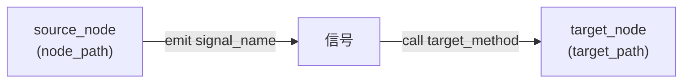

# 信号工具

> 管理 Godot 节点的信号连接。4 个工具，位于 `extensions/src/built_in/tools/signal/`。

## 工具列表

| 工具名 | 文件 | 功能 |
|--------|------|------|
| `connect_signal` | `connect_signal.hpp` | 将 source_node 的信号连接到 target_node 的方法 |
| `disconnect_signal` | `disconnect_signal.hpp` | 断开 source_node 信号与 target_node 方法的连接 |
| `list_signals` | `list_signals.hpp` | 列出节点所有可用信号的元信息 |
| `get_signal_connections` | `get_signal_connections.hpp` | 获取节点所有已连接的信号关系 |

## 注册

四个工具均带 `// @tool register` 注释，category 均为 `node_tools/signal`，由 codegen 自动注册。

## `connect_signal`

- **参数**：`node_path`（源节点）、`signal_name`（信号名）、`target_path`（目标节点）、`target_method`（方法名）、`flags`（连接标志，可选）
- **连接标志**：1=DEFERRED、2=ONESHOT、4=PERSIST、8=REFERENCE_COUNTED
- **needs_scene**: true — 需要已打开的场景

在内部通过 Godot 的 `Node::connect(signal_name, Callable(target, target_method), flags)` 实现。

## `disconnect_signal`

参数与 `connect_signal` 一致（不含 `flags`），断开已建立的连接。

## `list_signals`

列出目标节点的所有可用信号，不需要场景。返回信号名、参数列表、参数类型等元信息。内部调用 Godot 的 `get_signal_list()`。

## `get_signal_connections`

获取目标节点上所有已建立连接的信号列表。返回每个连接的源/目标节点、信号名、方法名、标志等信息。内部调用 Godot 的 `get_signal_connection_list()`。

## 注意事项

- `connect_signal` 和 `disconnect_signal` 使用 `resolve_node()` 分别解析源/目标节点路径
- 所有工具的主线程同步执行
