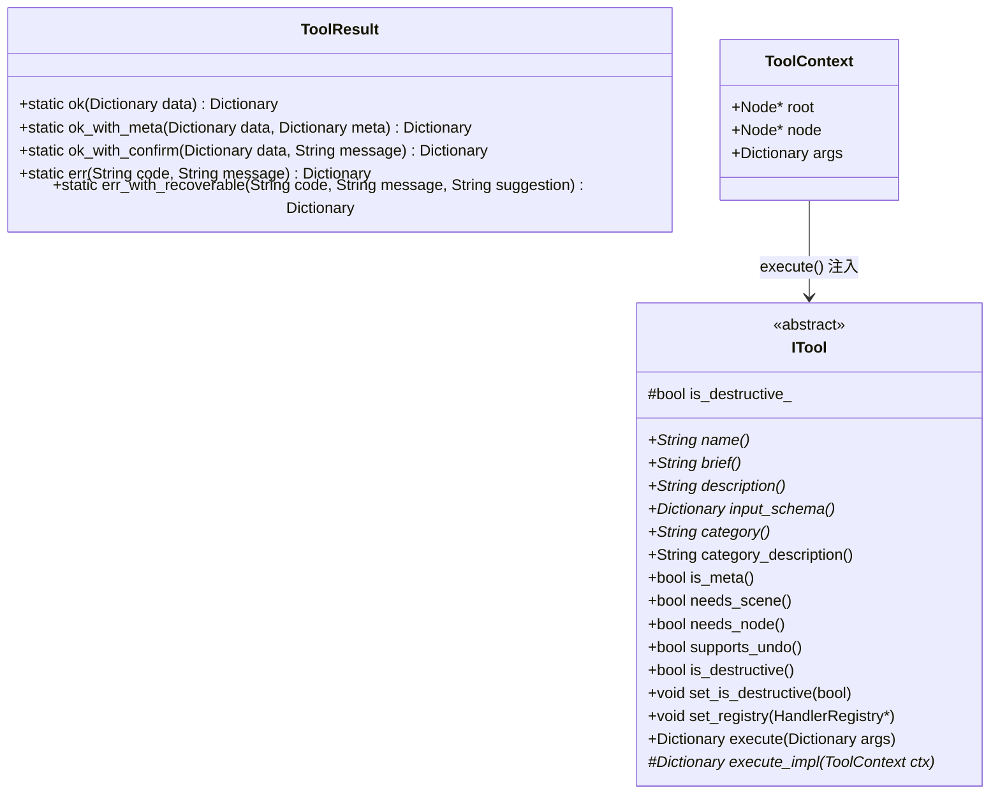
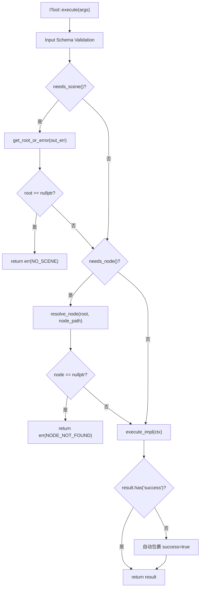

# ITool 基类体系

> 所有 MCP 工具的统一接口层，位于 `extensions/src/built_in/tool_base.hpp` 和 `tool_base.cpp`。包含三个核心类型：`ToolResult`（统一返回信封）、`ToolContext`（前置注入上下文）、`ITool`（抽象基类 + 模板方法）。

## ToolResult — 统一返回信封

静态工厂方法全部在 `tool_base.hpp:32-37` 声明，`tool_base.cpp:13-64` 实现。

### 成功信封

```json
{"success": true, "data": {...}}
```

| 工厂方法 | 文件:行 | 额外字段 |
|----------|---------|----------|
| `ToolResult::ok(data)` | `tool_base.cpp:13-20` | 仅 `data`（为空时省略） |
| `ToolResult::ok_with_meta(data, meta)` | `tool_base.cpp:22-32` | 追加 `meta` 字段 |
| `ToolResult::ok_with_confirm(data, message)` | `tool_base.cpp:34-42` | 追加 `confirm` 字符串 |

### 失败信封

```json
{"success": false, "error": {"code": "...", "message": "..."}}
```

| 工厂方法 | 文件:行 | 额外字段 |
|----------|---------|----------|
| `ToolResult::err(code, message)` | `tool_base.cpp:44-52` | 标准错误 |
| `ToolResult::err_with_recoverable(code, message, suggestion)` | `tool_base.cpp:54-64` | 追加 `recoverable: true` + `suggestion` |

### 内部结构



## ToolContext — 前置注入上下文

`tool_base.hpp:40-44`：

```cpp
struct ToolContext {
    Node *root = nullptr;   // 场景根节点（needs_scene=true 时保证非空）
    Node *node = nullptr;   // 目标节点（needs_node=true 时保证非空）
    Dictionary args;        // 原始参数字典
};
```

- `root`：仅当 `needs_scene()` 返回 `true` 时由 `execute()` 自动注入
- `node`：仅当 `needs_node()` 返回 `true` 时由 `resolve_node()` 自动注入
- `args`：客户端原始参数字典，按需通过 `cmd_utils` 的 `args_string/int/float/bool` 安全读取

## ITool 类图

### 元数据（纯虚函数）

| 方法 | 返回 | 说明 |
|------|------|------|
| `name()` | `String` | 工具注册名，全局唯一 |
| `brief()` | `String` | 简短描述（工具列表用） |
| `description()` | `String` | 完整描述（含用法说明） |
| `input_schema()` | `Dictionary` | JSON Schema 格式参数定义 |
| `category()` | `String` | 分类路径（如 `editor_tools/scene_tree`） |

### 分类（虚函数 + 默认值）

`tool_base.hpp:58-76`：

| 方法 | 默认值 | 说明 |
|------|--------|------|
| `category_description()` | `{}` | 分类说明文本 |
| `is_meta()` | `false` | 渐进式披露：meta 工具始终在 `tools/list` 可见 |
| `needs_scene()` | `false` | 是否需要已打开的场景（触发 `ctx.root` 注入） |
| `needs_node()` | `false` | 是否需要节点路径（触发 `ctx.node` 注入） |
| `supports_undo()` | `false` | 是否支持撤销（框架不处理，子类自行调 `undoable_set`） |
| `is_destructive()` | `is_destructive_` | 标记为可能破坏性操作 |
| `set_registry()` | `{}` | 依赖注入 HandlerRegistry 指针 |

### `is_destructive_` 标记

`tool_base.hpp:85`，通过 `GODOT_MCP_TOOL(cls, is_destructive_val)` 宏的第 2 个参数设置。用于：
- AI 客户端在调用前提示用户确认
- 元工具 `call_tool` 检查 `is_destructive()` 并追加确认步骤

## `execute()` 模板方法流程

`tool_base.cpp:70-167`：



### 步骤 1: Input Schema Validation（`tool_base.cpp:76-119`）

1. **Required 参数检查**（`:78-86`）：遍历 `schema["required"]` 数组，缺失返回 `MISSING_REQUIRED_PARAM`
2. **类型检查**（`:87-118`）：对 `schema["properties"][name]["type"]` 映射到 `Variant::Type`

### 类型验证映射表（`tool_base.cpp:98-109`）

| Schema `type` | 允许的 `Variant::Type` |
|---------------|----------------------|
| `"string"` | `STRING`, `NIL` |
| `"integer"` | `INT`, `FLOAT` |
| `"number"` | `FLOAT`, `INT` |
| `"boolean"` | `BOOL` |
| `"array"` | `ARRAY` |
| `"object"` | `DICTIONARY` |

`FLOAT` 可通过 integer 类型检查（`:101`），这是 `cmd_utils_json.json_to_variant` 中 `{x,y}` 等结构被解析为 `Vector2` 后兼容字符串/数值混合参数的必要设计（参见 `AGENTS.md`"`ITool::execute()` 类型验证"约束）。

### 步骤 2: 场景根节点解析（`:122-129`）

`needs_scene()` → `get_root_or_error()`（`cmd_utils.hpp:43`）→ 失败返回 `err("NO_SCENE", ...)`

### 步骤 3: 节点路径解析（`:132-152`）

`needs_node()` → 尝试 `args["node_path"]` → 后备 `args["path"]` → 空则返回 `err("MISSING_PARAM")` → `resolve_node(root, node_path)` → 失败返回 `err("NODE_NOT_FOUND")`

### 步骤 4: 执行业务逻辑（`:155`）

`execute_impl(ctx)` — 子类实现实际功能。

### 步骤 5: 安全包裹（`:158-164`）

检查返回字典是否有 `"success"` 键；若无则自动包裹为 `{"success": true, "data": result}` 并记录 `log_warn`。

## 子类实现契约

```cpp
class MyTool : public ITool {
public:
    String name() const override { return "my_tool"; }
    String category() const override { return "editor_tools/my_category"; }
    String brief() const override { return "短描述"; }
    String description() const override { return "长描述..."; }
    Dictionary input_schema() const override {
        Dictionary schema;
        // 定义参数属性
        return schema;
    }
    bool needs_scene() const override { return true; }

protected:
    Dictionary execute_impl(const ToolContext &ctx) override {
        // 业务逻辑 — ctx.root 保证非空
        return ToolResult::ok(some_data);
    }
};
```

## 注册方式

通过 `GODOT_MCP_TOOL(MyTool, false)` X-macro 注册（`register/register_*.hpp`），不需要手动实例化。详见 [x-macro-registration.md](x-macro-registration.md)。
