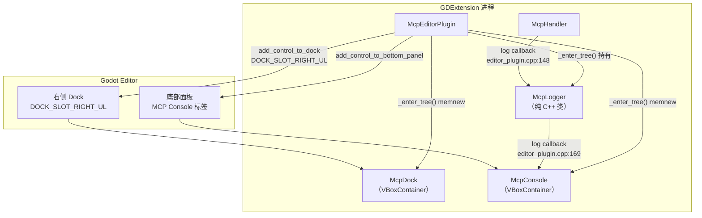
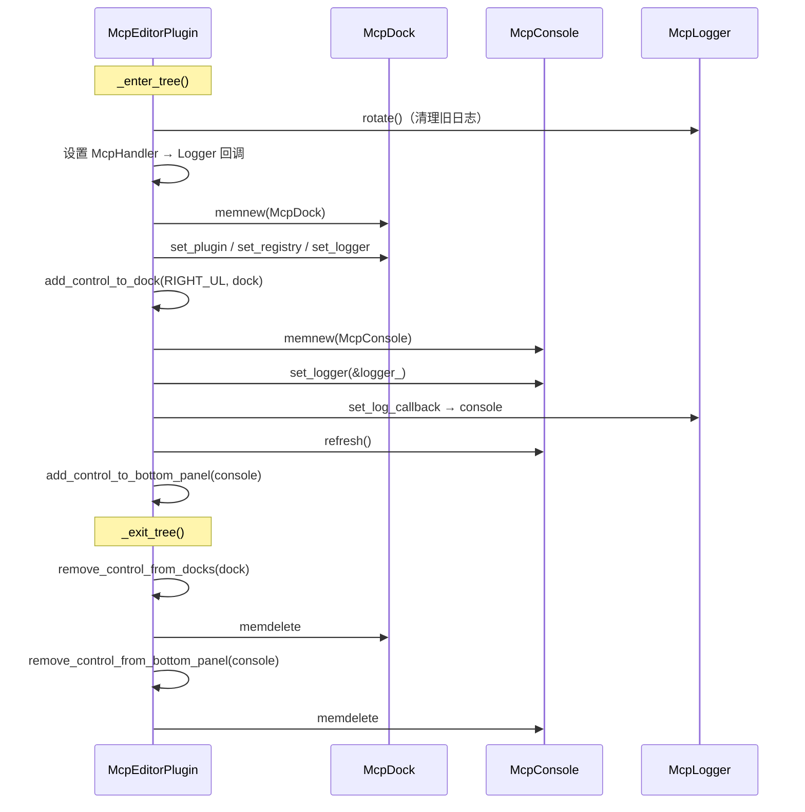

# UI 组件

> `extensions/src/ui/` — 编辑器 UI 组件：右侧 Dock 控制面板 + 底部 Console 日志面板 + Logger 数据后端。

## 组件关系



## 数据流

工具调用日志的传递路径：

```
McpHandler 执行工具
  → editor_plugin.cpp:148 log callback
    → McpLogger::append()           （内存缓冲 + JSONL 写入）
      → editor_plugin.cpp:169 log callback
        → McpConsole::on_log_appended()  （Tree 插入行）
```

## McpLogger

**纯 C++ 类**（无 `GDCLASS`），非 Godot Object，不可注册到 ClassDB。

```cpp
// mcp_logger.hpp:12
struct LogEntry {
    String timestamp;     // ISO 8601
    String tool_name;
    bool success;
    Dictionary args;
    Dictionary result;
    double duration_ms;
};
```

| 特性 | 说明 | 源码 |
|------|------|------|
| 内存缓冲 | 环形队列，超出 `max_entries_` 时从头删除 | `mcp_logger.cpp:47-51` |
| 默认上限 | 500 条 | `mcp_logger.hpp:38` |
| JSONL 写入 | 每条 `append()` 立即写文件 | `mcp_logger.cpp:84-126` |
| 文件命名 | `mcp_YYYYMMDD_HHMMSS.jsonl` | `mcp_logger.cpp:95-102` |
| 写入方式 | `FileAccess::WRITE` + `seek_end()` 追加 | `mcp_logger.cpp:116-120` |
| 轮转 | `rotate(keep_days=7)`，按文件名日期前缀判断，删除超期文件 | `mcp_logger.cpp:136-173` |
| 回调 | `set_log_callback()` — McpConsole 通过此回调实时更新 | `mcp_logger.cpp:53-55` |
| 清除 | `clear()` 仅清内存，不删 JSONL 文件 | `mcp_logger.cpp:62-64` |

## McpDock

**右侧 Dock 控制面板**，继承 `VBoxContainer`（`mcp_dock.hpp:22`）。

### 挂载方式

```cpp
// editor_plugin.cpp:160-164
mcp_dock_ = memnew(McpDock);
mcp_dock_->set_plugin(this);
mcp_dock_->set_registry(&registry_);
mcp_dock_->set_logger(&logger_);
add_control_to_dock(DOCK_SLOT_RIGHT_UL, mcp_dock_);
```

最小宽度 320px（`mcp_dock.cpp:25`），内容包裹在 `ScrollContainer` 中（`mcp_dock.cpp:28`）。

### 四个区域

| 区域 | 功能 | 关键控件 |
|------|------|---------|
| **Status** | 服务/桥接状态 | 状态图标、工具计数、桥接连接状态（每秒刷新 `mcp_dock.cpp:337-343`） |
| **Client Config** | 生成/复制 MCP 客户端配置 | `OptionButton` 客户端选择器 + `RichTextLabel` 配置预览（`mcp_dock.cpp:62-95`） |
| **Settings** | 端口/绑定地址配置 + 重启 | HTTP Port SpinBox、Bridge Port SpinBox、Bind 模式（Localhost/All/Custom）、Apply & Restart / Force Restart 按钮（`mcp_dock.cpp:99-165`） |
| **Console Settings** | 日志参数 | Max Entries SpinBox、Log Dir LineEdit（`mcp_dock.cpp:167-194`） |

### 关键回调

| 回调 | 行为 | 源码 |
|------|------|------|
| `_on_generate_pressed()` | 调用 `generate_client_config` 工具，写入项目 | `mcp_dock.cpp:248-259` |
| `_on_client_changed()` | 切换客户端时刷新配置预览 | `mcp_dock.cpp:261-263` |
| `_on_copy_pressed()` | 复制配置到剪贴板 | `mcp_dock.cpp:278-282` |
| `_on_apply_restart_pressed()` | `plugin->save_config()` + `restart_server(false)` | `mcp_dock.cpp:284-288` |
| `_on_force_restart_pressed()` | `plugin->save_config()` + `restart_server(true)` | `mcp_dock.cpp:290-294` |
| `_on_max_entries_changed()` | `logger_->set_max_entries()` | `mcp_dock.cpp:300-304` |
| `_on_log_dir_changed()` | `logger_->set_log_dir()` | `mcp_dock.cpp:306-310` |
| `update_status()` | 查询工具数 + `EditorInterface::is_playing_scene()` 判断桥接状态 | `mcp_dock.cpp:316-331` |

## McpConsole

**底部面板**，继承 `VBoxContainer`（`mcp_console.hpp:24`）。

### 挂载方式

```cpp
// editor_plugin.cpp:167-175
mcp_console_ = memnew(McpConsole);
mcp_console_->set_logger(&logger_);
logger_.set_log_callback([this](const McpLogger::LogEntry &entry) {
    if (mcp_console_) {
        mcp_console_->on_log_appended(entry);
    }
});
mcp_console_->refresh();
add_control_to_bottom_panel(mcp_console_, "MCP Console");
```

`add_control_to_bottom_panel` **直接调用**，无 `call()` 绕行。godot-cpp 10.0.0-rc1 已绑定此方法。

### 布局结构

```
McpConsole (VBoxContainer)
├── Toolbar: [Expand All] [Collapse All] ... [N entries] [Clear] [☑ Auto-scroll]
├── Column Header: [Time | draggable divider | Tool]
└── VSplitContainer
    ├── Tree (日志列表，默认折叠，含 Request/Response 子项)
    └── Detail Panel
        └── HSplitContainer
            ├── CodeEdit "Request" (JSON 高亮)
            └── CodeEdit "Response" (JSON 高亮)
```

### 功能

| 功能 | 说明 | 源码 |
|------|------|------|
| 日志列表 | `Tree` 两列（时间 + `[OK]/[FAIL] 工具名 耗时`），折叠时含 Request/Response 子行 | `mcp_console.cpp:268-294` |
| 颜色标记 | 成功绿色 `(0.3, 0.9, 0.3)`，失败红色 `(1.0, 0.3, 0.3)` | `mcp_console.cpp:280` |
| 详情面板 | 选中条目时，Request/Response 分别格式化展示（2 空格缩进 JSON） | `mcp_console.cpp:347-371` |
| JSON 高亮 | 从 `EditorSettings` 读取符号/数字/字符串颜色，创建 `CodeHighlighter` | `mcp_console.cpp:162-182` |
| 右键菜单 | Copy Entry / Copy Args / Copy Result | `mcp_console.cpp:394-428` |
| 列宽拖拽 | 拖拽分隔区域调整 Time 列宽，最小 60px | `mcp_console.cpp:494-506` |
| 自动滚动 | 新条目 `scroll_to_item()`，可切换 | `mcp_console.cpp:291-293` |
| 最大可见条目 | 500（`kMaxVisible`），超出从头删除 | `mcp_console.hpp:58` |

### 数据同步

- **新增**：`on_log_appended()` 实时追加单条到 Tree（`mcp_console.cpp:318-331`）
- **全量刷新**：`refresh()` 从 `logger_->entries()` 重新加载所有条目并重建 Tree（`mcp_console.cpp:434-442`）
- **清除**：`_on_clear_pressed()` 清空 Tree + 调用 `logger_->clear()`（`mcp_console.cpp:472-484`）

## 生命周期


