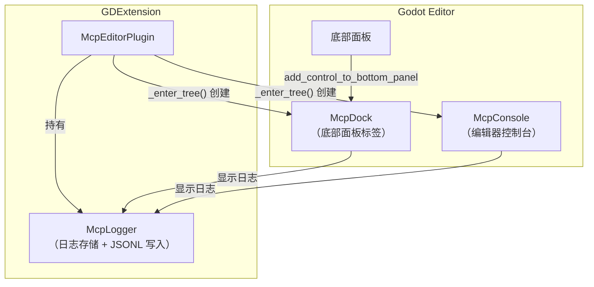

# UI 组件

> `extensions/src/ui/` — 编辑器底部面板 UI 组件：日志面板、控制台、Dock。

## 组件关系



## McpLogger

内存循环缓冲区 + JSONL 文件写入 + 自动轮转。

```cpp
struct LogEntry {
    String timestamp;    // ISO 8601
    String tool_name;
    bool success;
    Dictionary args;
    Dictionary result;
    double duration_ms;
};
```

| 特性 | 说明 |
|------|------|
| 最大内存条目 | 500（`set_max_entries()`） |
| 日志目录 | `res://.mcp_logs/`（`set_log_dir()`） |
| 文件格式 | JSONL（每行一个 JSON 对象） |
| 文件名 | `mcp_YYYYMMDD_HHMMSS.jsonl` |
| 轮转 | `rotate(keep_days=7)` 删除过期文件 |
| 回调 | `set_log_callback()` 实时通知 UI 更新 |

## McpDock

底部面板容器，通过 `add_control_to_bottom_panel` 添加到 Godot 编辑器底部。注意：`add_control_to_bottom_panel` 在 godot-cpp 10.0.0-rc1 未绑定，使用 `call()` 动态调用。

## McpConsole

编辑器控制台，显示工具调用日志和输出。

## 注意事项

- `add_control_to_bottom_panel` 在 godot-cpp 10.0.0-rc1 未绑定，用 `call()` 兜底
- JSONL 文件写入使用 `FileAccess::WRITE` + `seek_end()` 追加模式
- 日志轮转通过文件名日期前缀判断，删除超过 `keep_days` 的文件
