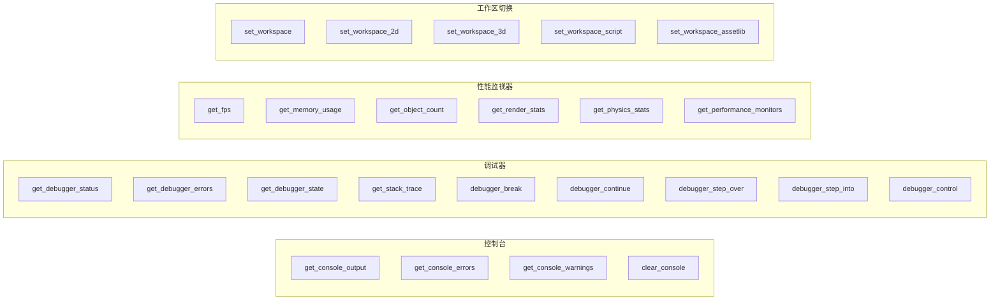

# 工作区工具（Editor Workspace Tools）

> `editor_tools/workspace/` 分类下的 24 个工具，覆盖控制台日志读取、调试器状态与控制、性能监视器读取、工作区切换四个子领域。

## 架构



## 工具列表

### 控制台（4 个工具）

| 名称 | 类型 | 说明 |
|------|------|------|
| `get_console_output` | 复合 | 读取编辑器 Output 面板的全部日志内容。支持 `keyword` 搜索、`type` 过滤（error/warning/info）、`exclude_mcp` 排除 MCP 日志 |
| `get_console_errors` | 专用 | 仅返回错误级别的日志条目 |
| `get_console_warnings` | 专用 | 仅返回警告级别的日志条目 |
| `clear_console` | 复合 | 清空 Output 面板 |

**实现细节**：通过场景树 `find_children("*", "EditorLog", true, false)` 定位 `EditorLog` 控件，再调用 `RichTextLabel.get_text()` 获取原始文本。由于 `EditorLog` 是编辑器内部类（不在 godot-cpp 绑定中），全程使用 `call()` 动态调用。

### 调试器（9 个工具）

| 名称 | 类型 | 说明 |
|------|------|------|
| `get_debugger_status` | 专用 | 调试器是否活跃、是否中断、是否可调试、会话是否活跃 |
| `get_debugger_errors` | 专用 | 错误与警告计数 |
| `get_debugger_state` | 复合 | 综合状态（错误/警告计数 + 中断/可调试/会话状态 + 栈帧位置） |
| `get_stack_trace` | 复合 | 栈追踪信息。仅在调试器中断时可用，无活跃会话时返回合理错误 |
| `debugger_break` | 专用 | 中断调试器执行 |
| `debugger_continue` | 专用 | 继续执行 |
| `debugger_step_over` | 专用 | 单步跳过 |
| `debugger_step_into` | 专用 | 单步进入 |
| `debugger_control` | 复合 | 统一入口：控制调试器（break/continue/step_over/step_into） |

**实现细节**：通过场景树 `find_children("*", "EditorDebuggerNode", true, false)` 定位 `EditorDebuggerNode`，再 `call("get_current_debugger")` 获取 `ScriptEditorDebugger` 实例。`is_breaked()`、`is_debuggable()`、`is_session_active()`、`debug_break()`、`debug_next()` 等均为 `call()` 动态调用。

### 性能监视器（6 个工具）

| 名称 | 类型 | 说明 |
|------|------|------|
| `get_fps` | 专用 | 当前帧率 |
| `get_memory_usage` | 专用 | 静态内存 / 静态最大内存 / 消息缓冲区最大大小（MB） |
| `get_object_count` | 专用 | 对象 / 节点 / 孤儿节点 / 资源计数 |
| `get_render_stats` | 专用 | Draw calls / 对象 / 图元 / 纹理内存 / 视频内存 / 缓冲区内存 |
| `get_physics_stats` | 专用 | 2D/3D 活跃物体 / 碰撞对 / 孤岛数 |
| `get_performance_monitors` | 复合 | 全量 59 个监视器数据，支持 `name` 参数按名称筛选 |

**实现细节**：使用 Godot 公开 API `Performance::get_singleton()->get_monitor(Monitor)`，通过枚举值 `Performance::MONITOR_MAX`（59）遍历所有监视器。枚举映射在 `get_performance_monitors.hpp:27-92` 中硬编码。

### 工作区切换（5 个工具）

| 名称 | 类型 | 说明 |
|------|------|------|
| `set_workspace` | 复合 | 统一入口：通过 `name` 参数指定 "2D" / "3D" / "Script" / "AssetLib" |
| `set_workspace_2d` | 专用 | 切换到 2D 编辑 |
| `set_workspace_3d` | 专用 | 切换到 3D 编辑 |
| `set_workspace_script` | 专用 | 切换到脚本编辑 |
| `set_workspace_assetlib` | 专用 | 打开资源库 |

**实现细节**：使用 `EditorInterface::get_singleton()->set_main_screen_editor(name)` 公开 API。Godot 内部名称分别为 `"2D"`、`"3D"`、`"Script"`、`"AssetLib"`。

## 设计决策

### 复合 vs 专用双路径

遵循本项目的一贯模式（与节点属性工具的 get/set 双工具一致）：

- **复合工具**（`debugger_control`、`get_performance_monitors` 等）作为通用兜底入口，参数驱动行为
- **专用工具**（`debugger_break`、`get_fps` 等）提供零参数快捷调用，适合 AI 客户端自动推理调用

### MCP 日志过滤

三级过滤策略：

1. 控制台通用 `get_console_output` 中的 `exclude_mcp` 参数（默认 `true`），按正则 `(?i)mcp|godot_mcp` 过滤
2. 专用 `get_console_errors` / `get_console_warnings` 继承 `exclude_mcp` 参数
3. 用户可显式传入 `exclude_mcp=false` 获取全量日志

### 编辑器内部类访问

`EditorDebuggerNode`、`EditorLog`、`ScriptEditorDebugger` 均不在 godot-cpp 10.0.0-rc1 绑定中。统一使用场景树遍历模式：

```cpp
Object *dbg = _find_debugger();
// 等价于:
// EditorInterface::get_singleton()->get_base_control()
//   ->find_children("*", "EditorDebuggerNode", true, false)[0]
```

详见 `cmd_utils.hpp` 的 `find_children` 模式。
