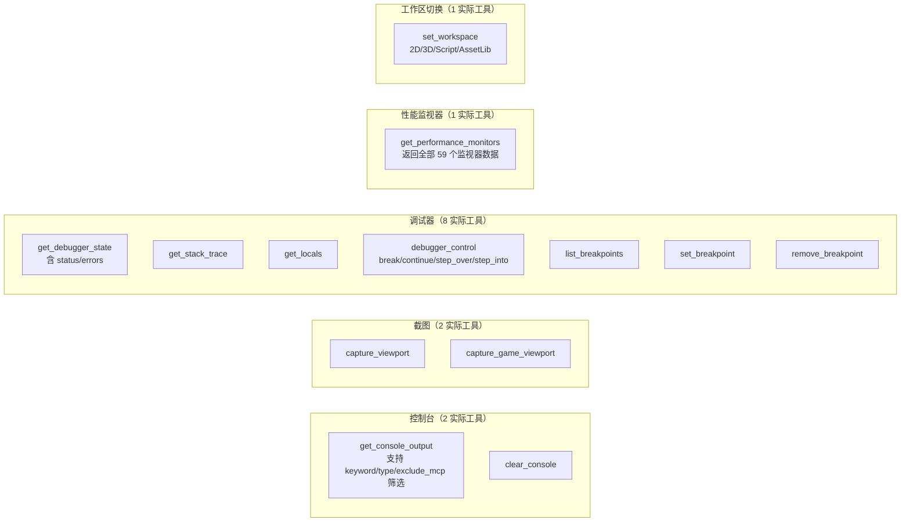

# 工作区工具（Editor Workspace Tools）

> `editor_tools/workspace/` 分类下的 **13 个实际工具**。部分复合工具通过参数支持多种子操作（括号内为复合工具可处理的子命令），子操作并非独立 ITool 实现。

## 架构



## 工具列表

### 控制台（2 个工具）

| 名称 | 类型 | 说明 |
|------|------|------|
| `get_console_output` | 复合 | 读取编辑器 Output 面板的全部日志内容。支持 `keyword` 搜索、`type` 过滤（error/warning/info）、`exclude_mcp` 排除 MCP 日志。子操作：`keyword` 过滤 → 等效 `get_console_errors`/`get_console_warnings` |
| `clear_console` | 复合 | 清空 Output 面板 |

**实现细节**：通过场景树 `find_children("*", "EditorLog", true, false)` 定位 `EditorLog` 控件，再调用 `RichTextLabel.get_text()` 获取原始文本。由于 `EditorLog` 是编辑器内部类（不在 godot-cpp 绑定中），全程使用 `call()` 动态调用。

### 调试器（8 个工具）

| 名称 | 类型 | 说明 |
|------|------|------|
| `get_debugger_state` | 复合 | 综合状态（错误/警告计数 + 中断/可调试/会话状态 + 栈帧位置）。子操作：`get_debugger_status` + `get_debugger_errors` 合并 |
| `get_stack_trace` | 复合 | 栈追踪信息。仅在调试器中断时可用，无活跃会话时返回合理错误 |
| `get_locals` | 专用 | 获取当前栈帧的局部变量 |
| `debugger_control` | 复合 | 统一入口：控制调试器。参数 `action`（break/continue/step_over/step_into）。子操作对应 `debugger_break`、`debugger_continue`、`debugger_step_over`、`debugger_step_into`、`debugger_step_out` |
| `list_breakpoints` | 专用 | 列出所有断点 |
| `set_breakpoint` | 专用 | 设置断点（指定源文件和行号） |
| `remove_breakpoint` | 专用 | 移除断点 |

**实现细节**：通过场景树 `find_children("*", "EditorDebuggerNode", true, false)` 定位 `EditorDebuggerNode`，再 `call("get_current_debugger")` 获取 `ScriptEditorDebugger` 实例。`is_breaked()`、`is_debuggable()`、`is_session_active()`、`debug_break()`、`debug_next()` 等均为 `call()` 动态调用。

### 性能监视器（1 个工具）

| 名称 | 类型 | 说明 |
|------|------|------|
| `get_performance_monitors` | 复合 | 全量 59 个监视器数据，支持 `name` 参数按名称筛选。子操作对应 `get_fps`、`get_memory_usage`、`get_object_count`、`get_render_stats`、`get_physics_stats` |

**实现细节**：使用 Godot 公开 API `Performance::get_singleton()->get_monitor(Monitor)`，通过枚举值 `Performance::MONITOR_MAX`（59）遍历所有监视器。枚举映射在 `get_performance_monitors.hpp:27-92` 中硬编码。

### 截图（2 个工具）

| 名称 | 类型 | 说明 |
|------|------|------|
| `capture_viewport` | 专用 | 截取编辑器视口图像，返回 PNG Base64 |
| `capture_game_viewport` | 专用 | 截取游戏视口图像（需游戏运行中） |

### 工作区切换（1 个工具）

| 名称 | 类型 | 说明 |
|------|------|------|
| `set_workspace` | 复合 | 统一入口：通过 `name` 参数指定 "2D" / "3D" / "Script" / "AssetLib"。子操作对应 `set_workspace_2d`、`set_workspace_3d`、`set_workspace_script`、`set_workspace_assetlib` |

**实现细节**：使用 `EditorInterface::get_singleton()->set_main_screen_editor(name)` 公开 API。Godot 内部名称分别为 `"2D"`、`"3D"`、`"Script"`、`"AssetLib"`。

## 设计决策

### 复合 vs 专用双路径

遵循本项目的一贯模式（与节点属性工具的 get/set 双工具一致）：

- **复合工具**（`debugger_control`、`get_performance_monitors` 等）作为通用兜底入口，参数驱动行为
- 子操作（`debugger_break`、`get_fps` 等）**不是独立 ITool**，而是复合工具的参数值选项
- 早期设计曾计划全部拆分为独立工具，后决定保持精简：13 个实际工具覆盖原本需要 31 个工具的能力

### MCP 日志过滤

三级过滤策略：

1. 控制台通用 `get_console_output` 中的 `exclude_mcp` 参数（默认 `true`），按正则 `(?i)mcp|godot_mcp` 过滤
2. `get_console_output` 的 `type` 参数可筛选 error/warning/info
3. 用户可显式传入 `exclude_mcp=false` 获取全量日志

### 编辑器内部类访问

`EditorDebuggerNode`、`EditorLog`、`ScriptEditorDebugger` 均不在 godot-cpp 10.0.0-rc1 绑定中。统一使用场景树遍历模式：

```cpp
Object *dbg = _find_debugger();
// 等价于:
// EditorInterface::get_singleton()->get_base_control()
//   ->find_children("*", "EditorDebuggerNode", true, false)[0]
```

详见 `cmd_utils.hpp` 的 `find_children` 模式。
