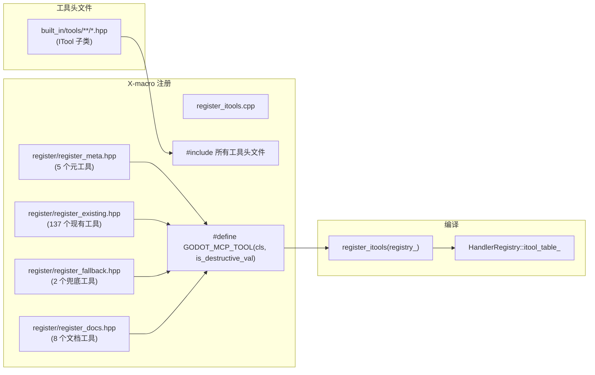
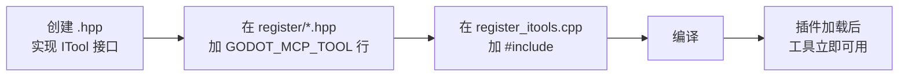

# X-macro 注册体系

> 替代 `tools/codegen.py` 的编译期工具注册方案。所有内置工具通过 `register_itools.cpp` 的 `#include` + `GODOT_MCP_TOOL` X-macro 注册，无需 codegen。

## 架构



## 注册文件

`extensions/src/built_in/tools/register/` 下 4 个 X-macro 注册文件：

| 文件 | 工具数 | 内容 |
|------|--------|------|
| `register_meta.hpp` | 5 | 元工具（`get_info`、`get_tools`、`get_categories`、`find_tool`、`call_tool`）。全部 `is_meta()=true`，共 5 个 always-on 工具 |
| `register_existing.hpp` | 137 | 137 tools (functional tools: scene tree, filesystem, scripts, workspace, bridge, lifecycle, etc.) |
| `register_fallback.hpp` | 2 | Layer 0 通用兜底工具（`get_node_property`、`set_node_property`） |
| `register_docs.hpp` | 8 | Layer 3 文档查询工具（`search_docs`、`get_class_info`、`get_best_practices`、`get_class_list`、`get_inheritance_chain`、`get_property_doc`、`get_method_doc`、`get_enum_doc`） |

## GODOT_MCP_TOOL 宏

定义于 `register_itools.cpp`：

```cpp
#define GODOT_MCP_TOOL(cls, is_destructive_val) \
    { \
        auto tool = std::make_unique<cls>(); \
        tool->set_is_destructive(is_destructive_val); \
        reg.register_tool(std::move(tool)); \
    }
```

参数：

| 参数 | 类型 | 说明 |
|------|------|------|
| `cls` | 类名 | ITool 子类名 |
| `is_destructive_val` | bool | 是否破坏性操作 |

工具元数据（`name()`、`category()`、`brief()`、`description()`、`is_meta()`、`needs_scene()`、`needs_node()` 等）通过 **ITool 接口的虚方法重写**提供，不再作为宏参数传入。宏只负责创建实例和设置破坏性标记，其余属性由类自身的 `override` 方法决定。

## 添加新工具流程



## 与旧 codegen 体系的区别

| 维度 | 旧体系（codegen） | 新体系（X-macro） |
|------|-------------------|-------------------|
| 注册方式 | `// @tool register` 注释扫描 | `GODOT_MCP_TOOL` 宏 |
| 代码生成 | `tools/codegen.py` + CMake 自定义命令 | 编译器原生处理 |
| 编译依赖 | Python + PyYAML | 无外部依赖 |
| 类型安全 | 无（Python 文本解析） | 有（编译器检查类名） |
| 新增工具步骤 | 仅创建 `.hpp` | 创建 `.hpp` + 加宏 + 加 include |
| UTF-8 BOM 问题 | 会导致漏扫 | 无影响 |
| 工具总数 | ~11,791（含 YAML 生成） | 152（纯手工编写） |
