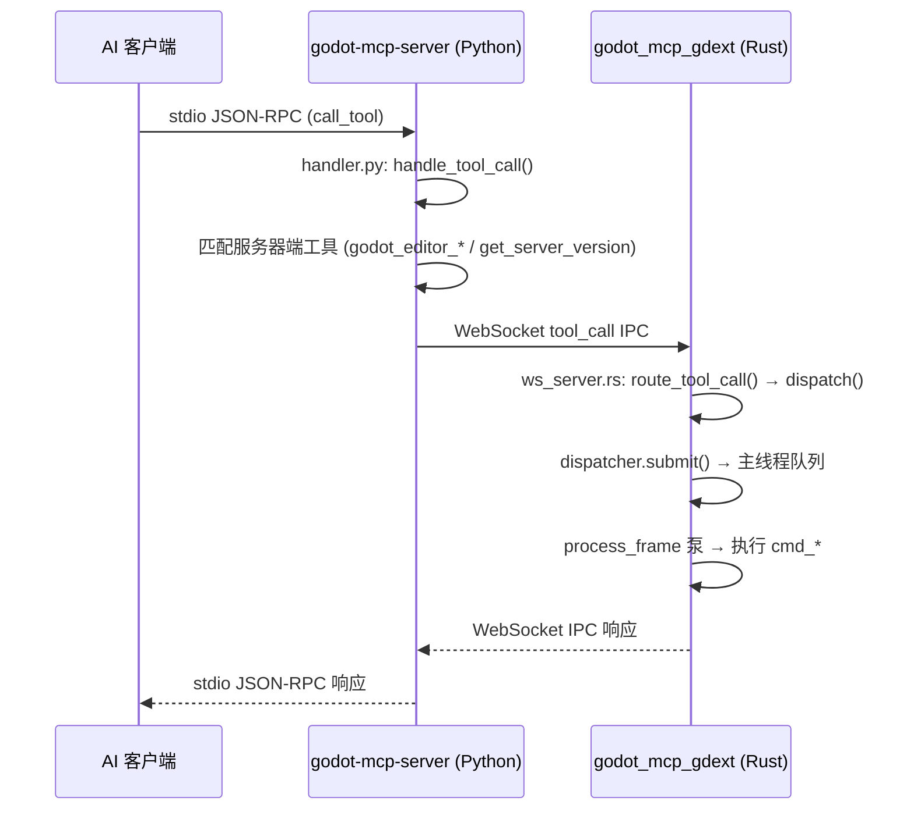

# 架构总览

## 双进程设计

```
AI 客户端 ── stdio ──► godot-mcp-server.exe ── WebSocket :9500 ──► godot_mcp_gdext.dll
                        (Python/Cython)                              (crates/gdext, cdylib)

crates/core ── 共享协议类型 (Rust lib)
server/ ── Python 服务器，通过 Cython --embed 编译为独立 exe
          registry.py 是工具 schema 的唯一权威来源
```

## 架构图

```
┌─────────────────────────────────────────────────────────────────────┐
│ AI 客户端 (Claude Code / OpenCode / Cursor / Copilot / Codex / …)   │
│ 标准输入输出 (stdio) JSON-RPC (MCP 协议)                              │
└───────────────┬─────────────────────────────────────────────────────┘
                │ stdio
                ▼
┌──────────────────────────────────────────────────────────────────────┐
│ godot-mcp-server.exe               (server/, Python/Cython)          │
│                                                                      │
│ ┌──────────┐  ┌────────────┐  ┌────────────┐  ┌─────────────────┐   │
│ │entry.pyx │→│handler.py  │→│bridge.py   │  │registry.py      │   │
│ │(asyncio) │  │(dispatch)  │  │(WebSocket)  │  │125 tools schema │   │
│ └──────────┘  └─────┬──────┘  └──────┬──────┘  └─────────────────┘   │
│                     │editor_ctl.py   │editor_ctl.py                   │
│                     │(open/close/    │(restart)                       │
│                     │ get_version)   │                                │
└─────────────────────┼────────────────┼────────────────────────────────┘
                      │ WebSocket ws://127.0.0.1:9500
                      │ tool_call IPC 请求
                      ▼
┌──────────────────────────────────────────────────────────────────────┐
│ godot_mcp_gdext.dll            (crates/gdext, cdylib)               │
│                                                                     │
│ ┌──────────┐  ┌────────────┐  ┌───────────────────────────────┐    │
│ │lib.rs    │→│editor_plugin│→│IpcWebSocketServer              │    │
│ │(#![gdext])│  │McpEditorPlugin│  (crates/gdext/src/ipc/)      │    │
│ └──────────┘  └────────────┘  └───────────────┬───────────────┘    │
│                                               │                     │
│                        ┌──────────────────────▼──────────────┐      │
│                        │ route_tool_call → dispatch()         │      │
│                        │ MetaCommands(先) → 17组 handler 链式 │      │
│                        └──────────┬───────────┬──────────────┘      │
│                                   │           │                     │
│                          ┌────────▼───┐ ┌─────▼─────────┐          │
│                          │dispatcher  │ │logging (mpsc) │          │
│                          │submit()    │ │log_info/warn  │          │
│                          │process_pend│ │drain_to_consol│          │
│                          └───────┬────┘ └───────┬────────┘          │
│                                  │               │                  │
│                          ┌───────▼───────────────▼────────┌         │
│                          │ process_frame (SceneTree 信号)   │         │
│                          │ 主线程泵（非 plugin .process()） │         │
│                          └────────────────────────────────┘         │
│                                                                     │
│                          Godot EditorInterface / Node / Scene API   │
└──────────────────────────────────────────────────────────────────────┘
```

## 数据流



## 关键属性

- **stdio 是唯一**启用的 MCP 传输
- **IPC 线路格式**: JSON-RPC 风格的 `IpcRequest`（`method`+`params`）/`IpcResponse`（`status` tag），类型定义在 `crates/core/src/protocol.rs`，Python 侧 `server/src/godot_mcp_server/protocol.py` 有对应的 Pydantic 模型
- **125 个工具**: 121 个通过 gdext 执行，4 个服务器端（`get_server_version` + 3 个 `godot_editor_*`）在 `handler.py` 中拦截
- **工具注册表**: Python 侧 `registry.py` 是权威来源；gdext 侧 `commands/mod.rs::create_registry()` 提供 17 个 CommandHandler 用于路由
- **服务器端断言**: Python 侧 `total == 125`；gdext 侧无计数器（通过路由匹配实现）

## 目录布局

```
crates/
├── core/          # 共享类型: protocol.rs, tool_manifest.rs (Rust lib)
└── gdext/         # GDExtension cdylib (Rust)
    └── src/
        ├── lib.rs           # gdextension 入口
        ├── editor_plugin.rs # McpEditorPlugin 生命周期
        ├── dispatcher.rs    # MainThreadDispatcher
        ├── logging.rs       # 跨线程日志
        ├── commands/        # 17 个命令处理模块
        ├── ipc/             # WebSocket 服务器
        │   ├── ws_server.rs # IpcWebSocketServer + route_tool_call
        │   └── plugin_state.rs
        ├── lsp/             # GDScript LSP 客户端
        └── dock/            # 编辑器右侧 Dock UI

server/                      # Python/Cython MCP 服务器
├── entry.pyx                # Cython --embed 入口
├── src/godot_mcp_server/
│   ├── handler.py           # GodotMcpHandler 分发器
│   ├── bridge.py            # GodotBridge WebSocket 客户端
│   ├── registry.py          # ToolRegistry (125 tools)
│   ├── editor_ctl.py        # 编辑器进程管理
│   └── protocol.py          # Pydantic IPC 协议模型
```

## 双进程启动顺序

```
1. AI 客户端启动 → godot-mcp-server.exe（stdio 子进程）
2. server 注册 125 个工具的 Schema，监听 stdio
3. AI 客户端调用 godot_editor_open → server 启动 Godot 编辑器
4. 编辑器加载插件 → gdext 初始化 → 启动 WebSocket 服务器 :9500
5. server 的 bridge.py 连接到 WebSocket
6. 连接建立 → gdext 发送 godot_ready 通知
7. 后续工具调用的完整链路开始工作
```